# Product review — v0.5.2 plus the v0.6 Pack content (2026-09-24)

**Verdict:** the engine is real, but what a user sees isn't a product yet. Every release so far has been judged by measuring the code. Nobody looked at the screen, and the screen shows it.

This review reads the product the way a user meets it: the app window, not the tests. Every screenshot below comes from the real desktop app running under `scripts/linux-preview.sh`, which this change adds. It is the first time the app has been looked at on a machine without a Mac.

## What was wrong

### 1. Nobody could see the app, so nobody did

- The desktop app is gated to macOS, and the CI screenshot job can't draw text. `scripts/check-desktop-fonts.py` records that v0.5.0 and every earlier release shipped windows with **no text in them at all**, and nothing caught it for five releases.
- `docs/screenshots/` doesn't exist. The README describes a window it has never shown.
- Consequence: layout bugs no test can see. The World map ("Explore the world") had collapsed to a one-pixel line and never showed in any release.

### 2. The World window was a debug inspector

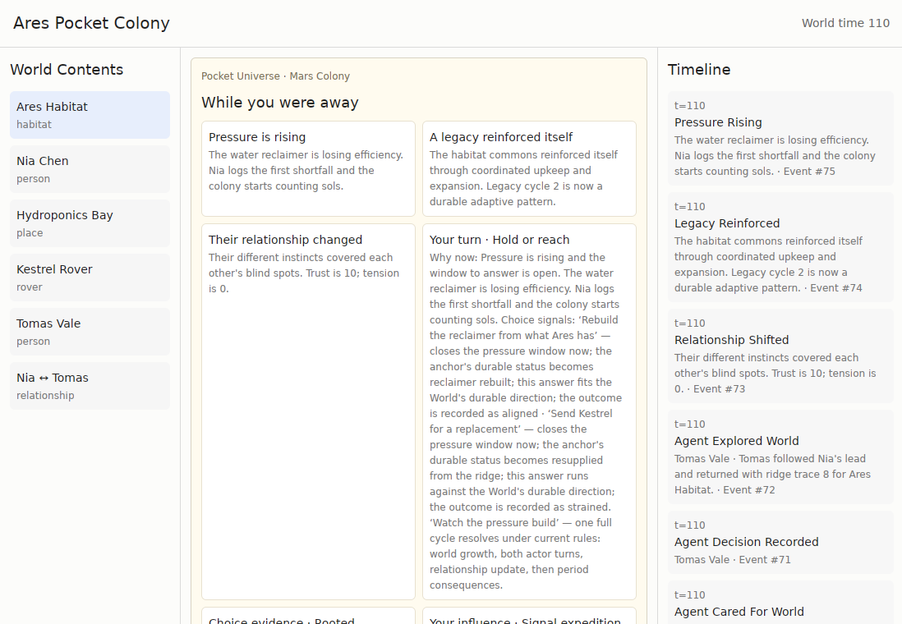

- **Three equal columns**: a list headed "World Contents", a centre grid of identical boxes, and a 300 px event log. Nothing says which one to read first.
- **The log is the kernel's raw log**: `t=110`, `Agent Decision Recorded · Tomas Vale · Event #71`, one line per internal step.
- **Jargon on every choice**: *"Choice signal: one full cycle resolves under current rules: world growth, both actor turns, relationship update, then period consequences."* *"Verified by this Event: World direction = Rooted at generation 6. Later growth and legacy formation read this durable posture."*
- **The decision was said three times**: once as a briefing card listing every option and its mechanics, again as a button panel, and again in "Choice evidence".
- **One weight for everything**: 156 `text_sm`, 196 `text_xs`, and no font weights anywhere. Every heading had the same weight as the body text.
- **The title twice**: the World's name appeared in two stacked title bars.
- **Kernel words in the details panel**: *"Recorded events whose StateChanges directly changed this entity"*, *"Relation incarnations … Removed relations remain inspectable as recorded tombstones"*.

### 3. There was no design system

- 519 colour literals, 126 of them different colours, written directly into the view code.
- Dark mode came from a formula (`world_theme::darken`) that inverts lightness, not from a palette anyone chose.
- **Zero** hover states in the whole app. Every clickable thing was a `div` with a border, identical to things that aren't clickable.

### 4. Home

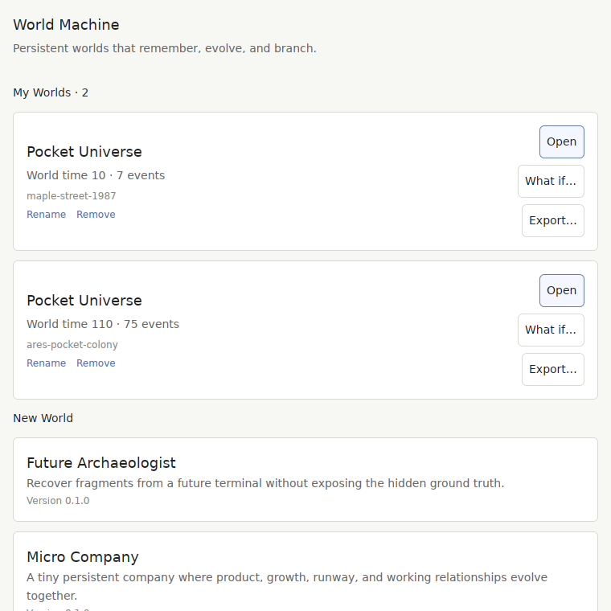

- Each World card had three stacked buttons of different widths, plus developer data: `World time 110 · 75 events` and the file id `ares-pocket-colony`.
- The screenshot fixture saved Worlds without names, so every screenshot listed both Worlds as "Pocket Universe".
- After the bundled Packs activated, Home showed **"Pocket Universe is ready — Start your first World · no World created yet"** to someone who already had two Pocket Universe Worlds.
- Status messages were inserted above the page, so a Pack finishing start-up pushed the card under the pointer down. Opening "Maple Street · 1987" announced *"Opened Pocket Universe"*.

### Root cause

The team's feedback loop was code measurement: "lines stopped repeating", "83% → 0% repeat". That is necessary, but it cannot tell you a window is empty, a panel collapsed, or a sentence is unreadable. `NEXT_TASK.md` already says a real-device check and a usability test "outrank everything". Neither has happened since v0.2.1. The rest of this document is what that loop would have caught.

## Against the best in the genre

A World Machine World is a small persistent world you leave and come back to, shaped by a few choices, with a history you can question and branch. Nothing else is quite that, but several of the best-made products in games and software each do one part of it very well. They are the right bar. Every one of them puts the world on screen and the words second; this app did the opposite.

| Product | What it does best | What we take | Where we stand |
| --- | --- | --- | --- |
| **Animal Crossing: New Horizons** | Coming back. The town has visibly moved on, and the news comes from the villagers themselves, on the morning announcement and in letters. | The return is a place that changed, not a list: the scene, a halo on whoever the news is about, the actor's face on each beat. | Halos and faces, yes. No before/after of the scene, and characters don't speak. |
| **RimWorld** | The map is the screen. Colonist portraits run across the top; events stack at the edge, coloured by how serious they are. | The scene as the hero, a cast with faces, history as a rail beside it, news coloured by severity. | News carries a tone (good, warning, bad): faces, dots, standing cards and scene tiles wear its colour. |
| **Crusader Kings III** | Decisions are event windows with a portrait, and each option shows its consequences as icons (+prestige, −stress). | Choices as cards with consequence chips. | Each choice lists what it changes ("↑ Trust", "Sea Finch → repaired", "Against the World's direction"), coloured by tone. |
| **Reigns** | Hover over a choice and the meters it will move light up before you commit. | Preview before commit. | Hovering a choice rings what it would change on the scene. It still can't show *how much*. |
| **The Sims** | Relationships and needs are bars and colours, never sentences like "Trust is 7". | A relationship as a line whose weight is its strength and whose colour is its tone. | Link weight and tone are done. Inspector values are still label/value rows, not meters. |
| **Townscaper / Islanders** | Restraint: almost nothing on screen but the world, and every interaction feels good. | Calm palette, one accent, the world first, motion that means something. | News eases in, in order, when time moves; trouble breathes on the scene; the World's history grows in. Things on the scene still jump to their new state instead of easing there. |
| **Wildermyth** | A procedurally generated story told as illustrated comic panels with the characters in them. | Beats as moments with people in them. | Faces are initials. There is no art pipeline, and Packs can't supply any. |
| **Git graph / Time Machine** | Branches and time as a picture you can scrub. | Lineage as lanes on one time axis; What if… as two futures side by side, drawn. | Branches are a graph: each World is a lane, each branch leaves its parent at the moment it split, and the selected World's ancestry lights up. There is still no scrubbing through time. |

### Scorecard (1 = absent, 5 = top of the genre)

| Dimension | v0.5.2 | Now | What moves it next |
| --- | :-: | :-: | --- |
| World legible at a glance | 1 | 3 | State meters on the scene; Pack-supplied art |
| Return payoff ("what changed") | 2 | 4 | Scene nodes easing from where they were to where they are |
| Decision clarity | 1 | 4 | Magnitudes in the preview; real choices before "wait" |
| Why / causality | 3 | 3 | A visual causal chain in *Why it happened* instead of an indented list |
| Characters you care about | 1 | 2 | Portraits, moods, a voice for each person |
| Branching / What if… | 2 | 4 | Scrubbing through a World's time; comparing any two points |
| Visual craft (type, colour, space) | 1 | 3 | Mac verification; motion; icon set |
| Motion and feedback | 1 | 2 | Nodes easing to their new state; numbers counting to their new value |
| First run | 2 | 3 | A seeded scene on the very first screen instead of a card list |

The honest reading: this change takes the app from "not a product" to a credible, consistent base. It is not top tier. The biggest gaps left are motion, art, and structured data that would let choices and changes be shown rather than described.

### What the data has to carry for the UI to stop describing things

A renderer can only show what a projection gives it. The generic, kernel-safe additions that unblock the rows above are:

1. ~~**`BriefingItem.tone`**~~ *(done: neutral / good / warning / bad)*: severity colour on beats and scene nodes, as RimWorld does.
2. ~~**`ProjectionCommand.effects`**~~ *(done: target, label, up / down / to a value, tone)*: consequence chips and hover previews, as Crusader Kings and Reigns do.
3. ~~**State deltas since the visit cursor**~~ *(done: `CanvasItem.changes`, replayed from the log)*: a numeric "what changed" on the scene.
4. **`CanvasItem` meters** (named values in a known range): bars instead of numbers.
5. **Pack art hooks** (palette, cover, portrait images): Worlds that look like their setting. Today a Mars colony's cover can be green.

This change makes four of these additions: `CanvasProjection.links`, `BriefingItem.tone`, `ProjectionCommand.effects` and `CanvasItem.changes`. Pocket Universe and Tiny Society fill them all in. A test holds each choice to the consequences it shows. It is optional on the wire in both directions, so old Packs and hosts are unaffected.

## What this change does

**The World window: the World first**

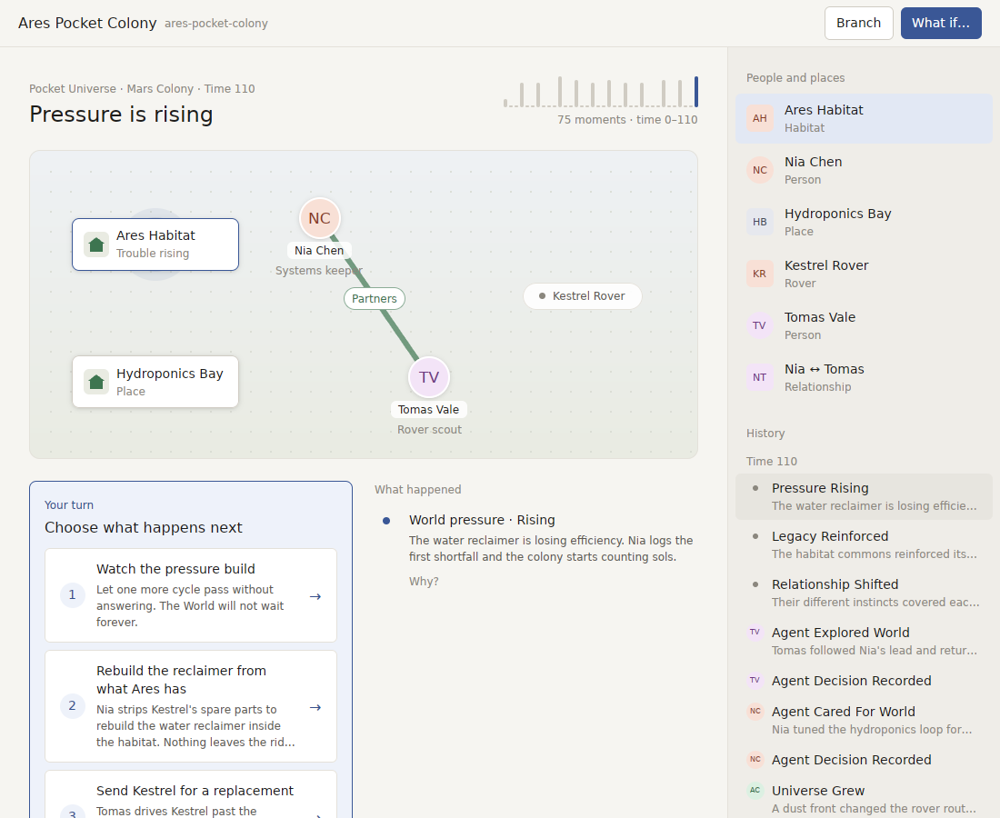

- **A drawn scene is the hero.** Places are tiles, people are faces (initials on a colour that is always theirs), relations are lines, and whoever the latest news is about has a halo. A deterministic layout pass keeps nodes from overlapping. A crowded World draws smaller on a taller stage.
- **An activity strip** next to the title shows when things happened across the World's life, with the stretch the news covers picked out.
- **Your turn** sits beside **What happened**. Choices are numbered cards that list what they change as coloured chips. Pointing at a choice rings what it would change on the scene before you commit. Each beat carries the face of whoever it happened to, edged in the colour of the news: amber for trouble rising, red for loss, green for good news.

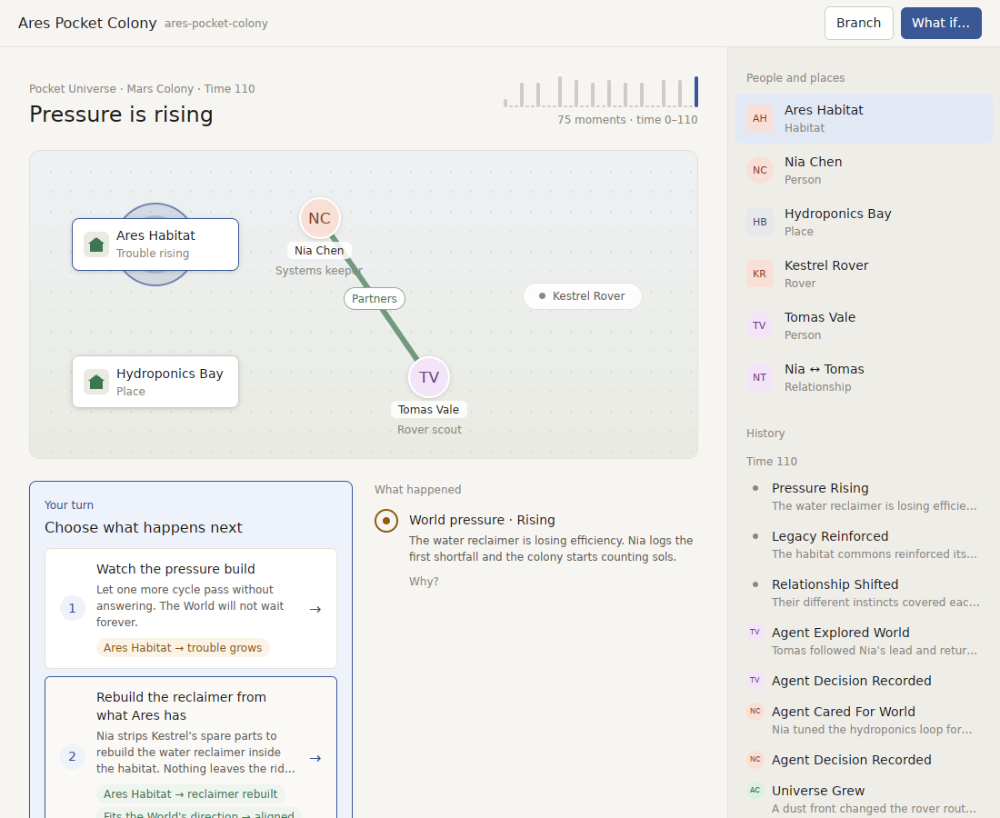
- **The sidebar** holds People and places with faces, and History as a rail of one-line moments with faces, grouped by time.
- **The details panel** uses plain words: *Connected to*, *What changed it*, *Between*, *What this changed*. It no longer shows tables of internal ids.
- **The desktop window** has one title bar, with **Branch** and a primary **What if…**.

Tiny Society, with thirteen things on stage, stays readable:

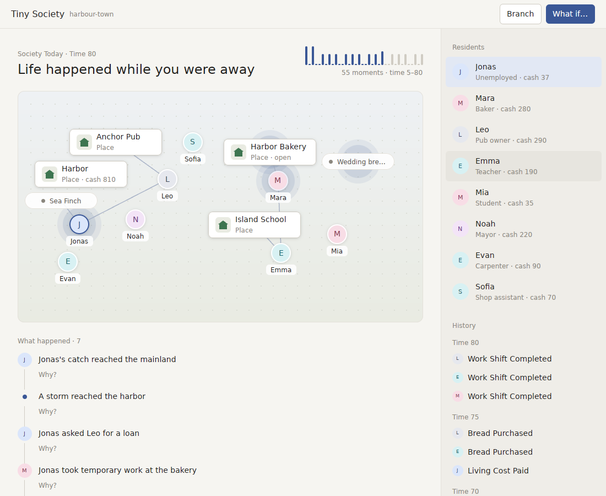

**Coming back** shows what moved on each person and place while you were away, on the scene itself: "cash ↓24" under Jonas, "cash ↑160" under Mara, a school whose till fell by 144. The Pack names the value and the direction's meaning; the numbers are replayed from the World's own log, so they never depend on anything the app remembered. `AWAY_HOURS=48 scripts/linux-preview.sh` opens every World as a return:

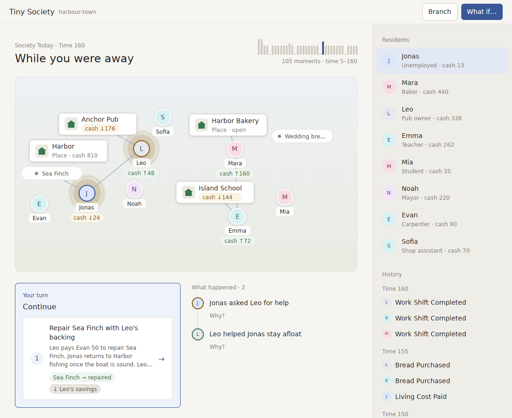

**History** tells what happened, in the World's words, with the face of whoever it happened to. The everyday round folds into one line per moment, and quiet stretches run together. It used to be "Agent Decision Recorded", "Agent Cared For World" and "Work Shift Completed", a hundred lines deep. Pocket Universe on the left, Tiny Society on the right:

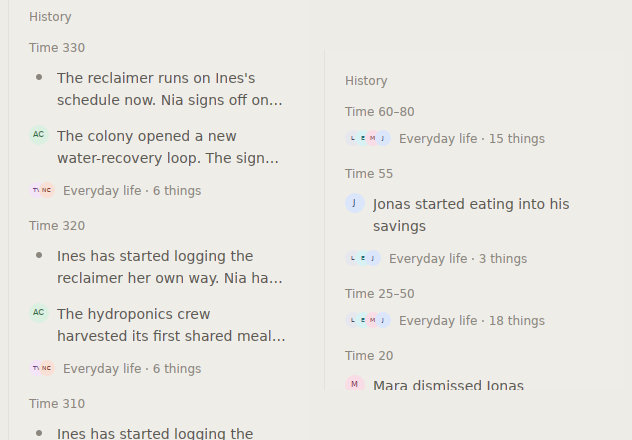

**What if…** shows two futures side by side, each with the thing that happened only there as its headline, and its scene with the differences haloed. It used to say "Strategy Comparison · Two independent futures evaluated from the same durable World" above two identical cards, then "FIRST RECORDED DIFFERENCE" and "2 recorded causal steps … 1 supporting record folded".

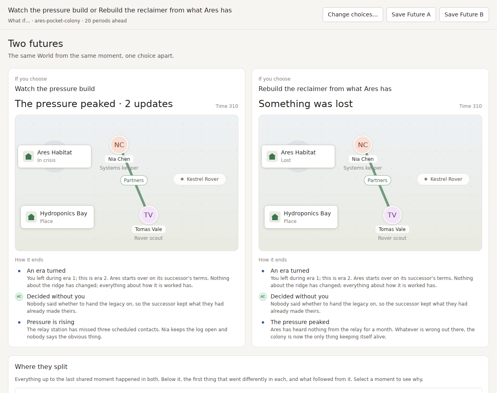

**Branches** are a graph, not an indented list of file ids ("ares-pocket-colony-branch-2 · time 110 · 75 events"). Reach it from the badge in a branched World's title bar (it used to be a menu item only), or from the World menu. Home says where a World came from in words: "Branched from Ares · Held on by choosing 'Let time pass'".

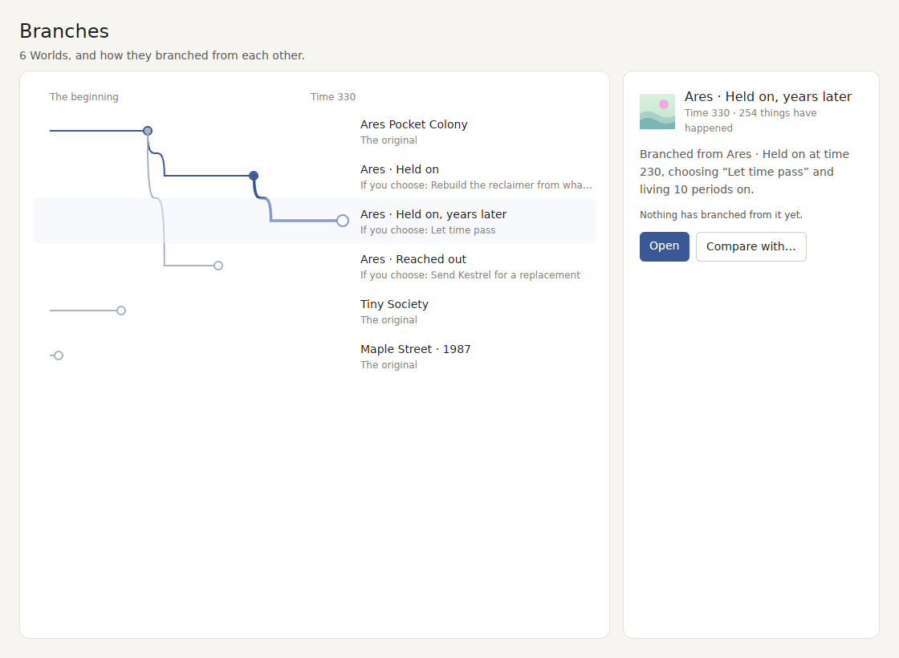

**One design system everywhere.** Every window (What if…, lineage, Settings, About, the Analyst panel, Pack review) now draws its literal colours from the same tokens, mapped by role, hue and lightness. It went from 367 literals to none in those files; colours still chosen at runtime (a selected versus unselected chip) go through the old `adapt()`.

**Dark mode** uses a palette picked by hand, not computed:

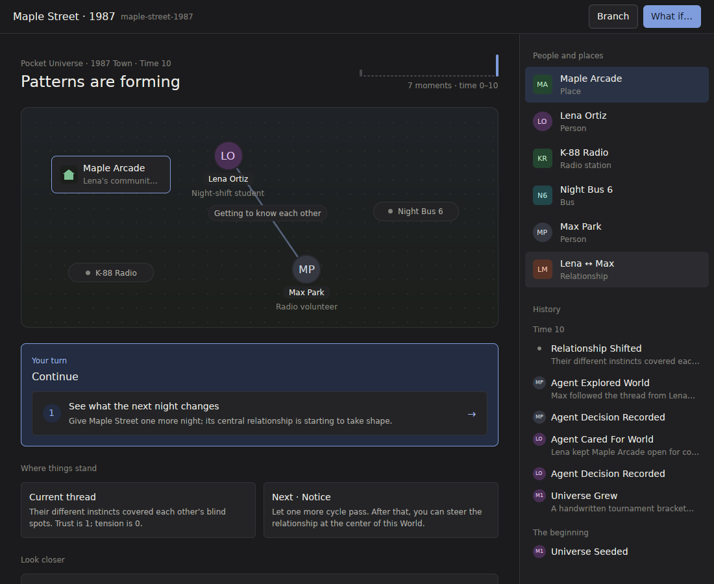

**Copy**
- Choices describe themselves in the World's own words. "Choice signal" mechanics are gone from the screen, and every consequence stays traceable in *Why it happened*.
- "Choice evidence · X — Verified by this Event: …" now reads **"You chose · Rooted — This World now leans rooted. What grows next, and what it leaves behind, follows that direction."**
- Trust and tension are no longer stated twice in one card. *"Resolved into a durable partnership"* now reads *"They have settled into a lasting partnership."*
- "Event #N" is gone from timeline lines and detail subtitles.

**Home**

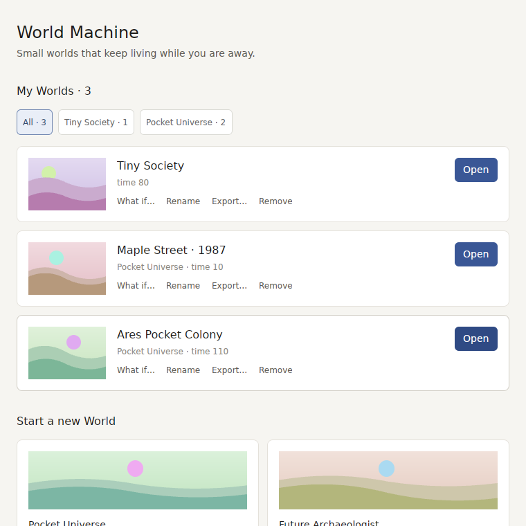

- Each card has a small generated landscape. It is stable per World and different between Worlds, so Worlds can be told apart before reading. The card also has the World's name, what kind of World it is and how far it has lived, one primary **Open**, and quiet text actions (What if… · Rename · Export… · Remove).
- **Start a new World** is a grid of cards with banners and a clear "Start a World →", with the recommended World first.
- A bundled Pack getting ready in the background no longer announces itself.
- The false "no World created yet" card is gone.
- Status floats over the bottom of the window instead of moving the page, and it names the World you opened.

**Seeing the app without a Mac**
- `scripts/linux-preview.sh` copies the tree, lifts the macOS gate in the copy only, and runs the real app under Xvfb with the bundled Packs and a demonstration library. It can click, and it captures every window. It doesn't replace checking on a Mac, but it closes the "nobody looked" gap for everyday changes.
- `APPEARANCE=dark scripts/linux-preview.sh` checks the dark palette (`WORLD_MACHINE_APPEARANCE` forces either appearance).
- `cargo run -p pocket-universe --example playthrough` prints fourteen visits as text, so the copy can be read end to end without the app.

## What is still not good enough, in order

1. **Check on a real Mac.** San Francisco has real weights. The Linux fallback font here does not, so headings look lighter in these screenshots than they will on a Mac. Capture `docs/screenshots/` in light and dark.
2. **Add the rest of the projection fields above**: meters, then Pack art. Tone, effects and deltas since the last visit are done.
3. **More motion.** News, the decision panel, the activity strip and trouble on the scene already move. Next is scene nodes easing to their new state when a choice lands, and numbers counting to their new value.
4. **Settings, the Analyst panel and Pack review** are on the tokens but still laid out as they were. They need the same pass the World window had; after that, `adapt()` can go. Scrubbing through a World's time would complete the branching story.
5. ~~**History shows every internal step.**~~ *(done: Packs tell each Event's line and mark the everyday round, which History folds)*
6. ~~**Recorded prose still has engine words.**~~ *(done: Pocket Universe 0.19.0 records plain words; old Worlds of that Pack no longer open)*
7. **The usability test** in `NEXT_TASK.md`. None of the above replaces five strangers and five minutes each.
