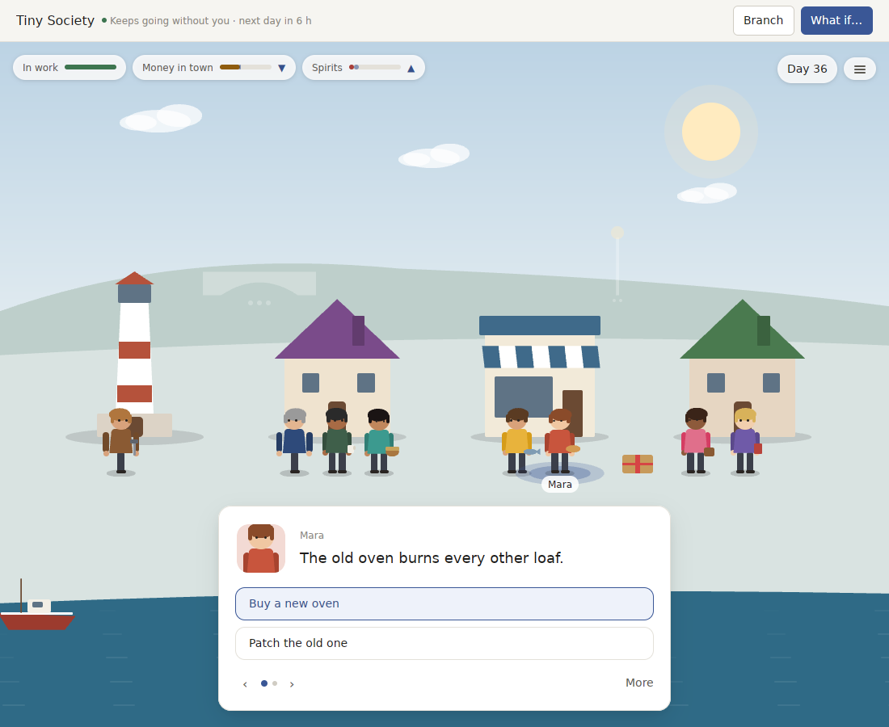
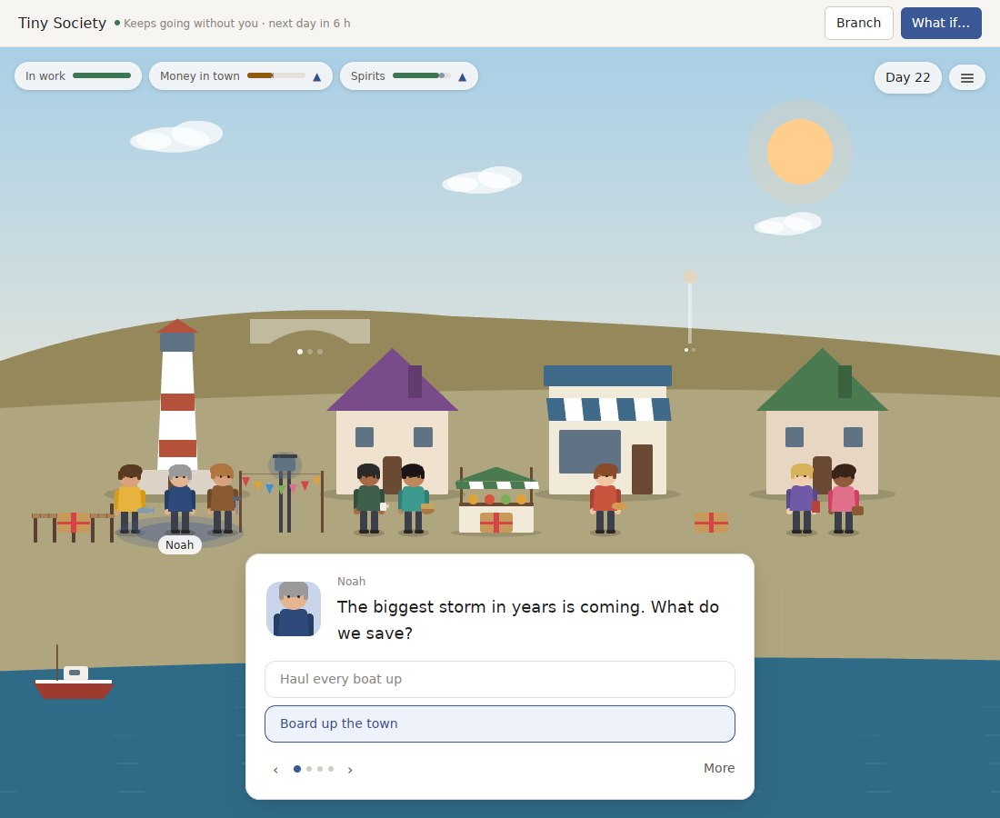

# v0.10.0 review: a story that leaves no mark

`v0.10.0` gave each World a storyteller. There is now something to decide every period, people want things and remember, seasons turn and chapters end. This review asks the question the best products answer next: **does what you decide change the place, and does it lead anywhere?**

As before, I played each World through its real Pack, the code the app runs: 30 periods, played three ways (always saying yes, always taking the last answer, never answering), plus a look at the first screen of a new World.

**Verdict:** the World now asks, but the answers don't stick. Whatever you choose, the harbour ends the month in the same place: same money within 5%, the same fourteen things on the scene, nothing new built or opened that you can see. Each question is a one-off that never comes back as a consequence. A choice is also split across two unrelated cards, and a new World opens on "Let the day pass". The next version has to be about **consequence**: answers that change the place you look at, and questions that grow out of earlier answers.

## What 30 periods look like

| | Tiny Society | Pocket Universe (Mars) |
| --- | --- | --- |
| What a new World first asks | "Let the day pass", and nothing else | "Let the sol pass", and nothing else |
| Money / trust at the end, *yes* vs *last answer* vs *never answer* | 3,426 · 3,588 · 3,468. The contrary player ends richest | trust 7 · 10 · 7 |
| Things on the scene at the end, any policy | 14, the same 14 it started with. Nothing added, opened or changed shape | 5, the same 5 |
| Questions that came up / how many different ones | 40 / 22 | 33 / 12 |
| Most repeated question | Market day 5 times, and "Mara's oven is failing" 3 times in a month | "Nia needs a spare seal" 4 times in 30 sols |
| Questions that follow from an earlier answer | 0 | 0 |
| What an unanswered month costs | 24 of 25 questions lapse, three chapters close, all "bitter" | 25 of 27 lapse |
| Cards on screen at once | up to 4 | up to 5 |
| Goals finished, then what | none finished in 30 days | the second dome and the map finish within 30 sols, and nothing takes their place |

Three things stand out.

- **Choices move numbers, not the place.** Granting Sofia her stall, buying Mara's oven, holding the fête: each nudges a gauge and a speech bubble, then the scene looks exactly as before. There is no stall, no new oven chimney smoke, no bunting. The pier's first section is a pip on a pale outline.
- **Questions are single-use.** "Set Sofia up with a stall" has no second act. There is no "the stall is doing well, and Leo feels the pub counter is empty" and no "Sofia took a job on the mainland because you said no". Wants rest and come back identical ("Mara's oven is failing" again).
- **A question is two cards.** "Send Tomas out for a spare seal" and "Tell Nia to make do" are separate cards among five, leafed through with ‹ ›, so the question itself ("Nia needs a spare seal") is never on screen with its answers.

## Against the products that do it best

| What makes a decision matter | Best in class | How | World Machine v0.10.0 |
| --- | --- | --- | --- |
| A decision is one card with two answers | *Reigns* | One face, one question, swipe left or right; both answers are on the same card | Each answer is its own card, and the question is not on any of them |
| What you choose is visible | *Animal Crossing*, *Townscaper*, *Frostpunk* | Every project, shop and building you approve appears in the place and stays | Nothing appears. Built goals are outlines on the ridge |
| Answers come back | *Fallen London*, *80 Days*, *Wildermyth* | Choices set qualities that unlock later storylets; threads run over weeks and pay off | Every storylet stands alone |
| People have their own arcs | *Stardew Valley* (heart events), *The Sims* | Each person's story advances as you help them, in stages you can see | A want granted is a tally in `granted`, and the same want returns |
| Chapters have a shape | *Frostpunk*'s scenarios, *Wildermyth*'s campaigns | Each chapter has a named threat or goal, rises to a decisive moment, and the ending tells how that moment went | A chapter is 24 days or a gauge at its end; the ending lists facts ("The harbour kept its bakery. Sea Finch waited on the slip.") |
| The place grows | *RimWorld*, *Animal Crossing* | New people arrive, new buildings open, finished projects unlock the next ones | The cast and the places never change; a finished goal leads nowhere |
| The first minute | *Animal Crossing*, *Townscaper* | You are handed something to do with your hands straight away | The first card is "wait" |
| Being away | *Animal Crossing*, *Neko Atsume* | People are glad you came back; the place kept going gently | A month away lapses 24 questions into grudges and three bitter chapters |

## v0.11: answers that change the place

The bar, checked by tests that play the real Packs for 30 periods three ways:

- A new World's first screen is a question, not a wait.
- At least half of the answered questions leave something visible on the scene: something added, opened, lit, decorated or changed shape.
- *Yes* and *last answer* end in visibly different places: at least three differences on the scene, not only in the gauges.
- At least a third of the questions in a month follow from an earlier answer.
- No question is asked more than twice in 30 periods.
- A week away lapses at most three questions.

1. **A question is one card.**
   - A storylet shows as a single card: whoever asks, what they say ("My nets are more hole than net."), and its two or three answers on the card itself, like *Reigns*. ← and → lean toward an answer and the gauges twitch, ⏎ chooses.
   - Only other *questions* are leafed through, not answers.
   - The Pack protocol gains an optional way to group commands into one question with its prompt. A Pack that doesn't group reads as before.
2. **What you choose appears.**
   - Answers add, change or remove things on the scene through the World's own state: Sofia's stall stands by the pub, the new oven's chimney smokes, bunting hangs for the fête, the lamp on the point is lit at night, each section of the pier reaches further into the water, the second dome stands next to the first.
   - Some are lasting (a stall, a pier), some pass (bunting for a week).
   - The scene shows them because the recorded state says so, never because the app remembers a click.
3. **Threads.**
   - Every want has a second and third act, set off by how it was answered. A stall granted leads to "Sofia's stall is thriving: take on Mia?" and then "Leo says the pub feels empty". A stall refused leads to "Sofia has an offer from the mainland".
   - Storylets can require earlier outcomes (qualities, in *Fallen London*'s terms), and a thread can end: someone leaves, someone arrives, something is built.
   - Asked "How are you?", people answer from where their thread stands.
4. **People arrive and leave.**
   - Threads and finished goals can bring someone new: a teacher's assistant, a second keeper for the new dome, a traveller who stays. Threads can also send someone away.
   - The cast is no longer fixed, and a finished goal opens the next ones.
5. **Chapters with a shape.**
   - Each chapter opens on a named pressure ("The long winter", "The pier before the storms") with a decisive question near its end.
   - The ending tells the threads it closed and how that question went ("Sofia's stall outgrew the pub counter. You chose to finish the pier before winter, and it held."), not a list of standing facts. Titles no longer repeat.
6. **A first minute and a fair return.**
   - A new World opens on its first question.
   - While you are away, wants wait for you rather than lapsing into grudges; only what cannot wait (a storm, market day) happens without you, at most three a week.
   - Coming back, the people who waited are the first thing you see.
7. **A deeper deck.**
   - Pocket Universe's deck grows from 17 storylets to the harbour's size or more, spread over its three places.
   - Rest times keep any question from coming up more than twice in 30 periods.
8. **Signed, and able to tell you.** Still waiting on the five secrets in `RELEASE_SIGNING.md`. With threads, a notification has something to say: "Sofia's stall opened".

As always, every concept is built in both Pocket Universe and Tiny Society before it counts. Items 2 to 7 change Pack rules, so both Packs' versions move and older Worlds need exporting first. The scene draws only what recorded state says is there, and no text written by a language model becomes World state.

**Order.** Item 1 first: it is the moment everything else is decided in. Then 2 and 3 together, since a thread's payoff is usually something that appears. Then 4 and 5, which build on threads, and 6 and 7 last.

## How we'll know

- The consequence tests above, in each Pack, next to the story-density tests from `v0.10.0`, which keep holding.
- A before-and-after screenshot pair, *yes* against *last answer* after 30 days, that a stranger can tell apart without reading anything.
- The two-week diary on a real Mac: note each day whether something you did earlier came back. The target is at least 7 of 14 days.

## Progress

Items 1 to 7 shipped in `v0.11.0`; item 8 still waits on the five secrets.

| The bar | Tiny Society | Pocket Universe (Mars) |
| --- | --- | --- |
| A new World's first screen | a question | a question |
| Answers that changed the scene, *yes* · *last answer* | 26 of 30 · 12 of 30 | 19 of 30 · 12 of 30 |
| Questions that followed from an earlier answer (calendar left out), *yes* · *last answer* | 13 of 27 · 12 of 30 | 11 of 27 · 11 of 30 |
| Things on the scene that differ between *yes* and *last answer* after 30 periods | 9 | 5 |
| Most any question besides the calendar's came up in 30 periods | twice | twice |
| Questions lapsed in a week away | at most 3 | at most 3 |

These are checked by `what_you_choose_changes_the_place_and_comes_back`, `a_new_world_opens_on_a_question` and `a_week_away_lapses_at_most_three_questions` in each Pack, next to the story-density tests, which still hold.

- **One card per question.** Mara asks about her oven with both answers on the card; ← and → lean, ⏎ chooses.

  

- **What you chose stands in the harbour.** Day 22 of the demo harbour: the pier's first section, bunting, a lamp post, Sofia's stall and parcels by the houses, all from recorded state. The storm season's climax asks what to save; hauling every boat up costs more than Noah has, so it is greyed.

  

Still to check by hand: the before-and-after pair a stranger can tell apart, and the two-week diary on a real Mac.
