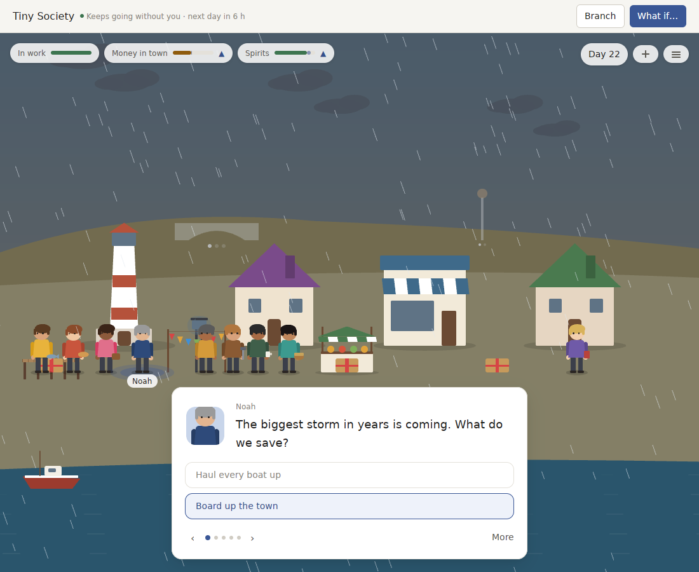
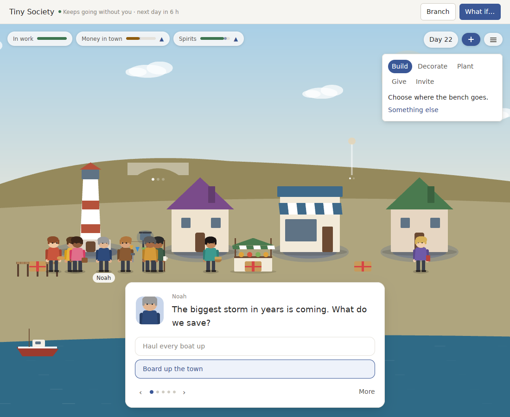
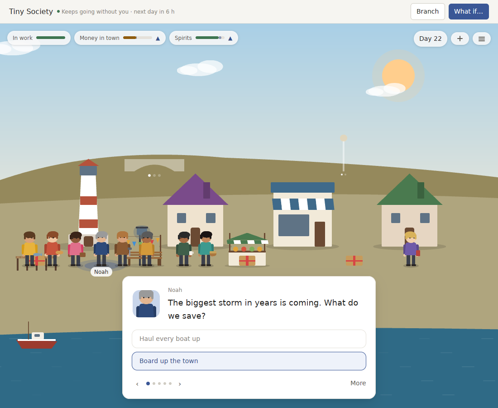

# v0.11.0 review: a card game in front of a painting

`v0.11.0` made choices stick: a question is one card, answers stand things up in the place, and questions grow out of earlier answers. Earlier reviews played 30 periods. This one asks the question that decides whether World Machine belongs next to the best products of its kind: **what is it like after a month, a season, a year?** A World that keeps going without you is a promise about the long run.

I played each World through its real Pack for 180 periods, two ways (always the first answer, always the last), timed a year of turns, and counted what the player can do and what the Packs have to say.

**Verdict:** the first three weeks are good now, and then the World runs out. After about 75 days the harbour asks nothing it has not asked before, the chapters go round the same three climaxes with the same titles, and everyone says their five everyday lines on a five-day cycle. Underneath, World Machine is a deck of 60 hand-written cards in front of a painted backdrop: the player answers, people recite, and the place is drawn from a few shapes. The best products in this space are systems that make stories, places you put your hands on, and people with lives of their own. No amount of extra cards closes that gap. The next version has to change what the product *is*: from a deck to a world.

## What half a year looks like

| | Tiny Society | Pocket Universe (Maple Street) |
| --- | --- | --- |
| Questions never asked before, in each 30 periods (*first answer*) | 34 · 17 · 2 · 0 · 0 · 0 | 29 · 11 · 5 · 1 · 0 · 0 |
| The same, *last answer* | 36 · 8 · 1 · 0 · 0 · 0 | 32 · 9 · 2 · 0 · 0 · 0 |
| Storylets in the deck | 64 | 56 |
| Everyday lines | 90 different lines, 855 said. "The rye's rising nicely." 36 times, every fifth day | "A little bigger every day." and five others each 36 times |
| Birthdays | "It's my birthday today!" 35 times, the same words from everyone | — |
| Chapters in 180 periods (*first answer*) | 13. "The storm we boarded up against" and "The school as it is" four times each | 11. "The long dark" and "The night we talked" twice each |
| How chapters end | 12 of 13 end "… hasn't forgotten being let down", even for the player who said yes to everything; "Harbor Bakery closed its doors. Mara reopened the bakery." ends six in a row | "They lost Maple Arcade." ends four of the *last answer* player's six |
| Things on the scene at the end | 21 (14 at the start) | 11 (5 at the start) |
| A turn, release build, on a new World · 180 periods · 360 periods | 1.7 ms · 16 ms · 32 ms | 0.7 ms · 60 ms · 247 ms |
| What the player can do in a World | answer a card, let time pass, ask someone one of three fixed questions, branch, *What if…* | the same |
| Written words the player can meet | about 5,400 in 1,000 strings | about 5,300 in 940 strings |

What stands out:

- **Content, not a world.** Everything that happens is a card someone wrote. When the cards are used up the World goes on turning them over: by day 90 each month is a third calendar (market day, birthdays) and two thirds reruns. v0.11's promise that chapter titles would no longer repeat holds for 30 days, not for 180.
- **The player only answers.** You cannot put the stall where you want it, give Mara flour, walk Jonas to the pier or plant anything yourself. Every change in the place is a reply to a question the World chose to ask.
- **People are voices, not lives.** Nobody has a day: people walk to a place and back for show, and say a line when their turn comes. Their ties to each other exist only where a card was written for them: Leo and Evan quarrel because one card says so, but nobody courts, teaches, envies or befriends anybody on their own, and no card remembers how two people get on.
- **The place is drawn from seven painters.** People, buildings and fixtures are rectangles, circles and triangles in flat colours (`art.rs`, 1,300 lines). There is no light, no weather, no shadow, no gesture. The storm of the decade is a card over a sunny harbour (see `review/v11-harbour.png`).
- **It gets slower as it lives.** A turn on a year-old Mars World takes a quarter of a second, and it grows faster than the World does: the snapshot re-reads the whole history. Each card's answers are previewed by playing them on a copy, so a card with three answers costs four turns. For a product whose whole point is living a long time, that is a design flaw, not a tuning task.

## Against the products that do it best

| What makes a living world top-tier | Best in class | How | World Machine v0.11.0 |
| --- | --- | --- | --- |
| Stories never run out | *RimWorld*, *Dwarf Fortress*, *Crusader Kings* | Stories come out of systems: needs, moods, relationships, traits, events that combine. Authored events are seasoning | Every story is an authored card; after 75 days there are no new ones |
| People have lives | *The Sims*, *RimWorld*, Stanford's *Generative Agents* | Each person has a day, needs, opinions of everyone else, ambitions; they act on them without being asked | People have a job, a want and a grudge counter; they act only when a card says so |
| You put your hands on the place | *Animal Crossing*, *Townscaper*, *Stardew Valley* | You place, build, plant, decorate, give; the place is recognisably yours | You answer questions; the Pack decides where everything stands |
| A year has a shape | *Animal Crossing*, *Stardew Valley* | 365 days of festivals, seasonal visitors, fish and flowers; every month has something new | A 40-day year with four seasons of colour; a handful of calendar days that repeat every 10 |
| The place is beautiful and alive | *Alba*, *Townscaper*, *A Short Hike*, *Animal Crossing* | Illustrated art, light that changes through the day, weather, animated water, smoke, birds, people who gesture | Flat shapes on a sky gradient; weather exists only in words |
| People talk | *Animal Crossing* (villagers), *Disco Elysium*, AI-native games (*Suck Up!*, *Inworld* demos) | Many lines per mood and situation; the newest games let you say anything and answer in character | Five lines a person, three fixed questions |
| Instant at any age | every one of them | A turn costs the same on day 1 and day 1,000 | Grows with the square of the history in Pocket Universe |
| It reaches you | *Animal Crossing Pocket Camp*, *Neko Atsume* | Notifications, widgets, "your visitor left a gift" | Nothing outside the app; waits on signing |

The one thing World Machine does that none of them do is also its best chance: **every World is a recorded history you can branch and compare** ("What if you had said no to Sofia?"). That only becomes interesting when the two branches can diverge far and in ways nobody wrote. A deck of 60 cards makes every branch a rerun of the same cards in a different order. Systems that generate lives make every branch a different town. The leap below is also what makes World Machine's own idea pay off.

## v0.12: a world, not a deck

The bar, checked by tests that play the real Packs for **365 periods**:

- **Endless.** In every 30 periods from the fourth month to the twelfth, at least eight situations the player has never seen before. No chapter title twice in a year. No everyday line more than three times in any 30 periods.
- **Lives.** Every person does something on every period that nobody asked for, and at least one relationship between two of the World's people (not with the player) changes every ten periods.
- **Hands.** At least five things to do besides answering, in both Packs. After 30 periods, at least a third of what stands in the place was put there by the player, where the player chose.
- **Alive to look at.** The scene shows the weather and light the World's state says it has: rain, snow, fog, storm, night. People move and gesture, smoke rises and water moves. Every person, building and fixture is a drawing the Pack ships, not a generic shape.
- **Instant.** On a 365-period World, in a release build, a snapshot takes at most 10 ms and a turn with its previews at most 50 ms, in both Packs.
- **Branches diverge.** Two branches split at day 10 and played 90 days the same way differ in at least a third of their people's situations and in what stands in the place.

1. **Lives.** A new System, `systems/lives`, next to `systems/storylets` and outside `world-core`:
   - Each person has a day (work, meals, visits, rest), needs (money, rest, company, purpose), a few traits, and an opinion of every other person that moves with what happens between them.
   - People act on their needs by proposing Actions like anyone else: Leo asks Mara to supply the pub, Emma tutors Mia, Jonas and Noah fall out over the slip, Sofia courts the new fisher. The Pack validates and records every one.
   - Situations are *composed*, not only written: a small grammar (who × what they want × who stands in the way × where) generates questions from the state, with the Pack's authored storylets kept as set pieces and climaxes.
   - Everyday lines are composed from what the person did that day and how they feel ("Sold the last loaf before noon, and Leo still owes me for Tuesday."), and a birthday is someone's, with a party or without one.
   - Chapter endings tell what changed between people over the chapter, and a title is never reused in a World.
2. **Hands in the place.**
   - Place and move what the town builds: pick where Sofia's stall goes, where the benches stand, which way the pier runs, where the second dome is raised.
   - Build and decorate from what the World can afford, plant a garden and watch it grow over the seasons, give someone something, invite someone, ask someone to help someone else.
   - Every verb is an Action the Pack validates. A place you arranged shows on Home's cover and in the next chapter's ending.
3. **A place worth looking at.**
   - Packs ship drawings: people with a few poses each (standing, walking, working, talking, celebrating), buildings in the World's own style, fixtures. The protocol gains an optional sprite sheet, and a Pack that ships none is drawn as today.
   - The scene gets light (the sun's angle, shadows, lit windows at night), weather from recorded state (the storm arrives as a storm), and life: smoke from chimneys that are lit, birds, waves, walk cycles, a camera that can zoom in on a person and pull back.
   - Honest note: art at the level of the products above is made by an illustrator. This release builds the pipeline and a complete first set; a commissioned artist's set should replace it before `1.0`.
4. **Instant at any age.**
   - Snapshots and talk read what they need from the current state and a small index kept as events are applied, never the whole history.
   - Card previews compute only what an answer changes, or are cached per turn.
   - A year-long World is part of the test suite, with a time budget.
5. **A year with a shape.** The calendar grows to a year with something in every week: seasonal visitors, festivals people prepare for, a harvest that depends on what was planted. A season lasts long enough to be felt.
6. **Signed, and able to tell you.** Still waiting on the five secrets in `RELEASE_SIGNING.md`. With lives, a notification has something worth saying: "Leo and Mara stopped speaking."

Not in this version, on purpose: **talking to people in your own words.** It is the most striking capability of the newest games, and World Machine is built for it (an `AgentRuntime` adapter, and a World voice that never becomes state). It only becomes worth doing once people have lives to talk about. It is the headline of v0.13, with the full art set.

As always, every concept is built in both Pocket Universe and Tiny Society before it counts. What lives in `systems/lives` must serve both; what is only the harbour's stays in its Pack. People's decisions are rules inside the Pack, recorded as Events, so a World replays without re-running any of them; no text written by a language model becomes World state. Items 1, 2 and 5 change Pack rules, so both Packs' versions move and older Worlds need exporting first.

**Order.** Item 4 first: everything after it makes Worlds longer and busier, and it has to be instant before they are. Then 1, the heart of the change. Then 2 and 5, which give the player a place in those lives. Item 3 runs alongside from the start, because it needs the most iteration by eye.

## How we'll know

- The year-long tests above, in each Pack, next to the story-density and consequence tests from `v0.10.0` and `v0.11.0`, which keep holding.
- A screenshot pair of two branches split at day 10, a season later, that a stranger can tell apart and explain without reading anything.
- A timed turn on a year-old World on a real Mac.
- The two-week diary on a real Mac, now with two questions each day: did something happen that I did not expect, and did I change the place with my own hands? The target is 10 of 14 days for each.

## Progress

`v0.12.0` ships items 1, 2 and 4, and the weather and life part of item 3. Item 5 (a year with a shape) and the rest of item 3 (Pack-shipped drawings, a zooming camera) move to v0.13 with talking to people, as decided when the work began. Item 6 still waits on the five secrets.

| The bar, played 365 periods | Tiny Society | Pocket Universe |
| --- | --- | --- |
| Never-seen situations in each 30 periods, months 4 to 12 | 8 or more every month; about 10 saying yes or left alone, about 25 saying no | 8 or more every month; about 10 on Mars saying yes and Icebridge left alone, about 25 on Maple Street saying no |
| Most any everyday line is said in 30 periods | 3 | 3 |
| Changes in how two people stand, in any 30 periods from month 4 | 3 or more | 3 or more |
| Chapter titles reused in a year | none | none |
| Everyone living there does something with each period | yes | yes |
| Things to do besides answering | 6: build, decorate, plant, move, give, invite | 6 |
| After a month of building, what stands that the player put there | a third or more | a third or more |
| Branches split at day 10 by one answer, then played 90 days the same way | a third or more of their situations differ, and the scene differs | the same, on Mars |
| A turn with its previews on a 365-period World, release build | 37 ms | 33 ms |
| A snapshot on the same World | 21 ms | 20 ms |

These are checked by `a_year_*`, `your_hands_shape_*`, `branches_become_*` and `the_weather_follows_the_world` in each Pack, next to the story-density and consequence tests, which still hold. The snapshot misses its 10 ms target by about half: history is still told in full, and turning that into an index is left for later. The turn, which is what a player waits for, is inside its 50.

- **The storm as a storm.** When the harbour's great storm is on, the sky and land darken and the rain drives in; winter brings snow that lies, autumn rain and fog, Mars its dust storms, Icebridge its blizzards. All of it follows from the World's state.

  

- **Your hands.** The plus beside the drawer handle opens what the World lets you do: build, decorate, plant, move, give, invite, each with its cost. Picking a bench lights up where it can go.

  

- **Where you put it.** Clicking a place builds it there, recorded like any other change, and the day does not pass.

  

Still to check by hand: the pair of branches a stranger can tell apart, a timed turn on a year-old World on a real Mac, and the two-week diary.
