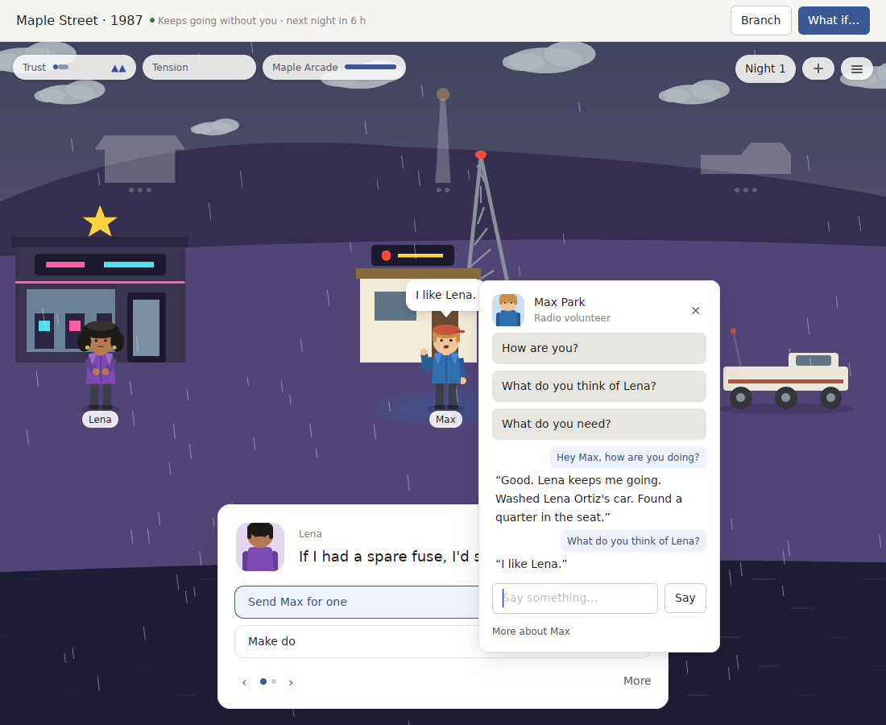
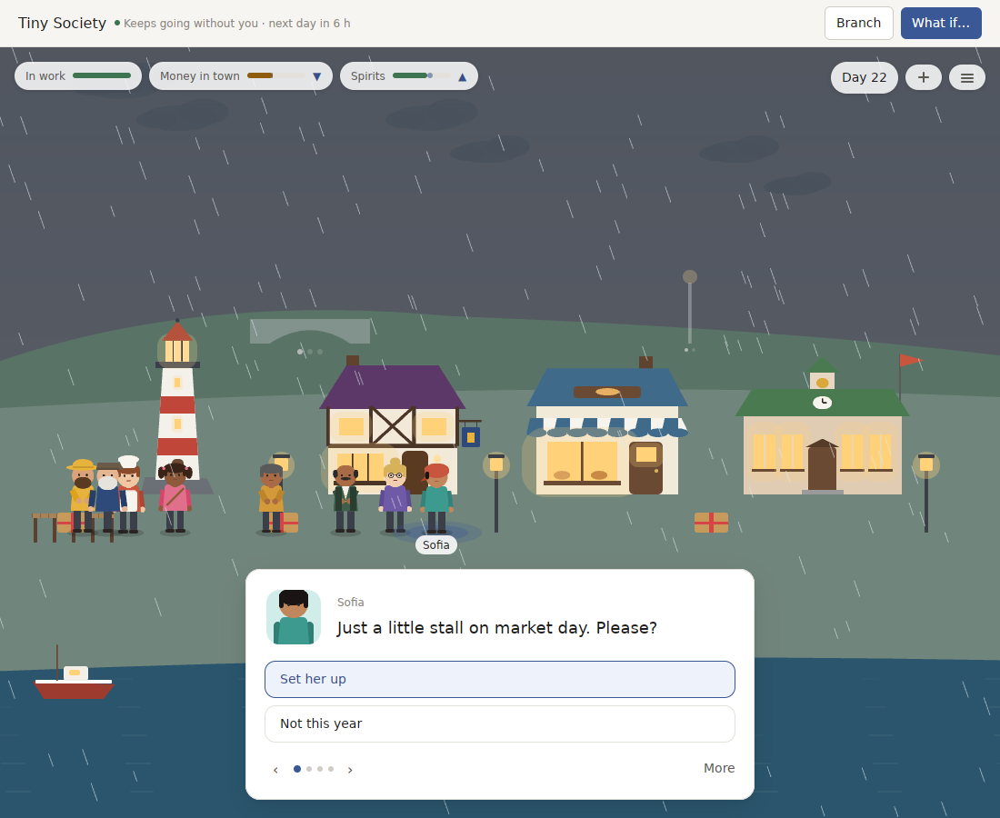

# v0.12.0 review: a world you cannot talk to

`v0.12.0` turned a deck of cards into a world: people with needs, traits and opinions of each other, situations that come from how they stand, and hands to build, plant and give. Measured over a year it never runs out. This review asks what stands between that world and the best products of its kind now that it is endless. The answer: you still cannot speak to it, its year has no shape, and it still looks like a diagram.

**Verdict:** the systems are there and the face is not. Three things decide whether a place like this feels alive to someone who opens it: whether they can talk to its people, whether its time has a rhythm they come back for, and whether it is a pleasure to look at. `v0.12.0` answers all three with "not yet". People have lives, but the player can only ask three fixed questions. The year is forty days, and its only calendar is market day and birthdays. Every building is one of seven generic painters and every person is the same body in a different shirt.

## Where v0.12.0 stands

| | Tiny Society | Pocket Universe |
| --- | --- | --- |
| What you can say to someone | three fixed questions | three fixed questions (two for newcomers) |
| A year | 40 days, four 10-day seasons | 40 periods, the same |
| What the calendar holds | market day every 10 days, regatta, harvest supper, winter coal, 8 birthdays | supply drop, launch window, 2 birthdays |
| How a place is drawn | lighthouse, shop and houses from the app's shared painters | domes, a tower, a bridge from the same painters |
| How a person is drawn | one body in their clothes, hair and skin colours, carrying a tool | the same; penguins are one bird |
| Light | the sky changes with the clock; nothing casts a shadow | the same |
| Camera | moves only during a return | the same |
| A year-old World's snapshot | 21 ms | 20 ms |

## Against the products that do it best

| What makes a living world top-tier | Best in class | World Machine v0.12.0 |
| --- | --- | --- |
| People you can talk to | *Animal Crossing* villagers, *Disco Elysium*, AI-native games (*Suck Up!*, Inworld demos) | Three fixed questions per person |
| A year worth coming back for | *Animal Crossing*, *Stardew Valley*: festivals every week, seasonal visitors, a harvest | Market day, birthdays, four storylets |
| A place drawn as itself | *Alba*, *A Short Hike*, *Townscaper* | Shared shapes; a lighthouse is the same tower everywhere |
| Light and a camera | Every one of them | A clock-coloured sky; a fixed view |

## v0.13: talk, a year, a face

The bar, checked by tests on the real Packs:

- **Talk.** Anyone living in a World can be spoken to in the player's own words. At least seven different kinds of question get seven different answers, drawn from the person's life, in both Packs and every seed. What is said can change how people feel, and each exchange is recorded, so a World replays without hearing anything again.
- **World voice speaks for people.** With the World voice on, a model answers for the person. It only proposes a meaning from the closed set and a reply, which the rules check.
- **A year with a shape.** Seasons a month long. Something on the calendar in every fortnight, and at least three festivals in every season. A harvest that depends on what was planted.
- **A face.** Every building a Pack's own drawing and every person drawn as themselves, in stances for standing, walking, working, talking and celebrating. Shadows from the sun, lit windows at night, and a camera that can move in.
- **Instant.** A snapshot of a year-old World in 10 ms at most, in a release build.

1. **Talking in your own words.**
   - A new System, `systems/conversation`, beside `lives`. It hears what the player types as one of sixteen meanings, from the words and the names in them: a greeting, how they are, how someone else is, what they think of someone, news, what they need, their work, a place, a compliment, thanks, comfort, an apology, rudeness, advice to make up with someone, goodbye, or not understood.
   - The person answers from their own life, in lines coloured by their traits.
   - The rules decide what words do:
     - kindness warms someone once a day;
     - rudeness is remembered until an apology;
     - talking eases loneliness;
     - advice to make up is taken only by someone who trusts the player and is on bad terms.
   - A `Listener` lets a Pack hear with a language model instead. The model is told how the person's life stands and what they would do if advised, and proposes a meaning and an answer. Anything unusable falls back to the System's own hearing.
   - The protocol gains a `say` intent and today's `exchanges`. The World window gains a text field in the person's card.
2. **A year with a shape.** A new System, `systems/calendar`. A Pack gives it an almanac: its year, its seasons and its festivals.
   - Days before a festival, people start getting ready. On the day it is held, and it goes grandly, fine or thinly depending on the place's spirits and what the player has put up.
   - Something goes up for the day, and people mix: the two who get on worst soften, or sour at a thin one.
   - A harvest counts what the player planted and grew.
   - Seasons grow to thirty days in both Packs.
3. **Drawings, light and a camera.**
   - The protocol gains drawings: flat shapes in a box, each filled with a fixed colour or a role (walls, roof, glass, clothes, hair, skin), with parts for a stance and parts that swing with a walk.
   - A person base in five stances is shared for Packs to dress.
   - Tiny Society draws its four buildings and eight residents. Pocket Universe draws each seed's places and people, and its penguins.
   - Shadows fall away from the sun, lit glass glows at night, and the camera moves in on whoever is being talked to and zooms with the wheel.
4. **Instant snapshots.** An index of which events touched each entity and relation, kept up to date as events are recorded, instead of re-reading the history on every snapshot. History is told from the latest 1,200 events.

## Progress

`v0.13.0` ships all four.

| The bar | Tiny Society | Pocket Universe |
| --- | --- | --- |
| Kinds of question, each answered differently from the person's life | 7 of 7 | 5 kinds, at least 4 different answers, for each of the pair in every seed |
| Meanings the conversation System hears | 16, in English and a few Chinese phrases | the same |
| What words can do | warm, hurt, apologise, ease loneliness, persuade two people to make up | the same |
| Days in a year | 120, four seasons of 30 | 120 |
| Days on the calendar | 15 festivals and arrivals, plus market day and birthdays | 13 for each seed, plus the supply drop and birthdays |
| Something on the calendar in every fortnight | yes | yes, in every seed |
| Festivals in each season | 3 or more | 3 or more |
| Planting changes the harvest | yes | yes, in every seed |
| Buildings drawn as themselves | lighthouse, bakery, school, pub | habitat, greenhouse, arcade, radio station, Icebridge, Fish Vault, council hall |
| People drawn as themselves | 8 residents and newcomers, in 5 stances | the pair in each seed, newcomers, penguins, in 5 stances |
| A snapshot of a 365-period World, release build | 9.1 ms | 8.7 ms |

These are checked by the tests below, next to the year-long, consequence and story-density tests from earlier releases, which still hold:

- `people_answer_what_you_say_in_your_own_words`, `people_answer_what_you_say_in_every_seed`
- `a_harbour_year_has_a_shape`, `every_place_has_a_year_with_a_shape`
- each Pack's drawing tests
- the conversation and calendar Systems' own tests, including what a model's proposal can and cannot change

- **Talking to Max.** The camera moves in on him, he gestures as he answers, and the conversation builds in his card.

  

- **The harbour at dusk.** The lighthouse, the timbered pub, the bakery's awning and the school's bell. The residents in their hats and aprons, and lit windows glowing.

  

Still to do: a commissioned artist's set to replace these first drawings, Home covers drawn with them, answers from World voice that do not hold up the window, and, as before, the two-week diary on a real Mac and the five signing secrets.
