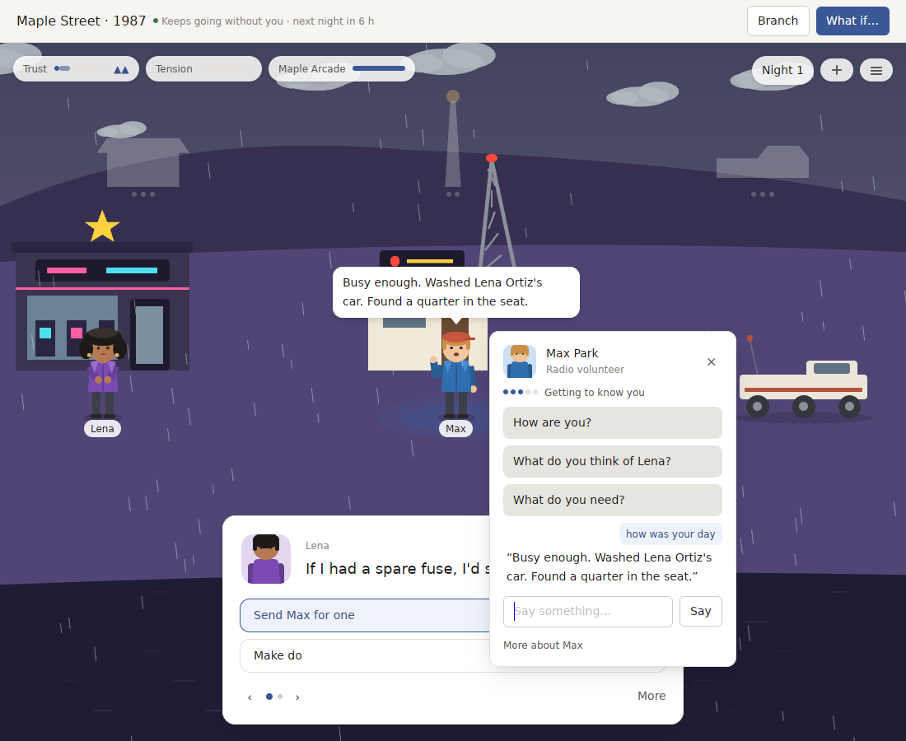

# v0.13.0 review: people who hear half and remember nothing

`v0.13.0` gave the World a voice, a year and a face. You can speak to anyone in your own words, the year has fifteen festivals, and the harbour and the settlements are drawn as themselves, with shadows from the sun. This review asks what now stands between it and the best products of its kind. The answer is depth: the people you talk to understand only half of what you say and remember none of it, the window freezes while World voice thinks, and the year says the same things every year.

**Verdict:** talking is real but shallow. A place like this is worth opening every day only if its people understand you and know you when you come back. `v0.13.0` fails both. Half of ordinary things a player types are not understood, a few are misheard, and nobody remembers a word of it the next day.

## Where v0.13.0 stands

Measured on the real Packs, deterministic hearing (no World voice):

| | Tiny Society | Pocket Universe |
| --- | --- | --- |
| Everyday phrases heard as some meaning, of a 60-phrase corpus | 32 of 60, 5 of them wrongly; 28 answered "I'm not sure what you mean" | the same System, the same result |
| Phrases misheard as something else | 5 of 60, for example "why are you angry at Leo" heard as *what do you think of Leo*, "want to get a drink later" as *what do you need*, "你觉得诺亚怎么样" as *how are you* (Chinese names are not matched) | |
| "How are you?" asked every day for 30 days | 30 different answers, but the same opening "Evan keeps me going" most days, once with "Evan is a gem." doubled | |
| What someone says about a third person | one line from the opinion band ("Leo? We get on.") | the same |
| What a person remembers of what the player said | whether they were hurt or warmed today, nothing else | the same |
| The player's standing with someone | a hidden number; nothing on screen | the same |
| A festival's words | three fixed lines by turnout, identical every year | the same |
| Answers with World voice on | the window waits for the model, up to 20 s | the same |
| Home covers and the things that go up for a festival | the app's generic shapes | the same |
| A snapshot of a 365-period World, release build | 9.1 ms | 8.7 ms |

Examples of the 28 not understood: "you look tired", "how was your day", "what have you been up to", "how's business", "who's your best friend", "love the bread", "I brought you flowers", any question about the weather or a festival, "tell me about yourself", family, "what worries you", "are you lonely", "you're annoying", "my bad".

## Against the products that do it best

| What makes a living world top-tier | Best in class | World Machine v0.13.0 |
| --- | --- | --- |
| People who understand you | AI-native games (*Suck Up!*, Inworld demos) understand nearly anything; *Disco Elysium* never offers a line it cannot answer | Half of everyday phrases are not understood without World voice |
| People who remember you | *Animal Crossing* villagers recall gifts, fights and moving day; *Stardew Valley* has visible hearts | Nobody recalls what you said yesterday; the bond is invisible |
| A voice that never stalls | Every one of them answers within a frame; AI games stream | The window freezes while the model thinks |
| A year that is new each year | *Stardew Valley* festivals change with who you know and what you did | The same three lines every year |

## v0.14: people who understand and remember you

The bar, checked by tests on the real Packs:

- **People understand you.** Of a fixed corpus of at least 150 everyday phrases in English and Chinese, at most 10% are not understood and none is misheard, in both Packs and every seed, without World voice.
- **People remember you.** Something said to a person can be recalled by them later, by what it was and when. The player's standing with each person is visible in their card and changes with what they are told and given.
- **The window never waits.** With World voice on, the answer is heard off the UI thread; the window keeps drawing and the reply arrives when it is ready, or falls back to the System's own hearing after a deadline.
- **A year that remembers itself.** A festival told in its second year is told differently from its first, from who came, what went up and what happened last time.

1. **Hearing far more.**
   - The conversation System's hearing learns more meanings: what someone has been doing, their day, their family, what worries them, the weather, a coming festival, a gift, "tell me about yourself", questions about two people ("why are you angry at Leo", "you and Leo should talk").
   - Names are matched in any language the Pack gives them, including Chinese names, and by first name and nickname.
   - What a person says about a third person comes from what happened between them, not a band.
   - The corpus test lives in `systems/conversation` and in each Pack, and reports every phrase it gets wrong.
2. **Memory and standing.**
   - Each exchange a person has with the player becomes something they know, with a meaning and a day, and they bring it up again ("You asked after Leo last week. We've made up since.").
   - The player's standing with a person is shown in their card, in words and a small mark, and moves with what they are told, what they are given and what is built for them.
   - Opening lines vary without repeating a clause within a day; a test asks every question for 30 days and fails on a repeated clause.
3. **A voice off the UI thread.**
   - The listener runs on a background task. The window shows the person thinking and stays responsive; the answer is proposed, checked and recorded when it arrives.
   - A deadline falls back to the System's own hearing, and a slow or failed model never blocks the clock.
4. **Festivals with memory, covers with faces.**
   - Festival lines are chosen from what happened at that festival last year and who is new since.
   - Home covers and the things that go up for a festival are drawn with each Pack's drawings.

## How we'll know

- `people_understand_everyday_phrases` in `systems/conversation`, and the same corpus run against each Pack in every seed.
- `people_remember_what_they_were_told` and `the_player_standing_is_shown_and_moves`.
- `no_clause_repeats_within_a_day` over 30 days of every question.
- A World-voice test with a listener that sleeps past the deadline: the window's frame is never held, and the System's own answer is recorded.
- As before, a snapshot of a year-old World in 10 ms at most, and the year-long, consequence and story-density tests still hold.

Out of scope by decision: Worlds saved by earlier releases. They are not carried forward, and a Pack version bump may still start a fresh World.

Still to do, and outside the code: the two-week diary on a real Mac (clicks, keys, sound), the five signing secrets that would allow notifications, and a commissioned artist's set to replace the first drawings.

## Progress

`v0.14.0` ships all four.

| The bar | Tiny Society | Pocket Universe |
| --- | --- | --- |
| Kinds of thing people hear | 28, up from 16 | 28, the same System |
| A fixed corpus of everyday phrases, English and Chinese | 428 phrases, none unheard, none misheard, spoken to three people | 428 phrases, none unheard, none misheard, in every seed |
| New phrasing, measured before it was tuned for | three sets: 27%, 25% and 45% not understood; 13%, 3% and 7% misheard | the same System |
| Names heard in Chinese | every resident and newcomer, and the four places | the pair, newcomers and places in every seed |
| What people remember | a month of what the player said, one thing brought up a day | the same |
| Standing with the player | shown in every card: five marks and a few words | the same |
| "How are you?" over 30 days | no opening on more than half of the days, no clause repeated within an answer | the same |
| World voice | asked off the window's thread; the World's own answer after 12 seconds | the same |
| A festival's second year | told against its first, in every festival that came round twice in a 365-day year | the same, in every seed |
| Festival fixtures drawn by the Pack | flag, bunting, lanterns, stall, tent | the same five in each seed's colours |

The corpus measures what the System was built to hear, and the bar of at most 10% not understood holds on it. Phrasing it has never seen is the honest measure. Each of the three sets was written before any change for it, and a quarter to nearly half of it went unheard, idioms most of all. Each set was then added to the corpus. Rules and word lists cannot keep up with open language: for a player who types freely, World voice is how people understand them, and it no longer costs a frozen window.

These are checked by the tests below, next to the year-long, consequence, story-density, talk and calendar tests from earlier releases, which still hold:

- `everyday_words_are_understood`, `people_understand_everyday_phrases`, `people_understand_everyday_phrases_in_every_seed`
- `people_remember_what_they_were_told`, `the_player_standing_is_shown_and_moves`
- `no_clause_repeats_within_an_answer_or_every_day`
- `a_model_that_takes_too_long_is_not_waited_for`, `an_app_can_ask_the_model_itself_and_the_world_still_decides`
- `a_festival_remembers_last_year`, and each Pack's year-long test checking festivals are told differently two years running

- **Asking Max about his day.** He answers from what he did, and his card shows where the player stands with him.

  

Still to do: a commissioned artist's set, drawings for what the player builds, trying World voice's deadline against a real model on a Mac, and, as before, the two-week diary on a real Mac and the five signing secrets.
