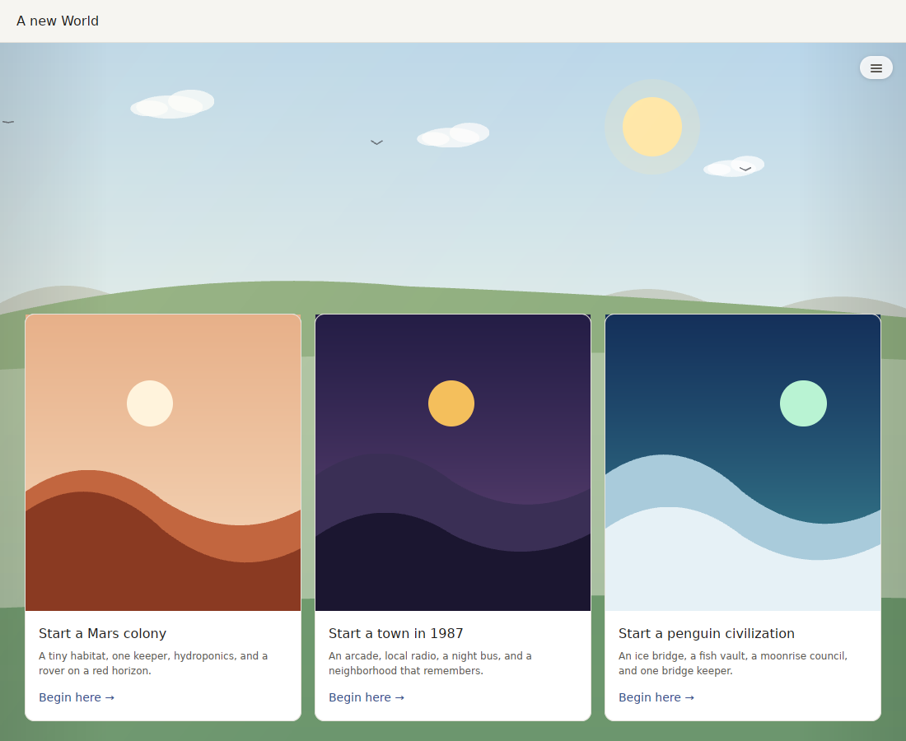
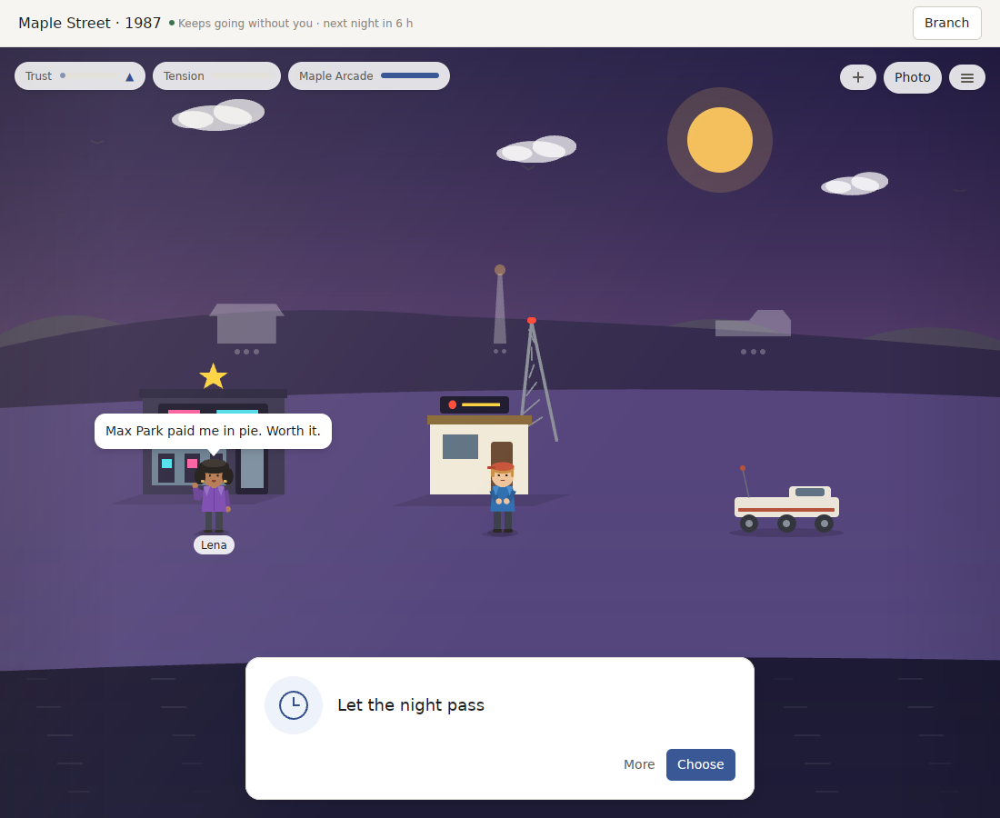
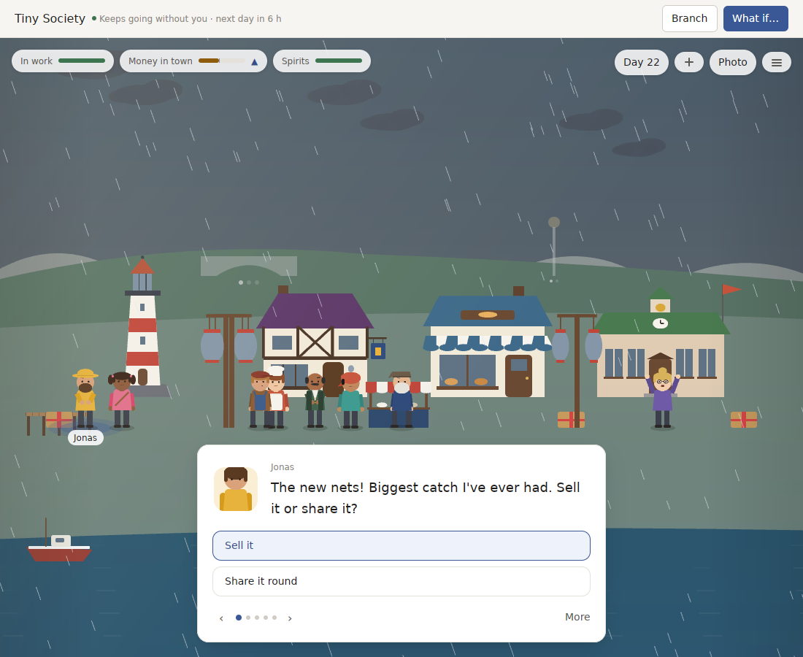

# v0.16.0 review: a craft release that a new player never meets

`v0.16.0` shipped both craft plans from the [v0.15 review](REVIEW_v0.15.md) at once. People have faces and outlines of their own, the scene moves at the display's rate, music follows the hour, and Tiny Society's core residents speak in voices of their own, in English or Chinese. This review plays the release the way a new player meets it, measures its first two months, and puts it beside the best products of its kind again. The screenshots come from the real app under `scripts/linux-preview.sh`. The numbers come from a scripted player on the release commit.

**Verdict:** the craft is real, but it is in the wrong place, and it does not last. A first launch opens Pocket Universe, which has two people, shared lines and no Chinese. Tiny Society is where nearly all of `v0.16`'s voices, scenes and translation went, and it sits under "More worlds". Once a player is in, more than half of the first month's days bring nothing new to find. Eight of the last ten releases have also thrown the player's World away. The leap now is from a demo that impresses in a screenshot to a product someone keeps: lead with the best World, give every day something new, never lose a save, and finish the surface to the standard of the best procedural games.

## What a new player sees

A first launch opens a new Pocket Universe World and asks which place to start. The three covers are abstract hills. The drawn scenes that Home shows once a player has Worlds (people, domes, a rover) never appear here, so the product's first picture is its plainest.

Picking the 1987 town opens a night street with two people and a choice to let the night pass. Lena's first line is "Max Park paid me in pie. Worth it." It names a Max Park who is not on the scene, on the World's first night. The lower third is empty ground. The two far buildings are grey boxes with three dots, and the gauges read "Trust" and "Tension".

Tiny Society, one click further away, is the product the release notes describe: a harbour, a lighthouse, a market, fourteen people with faces, rain, and a question in Jonas's own words. The card's portrait of Jonas does not match Jonas on the scene, though. On the scene he has a sou'wester and a beard; the portrait is a clean-shaven face with brown hair. The card draws people with the old generic figure (`Figure::of`), not the Pack outline the scene uses, and it shows no mood.

## Measured

A scripted player opened Tiny Society, answered the first open question each day, made something every third day, and let the day pass for 60 days (release build, the `v0.16.0` merge commit).

| Measure | Day 30 | Day 60 |
| --- | --- | --- |
| Days with nothing new to find (no book entry, keepsake or chapter) | 17 of 30 | 39 of 60 |
| Book entries found | 16 of 92 | 22 of 94 |
| Keepsakes | 1 | 1 |
| Chapters closed | 1 | 2 |
| Distinct lines heard | 383 | 798 |
| Distinct questions asked | 48 | 91 |
| Voice records carried in every snapshot | 209 | 513 |

The first 30 days brought new things on these days, one number per day: `1 1 0 5 1 0 1 0 0 1 0 1 0 0 0 1 0 0 0 0 1 0 0 0 1 0 2 0 1 1`. After the first week, four quiet days in a row are common. A player who only answers questions gets one keepsake in two months, because keepsakes come on returns and through friendships, and this player neither leaves nor talks.

Every snapshot carries every voice record the World has kept. That list grows from 14 on day 1 to 513 on day 60, and it is part of why a year-old snapshot takes 33 ms.

Of the ten releases from `v0.7.0` to `v0.16.0`, eight moved a Pack's version, and each of those made every earlier World of that Pack refuse to open.

## Scorecard

The bars come from the v0.15 review and from new research for this one; sources are listed at the end. **Gap** is an honest reading.

| Dimension | What the best do | World Machine v0.16.0 | Gap |
| --- | --- | --- | --- |
| **Simulation and memory** | Schedules, heart events, memory streams, a paced storyteller | Lives every period, memory of words and deeds, doors, a storyteller, deterministic replay | close; ahead in replay |
| **First launch** | Opens on the best thing the product has. Finch opens by hatching your pet; agency and a bond in the first minutes | Opens Pocket Universe with two people, shared lines and English only; the flagship is one menu away | far, and cheap to fix |
| **Daily novelty** | Something new every real day for the first 30 to 100 days; a dated event every one to two weeks (Cozy Grove, Animal Crossing) | 17 of the first 30 days bring nothing new to find; festivals come by the calendar | far |
| **Saves** | Never break a save. Stardew 1.6 rewrote item IDs and migrated every save; Animal Crossing keeps saves across every update | Eight of the last ten releases made every earlier World refuse to open | missing |
| **Visual finish** | Townscaper, Tiny Glade, A Short Hike: soft contact shading, edge treatment, a limited graded palette, depth fade, nothing unfinished on screen | Faces, outlines, parallax and a light grade; flat fills, no contact shading, everyone on one baseline, an empty foreground, grey placeholder buildings | far |
| **Characters on screen** | Stardew: small figures (about 12% of screen height) plus a large expressive portrait in every dialogue | Figures at about 9% of the scene, which is the norm; the dialogue portrait is a different drawing with no mood | close in size; the portrait is wrong |
| **Writing and voices** | 150+ lines and 5+ scenes per core resident; Animal Crossing writes per personality type | Tiny Society's eight core residents meet this bar; everyone else, and all of Pocket Universe, shares lines by trait | close in Tiny Society, far in Pocket Universe |
| **Music** | Composed material arranged by rules (No Man's Sky's Pulse, Spore); motifs tied to places and things (Proteus) | Three synthesised layers by hour and weather; no motif, no phrase, nothing that belongs to a place or a person | far |
| **Language** | Complete localisation of every screen | Tiny Society and the app at 97%; Pocket Universe, the World a new player meets first, in English | far where it matters most |
| **Player presence** | In watch-a-world games (Travel Frog, Neko Atsume) the player is a caretaker; the world writes back with postcards and souvenirs | The player's deeds are acknowledged; nobody writes to the player while they are away | far |
| **Platform** | Notarized, updates, zero energy impact when idle, under one idle wake-up a second, first frame within 400 ms | Ad-hoc signed; never timed on a Mac | missing; needs an Apple account and Macs |

## v0.17: a World you keep

A release that turns the showcase into a product a player keeps. It has six parts, each with a tested bar. Everything is still made by the program; nothing waits on an artist, a composer or a writer.

1. **Lead with the best World.**
   - A first launch opens Tiny Society.
   - Every place on the first-run chooser shows its drawn scene, never abstract hills.
   - No first-day line may name someone the player has not met.
   - Tested: the first-run World is Tiny Society, and no line in its first three days names someone absent from the scene.
2. **Something new every day.**
   - A daily director guarantees at least one new thing on each of the first 30 days, for a player who only answers questions. It draws from what the World can offer that day: a book entry, a keepsake, a newcomer, a visitor, a letter.
   - A dated event lands every 7 to 14 days.
   - While the player is away, people write to them: at most one letter or postcard a day, addressed to "you", sometimes with a keepsake.
   - Tested in both Packs: zero quiet days in the first 30, and at least one keepsake a week for the answer-only player.
3. **Never lose a World.**
   - A World made by `v0.16.0` opens in `v0.17`, and from then on no release may break an earlier World.
   - Carrying a World forward replays the player's own recorded choices under the new rules from the same start. The earlier history stays readable in the file as a closed chapter.
   - Tested: a fixture World from each Pack, saved by the previous release, opens and plays on. CI keeps the previous release's fixtures, and a test fails the build if they stop opening.
4. **Finish the surface.**
   - Soft contact shadows and ambient shading under every person, building and thing.
   - An edge treatment for readability, a graded palette per hour, and depth fade.
   - People stand at different depths on the ground rather than on one line.
   - A foreground with paths, plants and props, so no third of the screen is empty.
   - Unbuilt places drawn as a sketch of what will stand there, not a grey box.
   - Dialogue portraits drawn from the same outline as the scene, with the person's mood and a talking mouth.
   - Tested: the portrait and the scene figure come from the same outline; every hour's grade differs; no canvas region larger than a quarter of the scene is empty.
5. **Music with memory.**
   - Each World has motifs of its own, derived from its palette and name, arranged in phrases (statement, answer, return) over the existing layers.
   - Each core resident has a short motif heard when they speak to the player.
   - Festivals have a theme.
   - Tested: motifs differ between Worlds and between people, phrases recur within a loop, and a festival day sounds unlike any other.
6. **Pocket Universe at parity.**
   - Each place's core cast gets a style sheet and 150 lines of their own, with five scenes each.
   - Pocket Universe is shown in Chinese, at the same 95% bar as Tiny Society.
   - Snapshots stop carrying every voice ever kept: only today's and the latest few per person, so a year-old snapshot is back under 20 ms.

**Out of scope for this release:** new Packs, multiplayer, and anything needing the Apple account (notarization, notifications, updates). Those still wait on the five signing secrets in [RELEASE_SIGNING.md](RELEASE_SIGNING.md).

## How we'll know

- The first-run World is Tiny Society, its chooser draws scenes, and no first-day line names an absent person.
- The same scripted 60-day player as above, in both Packs, shows no quiet day in the first 30, at least four keepsakes in 30 days, and a dated event every 14 days or sooner.
- A `v0.16.0` fixture World from each Pack opens and plays a further 30 days, and CI keeps that fixture green from now on.
- Portraits come from the scene outline; contact shading, grade and depth are checked on contact sheets and by the region test.
- Motif and phrase tests pass for every World and core resident.
- Pocket Universe has 150+ lines per core resident and reaches 95% Chinese. A year-old snapshot is under 20 ms.
- Every earlier bar still holds, and replay stays deterministic.

## Sources

- **Content cadence:**
  - Cozy Grove, a 100+ day story with a daily reset: [Spry Fox support](https://support.spryfox.com/hc/en-us/articles/1500005307201).
  - Animal Crossing's monthly events: [GamesRadar](https://www.gamesradar.com/upcoming-animal-crossing-new-horizons-events/).
  - Stardew heart events at 2, 4, 6, 8 and 10 hearts: [heart events guide](https://www.switchbladegaming.com/stardew-valley/heart-events-guide/).
- **Saves:**
  - Stardew 1.6 kept every save: [PC Gamer](https://www.pcgamer.com/games/life-sim/all-you-save-files-will-be-fully-intact-eric-barone-confirms-that-stardew-valleys-16-update-isnt-out-to-delete-your-progress/).
  - Animal Crossing keeps save data across updates: [Nintendo support](https://en-americas-support.nintendo.com/app/answers/detail/a_id/49112).
- **Procedural art:**
  - Tiny Glade's lighting: [Digital Foundry](https://www.youtube.com/watch?v=cvswAg5Lrtw).
  - Townscaper: [Organic Towns from Square Tiles](https://www.youtube.com/watch?v=1hqt8JkYRdI).
  - A Short Hike: [interview](https://nintendoeverything.com/interview-a-short-hike-dev-on-bringing-the-game-to-switch-inspiration-art-style-possibility-of-a-sequel-more/).
- **Characters:**
  - Stardew's 16×32 figures and 64×64 portraits: [Stardew forums](https://forums.stardewvalley.net/threads/sprite-size-first-time-modding-sv.7128/). The 12% of screen height is our own reckoning at 1080p.
- **Music:**
  - No Man's Sky's Pulse: [GDC](https://www.gdcvault.com/play/1024067/The-Sound-of-No-Man).
  - Proteus: [Game Developer](https://www.gamedeveloper.com/audio/the-sound-and-music-of-proteus---an-academic-case-study).
- **Player presence:**
  - Travel Frog: [Quartz](https://qz.com/1198149/japans-hit-mobile-game-travel-frog-is-teaching-a-philosophical-lesson-about-letting-go).
- **Platform:**
  - Apple's [Energy Efficiency Guide for Mac Apps](https://developer.apple.com/library/archive/documentation/Performance/Conceptual/power_efficiency_guidelines_osx/Timers.html).
  - First frame within 400 ms: [WWDC19](https://developer.apple.com/videos/play/wwdc2019/423/).

Some of these figures came from search summaries rather than the pages themselves (the fetches were blocked). They are bars to aim at, not measurements of those games.
