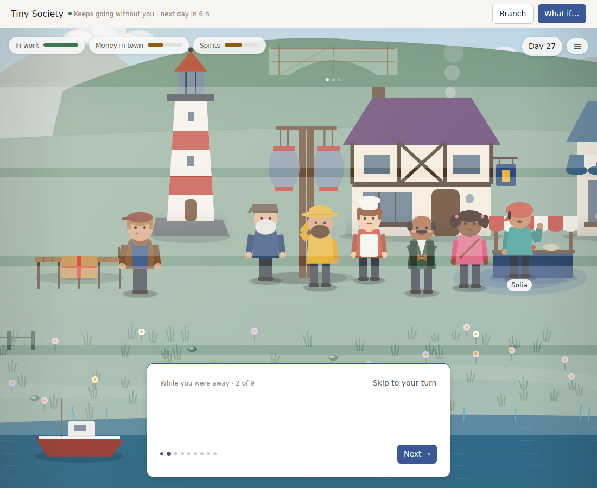

# v0.17.0 review: a good first month, then the same year again

`v0.17.0` fixed the first month. A new player starts in the harbour, meets someone or gets a letter every day, and every World saved by `v0.16.0` carried forward. This review plays far past that: sixteen months in each Pack. It then asks what the best products in the category do that World Machine does not, now that keeping old Worlds and old content working is no longer a constraint.

**Verdict:** the World runs out of purpose long before it runs out of days.
- Everything it is building towards is finished by day 90.
- After that, a keepsake arrives almost every day for a year, so none of them mean much.
- Half the collection book is out of reach for a player who answers questions and builds.
- Pocket Universe asks the same two leftover questions from its earliest design on 188 of 480 days.

Meanwhile the app still carries its engine-demo past: Branch and What if on every World, strategy and lineage windows, two test Packs, and 13 packages nothing in the product uses. The next leap is:
- cut down to one product;
- give it a second year;
- let it live on the desktop, where games of this kind now live.

## Measured

A scripted player answered the first question each day, made something every third day, and let the day pass: 480 days in Tiny Society and in Pocket Universe's Maple Street (release build).

| At day | 30 | 90 | 180 | 365 | 480 |
| --- | --- | --- | --- | --- | --- |
| Tiny Society: book found | 31 of 101 | 45 of 106 | 53 of 108 | 56 of 108 | 56 of 108 |
| Tiny Society: keepsakes | 21 | 77 | 165 | 350 | 465 |
| Tiny Society: goals finished | 1 of 2 | 2 of 2 | 2 of 2 | 2 of 2 | 2 of 2 |
| Maple Street: book found | 16 of 69 | 35 of 75 | 39 of 76 | 39 of 76 | 39 of 76 |
| Maple Street: keepsakes | 27 | 83 | 172 | 357 | 472 |
| Maple Street: goals finished | 0 of 3 | 3 of 3 | 3 of 3 | 3 of 3 | 3 of 3 |

- **Goals:** in both Packs every goal is finished by day 90. For the rest of the year there is nothing to work towards.
- **Keepsakes:** after the first month a keepsake comes almost every day, about 350 a year, nearly all of them letters. In `v0.16.0` a player got one in two months; now a keepsake is a daily receipt.
- **The book:** it stalls at 52% (Tiny Society) and 51% (Maple Street) found, and stops moving after month six. The rest needs friendships and moments this player never reaches, and nothing tells them how.
- **Repetition:** the share of lines heard that the player had not heard before falls, month by month, from 75% to 45% in Tiny Society and from 64% to 33% on Maple Street.
  - Tiny Society asks "The bakery's shut. How do I open again?" 50 times.
  - Maple Street asks "Maple Arcade can't take much more." and "Who carries this on after us?" on 188 days each. Both come from Pocket Universe's first design (pressure and succession), which still runs under the new systems.
- **Quiet days** come back after the first month in Tiny Society: 5 in every 60 days. Maple Street has none.

A return to Tiny Society (above, from the real app under the Linux preview) shows two new faults.
- **The film card:** it says "While you were away · 2 of 9" with nothing under it. This may be the screenshot catching it between beats, which needs checking.
- **Bands across the scene:** while the camera is zoomed in, translucent horizontal bands cross the whole scene. The haze and foreground layers from `v0.17.0` are drawn for the unzoomed stage.

Branch and What if still sit at the top of every World. They are tools from when World Machine was an engine for comparing futures, not part of a cozy game.

## What the product carries that it does not use

- The workspace has 53 packages. 13 of them are reachable from nothing a player runs:
  - three demonstration desktop apps: strategy comparison, lineage explorer, Tiny Society's own window;
  - the future-archaeologist desktop app;
  - Micro Company and its Pack;
  - the query, CLI, investigation and agent-tool crates.
- Of the 40 the app does reach, the strategy, lineage and comparison crates exist to serve Branch and What if.
- Future Archaeologist and Micro Company are hidden from Home, but still ship.
- Pocket Universe is 23,000 lines, the biggest crate in the tree. Its first design (gauges called Trust and Tension, an era, pressure, succession and legacy) runs underneath the lives, storylets and hands systems that now tell its story. It surfaces as the repeated questions above and as gauges a player cannot act on.

## Learning from the best

| What the best do | Who | World Machine v0.17.0 |
| --- | --- | --- |
| **Live on the desktop.** A strip along a screen edge, always on top if you like, on any display. Low CPU is the review-killer. | Rusty's Retirement: 97% of 6,590 reviews positive, 550k sold. Tiny Pasture, Ropuka's Idle Island, Spirit City | A World is a window you open. Nothing lives at the edge of your screen. |
| **A second year.** A mastery or perfection layer with ways to skip the grind. Hosting guests. Characters and places that change over years. | Stardew 1.6 (Mastery, Perfection, waivers), ACNH 3.0 (a hotel to decorate for guests), Cozy Grove (a steady cadence of content) | Goals done by day 90. The second year is the first year again. |
| **Few verbs, each meaningful.** Shape the world indirectly and let it respond. | Townscaper (one verb), Unpacking (one verb set, 1,000 items), The Sims (autonomy plus steering) | Answer, build or plant, give, invite, talk. No way to start something the town then does. |
| **Share a World.** A code or link to a snapshot visitors cannot spoil. A photo mode. Kind notes between players. | ACNH Dream Address, Townscaper's town-as-text, Tiny Glade's photo mode, Kind Words | Photo saves a screenshot. Nothing can be shared as a World or a postcard. |
| **Local, typed AI characters.** First text within about a second. Output is a typed intent that a rule checks, never trusted text. | Apple Foundation Models on macOS 26 (guided generation into your own types), inZOI (an offline 0.5B model). Where Winds Meet shows what happens when chat can complete quests. | World voice needs a model you configure yourself. Its answer is already only a proposal, which is the right design. |

## v0.18: one product, a second year, on your desktop

Compatibility with earlier versions and content is out of scope by decision. Worlds from `v0.17.0` will not open in `v0.18.0`, and anything the product does not use is removed. Everything is still made by the program.

1. **Cut down to one product.**
   - Remove the demonstration apps and Packs, and the crates nothing in the app uses. Remove Branch, What if and their comparison machinery from the World window.
   - Remove the carry-forward machinery, its fixtures and its release rule.
   - Remove Pocket Universe's first design (gauges, era, pressure, succession, legacy) and leave its story to the systems both Packs share.
   - Tested:
     - the workspace builds with no package the app, its Packs or their tests do not use;
     - no gauge is shown that no choice or deed can move;
     - no question is asked more than six times in a year.
2. **A second year.**
   - Each Pack has a ladder of works to build towards, at least eight a year, with one always in progress.
   - The second year is different from the first:
     - children grow up;
     - a shop changes hands;
     - newcomers settle;
     - one festival is new, chosen by what the town did in its first year.
   - Keepsakes become rare again, no more than three a week. Letters go into a letter box of their own and no longer count as keepsakes.
   - Every book entry can be found within a year by a player who plays warmly, and each silhouette says how.
   - Tested with the 480-day player:
     - never a day without something to work towards;
     - at least 90% of the book reachable by the warm player;
     - no more than three keepsakes in any week;
     - the second year's new-line share at least 60%.
3. **Live on your desktop.**
   - A strip mode: any World as a band along the bottom (or top) of the screen, on any display, always on top if you like. Residents walk its length and the day's letter arrives in it. Double-click opens the full window.
   - The strip draws only while something moves: under 15 frames a second when it does, and none when nothing does.
   - Tested: the strip's frame budget and its idle stillness, in the same benchmark as the window. CPU and energy are measured on a Mac.
4. **Two verbs that start things.**
   - **Suggest:** propose a picnic, a market or a dance. The town decides who comes, how it goes and what it leaves behind, through the same Actions as everything else.
   - **Host:** a resident of another of your Worlds visits, brings a letter and leaves a keepsake. The visit goes through validated Actions in the host World, never shared state.
   - Tested: a suggestion's outcome follows from the people and the weather, and replays the same; a visitor never writes to the World it came from.
5. **Share a World.**
   - **Postcards:** a moment rendered as a card with a caption in a resident's voice, saved as an image.
   - **World codes:** a World's start and history in a short file or text that anyone can open as a visit, read-only, which cannot change the original.
   - Tested: a code reopens as the same World, event for event; a visit writes nothing back.
6. **Fix what the return shows.**
   - Every beat of the return film has words.
   - Nothing drawn for the unzoomed stage (haze, foreground, rims) shows as bands when the camera zooms in.
   - Tested on screenshots and by a beat-text test.

**Not in this release:** a local model for World voice, on Apple Foundation Models or a small MLX model. It is the right direction: typed intents fit the Action-Event rule. But it can only be built and judged on a Mac with Apple Intelligence, and it does not work on mainland-China accounts. Signing, notarization and notifications still wait on the Apple account.

## Sources

- **Desktop games:**
  - [Rusty's Retirement on Steam](https://store.steampowered.com/app/2666510/Rustys_Retirement/) and its [sales](https://www.pcgamesn.com/rustys-retirement/high-sales).
  - Rusty's [strip settings](https://steamcommunity.com/app/2666510/discussions/0/596262211620461398/) and [CPU complaints](https://steamcommunity.com/app/2666510/discussions/0/4357871935586195192/).
  - [Tiny Pasture](https://store.steampowered.com/app/3167550/Tiny_Pasture/), [Ropuka's Idle Island](https://store.steampowered.com/app/3416070/Ropukas_Idle_Island/), [Spirit City](https://store.steampowered.com/app/2113850/Spirit_City_Lofi_Sessions/).
- **Verbs:**
  - [Townscaper](https://www.pcgamer.com/townscapers-developer-on-how-its-radically-casual-design-is-inspiring-a-new-wave-of-low-stress-builders-to-adapt-the-blueprint/).
  - [Unpacking at GDC](https://www.gamedeveloper.com/gdc2022/gdc-2022-unpacking-a-narrative-through-1-000-household-items).
  - [The Sims' autonomy](https://gmtk.substack.com/p/the-genius-ai-behind-the-sims).
- **Second year:**
  - [Stardew 1.6 changelog](https://www.stardewvalley.net/stardew-valley-1-6-update-full-changelog/).
  - [ACNH 3.0](https://nookipedia.com/wiki/Animal_Crossing:_New_Horizons/Update_history/3.0).
  - [ACNH retention study](https://dl.acm.org/doi/fullHtml/10.1145/3450337.3483483).
- **Sharing:**
  - [Dream Address](https://nookipedia.com/wiki/Dream).
  - [Townscaper towns as text](https://steamcommunity.com/app/1291340/discussions/0/2969524734458386243/).
  - [Kind Words](https://www.pcgamer.com/kind-words-is-a-sweet-game-about-supporting-strangers/).
- **AI characters:**
  - [Apple Foundation Models](https://developer.apple.com/videos/play/wwdc2025/286/) and [where they are available](https://support.apple.com/en-by/121115).
  - [inZOI's offline model](https://www.nvidia.com/en-us/geforce/news/nvidia-ace-naraka-bladepoint-inzoi-launch-this-month/).
  - [Where Winds Meet NPC exploits](https://kotaku.com/where-winds-meet-ai-npc-llm-chatgpt-steam-2000650074).
  - [Generative Agents](https://dl.acm.org/doi/fullHtml/10.1145/3586183.3606763).
