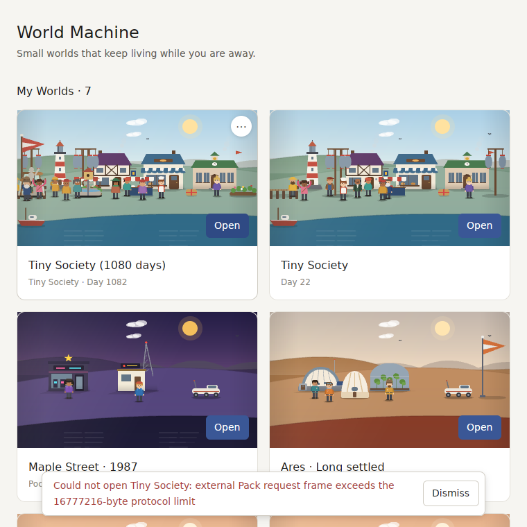
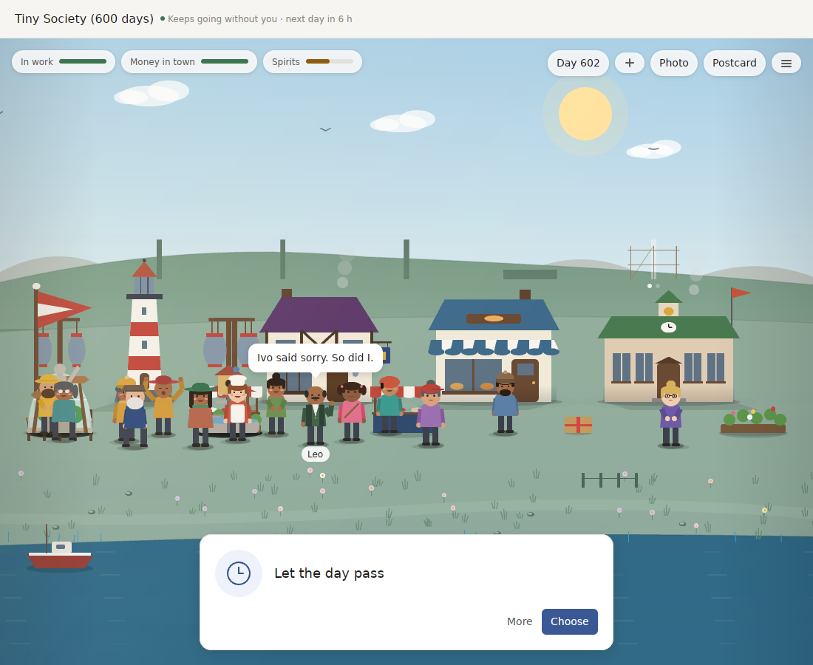

# Review of v0.19: what stands between World Machine and 1.0

`v0.19.0` kept a World going for three years in the tests. This review looks at it the way a player would meet it:
- a World that has been kept for months;
- someone who has just downloaded it;
- someone who answers differently from the scripted player;
- someone deciding whether to buy it.

It then sets out the next major version, **1.0**, as concrete work, bars and decisions.

Measured on 2026-09-29 at `f568d46` (release builds, a 4-core Linux machine with ±15% noise; the app itself in the Linux preview). **M** is measured, **I** is inferred from code or other numbers. The raw logs, probe crate and scripts are kept outside the repository; the numbers here are the ones that matter.

## First: a long-kept World stops opening (M)

A 1,080-day Tiny Society World fails on **Open** in the real app: *"external Pack request frame exceeds the 16777216-byte protocol limit"*.

The app runs the included Packs as separate processes, and they win over the built-in copies. Opening a World sends the Pack its whole history as tagged JSON in one message, capped at 16 MiB. The compact, compressed form of `v0.19` is only used for the file on disk.

| World | Day 360 | Day 540 | Day 600 | First over 16 MiB | Day 1,080 |
|---|---|---|---|---|---|
| Tiny Society, open message | 9.1 MB | 14.2 MB | 15.9 MB | **day 660** | 29.6 MB |
| Maple Street, open message | 5.6 MB | — | — | **day 1,020** | 18.2 MB |

- **When a player hits it (I):** a World advances four days for every real day, so Tiny Society stops opening after about **five months of real use**. A save asks for the same history back, so saving probably fails at the same point; this was not exercised.
- **Why the tests missed it:** every three-year test used the in-process Packs, so no test crossed the process boundary with a long World.

**This needs a `v0.19.1` before anything else** (see the plan below).

## Measured

### The volume holds; the variety runs out (M)

A scripted player answered the first answer to every question and made something every third day. Per 30 days after day 60:
- **Tiny Society:** they noticed 50–60 things.
- **Pocket Universe:** 45–55.
- **Every month after day 90 has the same beat:** 8–9 letters, 5 keepsakes, 20–22 firsts and 3–6 festivals.

What falls is how much of it is a new *kind* of thing (the text with names and numbers blanked out):

| New kinds per 30 days | Days 1–30 | Day 360 | Year three |
|---|---|---|---|
| Tiny Society | 65 | 9 | 2–7 |
| Maple Street | — | — | 1–4 after day 500 |

Three further findings:
- **The same few lines and questions repeat.**
  - The most repeated line is "The light down by Harbor makes you want to stay." (116 times; 43 in year three). Maple Street's equivalent is said 177 times.
  - The eight most asked questions everywhere are one storylet, learning from someone, under different names.
  - Year three's works are all "Flowers round…" or "Lamps and bunting on…" earlier works. One reads "Flowers round the flowers along the quay".
- **Pocket Universe goes stale.** New lines per 120 days fall to 32–35% by days 961–1,080 in all three places.
  - The shipped 60% bar covered only its second year (days 121–240, 71–72% measured).
  - Its year turns stop after day 480. Tiny Society holds at 56–57%.
- **The three Pocket Universe places are one skeleton.** Maple Street, Ares and Icebridge each end with exactly 39 works, 766 firsts and 306 letters, with year turns on the same days. Only the words differ.

### Only saying yes builds anything (M)

Four scripted players over three years of Tiny Society:

| Player | Works finished | Couples | Money in town | Mean opinion between residents | Arrived / left |
|---|---|---|---|---|---|
| Takes the first answer | 50 | 12 | ~31,000 | 20.6 | 11 / 5 |
| Takes the last answer (usually "not now") | 0 | 0 | ~2,220 | −2.4 | 11 / 5 |
| Never answers, only makes things | 0 | 0 | — | — | 11 / 5 |
| Absent | 0 | 0 | — | — | 11 / 5 |

- **Only yes-players see works or couples.** A player who defers or ignores the questions gets a stalled, poorer, colder town.
- **The world ignores refusal.** Refusing or ignoring opens nothing of its own: arrivals and departures are the same for every policy, and letters are 303–304 for all of them.
- **Days with no call for the player.** After day 60, a question waits on only 12–30 of every 30 days in Tiny Society, and on 7–12 of 30 in Maple Street's third year.
- **21% of Tiny Society's questions have only one answer**, including 68 birthday cards.

### The first minute is weaker than its test says (M)

- **The test's greeting is a dismissal.** The first-minute test's "greeting within 20 seconds" at 9.6 s is Mara saying "I'm sorry, Jonas. I can't keep you."; the test only looks for "I'm ".
  - The real greeting ("Oh, a new face! I'm Leo…") is recorded but is not among the lines people say when the window opens.
- **Nothing is asked at first.** A new World opens with no question.
- **The first briefing makes no sense.** It says "Life happened while you were away" to someone who has never been there.
- **Timings:** first choice at 23.9 s, first keepsake at 32 s. The first question only comes after a deed.
- **Most of the app is hidden.**
  - There are no tooltips. The hands (+) and drawer (≡) are icons named only for screen readers.
  - Zoom is scroll-wheel only, turning a card is Space only, and the strip, guests and World codes are menu-only.
  - Of about 12 things to do in the first week, a newcomer would likely find about 6 (I).

### Engineering (M)

- **Size:** 81.8k lines of Rust plus 31.4k of tests.
  - Tiny Society 14.5k, world-gpui 13.2k, systems 12.6k, Pocket Universe 12.1k, desktop 9.0k, kernel 8.1k.
  - 822 tests, 17 ignored (including the four 1,080-day ones). No TODOs in the code.
- **CI does not test the interface.**
  - world-gpui's 70 tests never run in CI: Linux excludes the crate and macOS only compiles it.
  - Clippy never runs on world-gpui or the desktop app.
  - The macOS job's path filter leaves out `systems/**`, so a change to lives or storylets alone never builds the app on a Mac.
- **Performance at three years (release):**
  - snapshot median 11.7–12.7 ms in the shipped benchmark (16–18 ms back to back in a separate probe), and already about 10 ms at day 30;
  - **opening from a click 300–360 ms**, of which reading the 2.1 MB file is 242–366 ms;
  - saving 94–116 ms;
  - about 176 MB of memory for a loaded World, before GPUI and the Pack process's own copy.
- **Docs have drifted from the code:**
  - `KNOWN_ISSUES.md` says a World catches up at most seven periods; the code caps it at 28.
  - It gives about 80 ms to open from a checkpoint; a click measures 300–360 ms.
  - 15 entries say "untried on a Mac".

## Learning from the best

- **A 1.0 keeps old saves.**
  - RimWorld 1.0 was mostly the last beta plus fixes, and opened its saves.
  - World Machine broke Worlds in `v0.18` and `v0.19`.
  - The rule `v0.17` had (every Event holds what it changed, so a new version can carry an old World forward) should come back as a promise: **every release from 1.0 on opens every 1.0+ World.**
- **The strip puts World Machine in a genre that sells, on Steam.**
  - Rusty's Retirement: 550k sold by July 2025 at $7.
  - Tiny Pasture: 200k sold, 92% positive.
  - Cast n Chill: more than 550k sold, Windows and macOS.
  - Presence alone does not keep people: Desktop Mate fell 86% from its peak, with mixed reviews. The winners pair a quiet presence with a small, visible thing to collect or grow.
- **Tiny Glade is the closest model.**
  - Rust, everything procedural, two people.
  - 616k sold in under a month at $15, 97% positive, and an Apple-silicon Mac port in May 2026.
  - Procedural art reaches the top of the genre when it has one strong look.
- **Players distrust generative AI; the World keeping the last word is the answer.**
  - A 2025 survey of 1,799 players found 85% negative about generative AI in games.
  - Where Winds Meet's LLM characters could be talked into giving up loot.
  - World Machine's rule is that a model's words are never the World's truth. That rule and plain wording ("made by the program", not "generated") are what to say on a store page.
- **Notarization is the first wall.**
  - Since macOS 15, Control-click → Open no longer gets past Gatekeeper, and Steam requires notarized Mac builds.
  - The pipeline is ready and waits on an Apple Developer membership ($99 a year).
- **Apple's own model is free.**
  - On macOS 27, `fm` ships with every Mac.
  - Apple's larger model on Private Cloud Compute needs no key and is free up to 2 million first-time downloads, but only through Swift.
  - A small Swift helper would reach it, give typed refusals, and support macOS 26. Its first run may ask to accept terms in a terminal (unverified), which the app's check must notice.
- **A cloud voice cannot be bundled into a one-off price.** At about $0.003 an exchange, 20 a day is roughly $1.80 per player per month, so a Claude voice stays bring-your-own-key.
- **Updates and stores:**
  - Direct download plus Sparkle 2 (signed appcasts) and Steam suit an app like this.
  - The Mac App Store needs the sandbox. Installable Pack programs likely clash with its rules, and Worlds would move into the container; that is for later, if at all.
  - Widgets, App Intents and Shortcuts need Swift extensions and a Team ID, so they come after Developer ID.
- **Testing without telemetry:**
  - watched think-aloud first hours;
  - Steam Playtest;
  - a two-week diary study.
  - World Machine has its own advantage: a tester can send their World file or code, and replay shows exactly what happened, with no analytics.
- **Chinese matters.** Simplified Chinese passed English as Steam's top language, so a native speaker's pass over the generated catalogs is cheap insurance.

## The plan

### `v0.19.1` (now): long Worlds open again

- **Open and save in the compact form.** The Pack protocol carries the compact encoding (and the season's checkpoint with only the events since), compressed, for open and for the archive a save asks back.
  - Frames are streamed or chunked rather than one 16 MiB message.
  - A Pack that speaks the old protocol still opens a World that fits.
- **A test that crosses the process boundary.** A three-year World from each Pack opens, plays a day, saves and reopens through the real Pack process. So does the fixture of a `v0.19.0` World saved at day 900.
- **Fix what the measurement found cheaply:**
  - the first-minute test checks for the real greeting;
  - CI runs world-gpui's tests and clippy on world-gpui and the desktop app;
  - the macOS path filter includes `systems/**`;
  - `KNOWN_ISSUES.md` says 28 periods and 300–360 ms.

### 1.0: a World you keep, made to be found, on a real Mac

Each item names its bar. The measured value today is in brackets.

1. **Never lose a World again.**
   - The World format and Pack protocol are frozen at 1.0; later changes only add.
   - Each release carries forward every earlier 1.0+ World, and CI opens fixtures saved by every release since 1.0.
   - Opening from a click takes under 150 ms at three years [300–360 ms].
   - A three-year World uses under 100 MB in memory [176 MB].
2. **Your choices make the town.**
   - Deferring, refusing and ignoring each lead somewhere of their own: a quieter town finishes smaller works its own way, people move away when nobody helps them, and a different set of friendships forms.
   - Arrivals and departures depend on the player [identical for every policy].
   - A player who never says yes still finishes at least 10 works in three years [0].
   - Every question has at least two answers that change something [21% have one].
   - Bar: the four scripted players' towns differ at day 1,080 on works, people, money and friendships, and a test holds each difference.
3. **Something new all three years.**
   - At least 10 new kinds of thing in every 30 days to day 1,080 in both Packs [2–7 in year three].
   - No line more than 20 times a year [116].
   - No question template among more than a quarter of what is asked [one storylet leads everywhere].
   - Year three's works are new works, not another coat on old ones.
   - Pocket Universe's places diverge:
     - their own ladders, turns and pace;
     - year turns that go on past day 480;
     - at least 55% new lines in every 120 days to day 1,080 [32–35%].
4. **A first hour a stranger can find.**
   - A new World opens with Leo's greeting and a first question, and never says "while you were away".
   - Every icon has a visible name on hover.
   - One gentle pointer at a time: the hands, the drawer, zoom and the strip, each shown once until used.
   - Bar: of the 12 things to do in the first week, at least 10 are found without help by five think-aloud testers [about 6 estimated].
5. **On a real Mac.**
   - Developer ID, notarization and Sparkle 2 updates, from the pipeline that already exists.
   - The 15 "untried on a Mac" entries each tried and either fixed or kept with what was seen.
   - `fm` checked for the terms prompt.
   - Notifications when a World has something for you, which may already work with a signed bundle.
   - Measured on a real Mac: frame time, energy use of the strip over an hour, snapshot and open times.
6. **One look and one sound of its own.** A single direction for everything drawn and heard, held to by the golden pictures:
   - fewer, larger people with more pose;
   - the light and colour grade that made the day-600 harbour work, applied everywhere;
   - music checked by ear on a Mac.
7. **Ready to put on a store.**
   - A Steam page and Playtest build for Mac.
   - A fixed price in the genre's range ($7–15).
   - Store wording that says what is made by the program and that a model's words never decide anything, with the voice off by default and `fm` offered first where it works.
   - A native speaker's pass over the Chinese catalogs.
   - A two-week diary study with ten people, whose World files are the evidence.

**Not in 1.0:**
- the Mac App Store and sandboxing;
- widgets, App Intents and Shortcuts, which need a Swift extension after Developer ID;
- iCloud sync;
- a Windows build;
- Apple's cloud model through a Swift helper, which comes first after 1.0.

### Decisions only you can make

- **Apple Developer membership** ($99 a year) to switch on notarization. Nothing on a real Mac or on Steam can ship without it.
- **Steam** ($100 per app) and a price.
- **Whether 1.0 goes on sale.** Plans 5–7 assume yes. If it stays free on GitHub, 7 shrinks to the diary study.
- **A Mac to test on**, or a person with one, for plan 5 and the playtests.

## What v0.19.1 did

- **Long Worlds:** a three-year Tiny Society World opens (0.8 s) and saves (0.4 s) through the real Pack program, with 2.8 MB on the wire instead of 29.9 MB. Ten years takes 9.9 MB under a 64 MB limit.
- **First minute:**
  - A new World opens with Leo's greeting first, at 5 s (13 s in Pocket Universe), then a first question.
  - The tests check the greeting itself.
- **CI:** it runs world-gpui's tests and clippy on the interface and the app. The macOS job builds on any crate, System or World change.
- **Docs:** the drifted documentation is corrected.

Everything else in the 1.0 plan is still open.

## What v0.20.0 did

The four parts of the 1.0 plan that need no decision from the owner:

| Plan item | Bar | v0.20.0 |
|---|---|---|
| 1. Opening a three-year World | under 150 ms | 120–150 ms |
| 1. Memory | under 100 MB | under 100 MB after 20 actions |
| 1. One action | — | 26–41 ms, and 61–106 ms through the Pack program |
| 2. A player who never says yes | ≥10 works in three years | Tiny Society 19, Pocket Universe 28–35 |
| 2. Arrivals and departures | depend on the player | differ for all four scripted players |
| 2. Questions with one answer that matters | none | 0–0.4% |
| 3. New kinds per 30 days, Tiny Society year three | ≥10 | at least 12 |
| 3. Most repeated line | ≤20 a year | 17 |
| 3. Pocket Universe new lines | ≥55% per 120 days | at least 58% |
| 4. Icons named on hover, one pointer at a time | 10 of 12 things found | all 12 have a visible control; the think-aloud test with five people is still to do |

Still open: items 5 to 7, which wait on the owner's decisions and a Mac.

## Sources

- RimWorld 1.0 release (2018-10-17): https://ludeon.com/blog/2018/10/rimworld-1-0-released/
- Rusty's Retirement: https://en.wikipedia.org/wiki/Rusty%27s_Retirement
- Tiny Pasture: https://store.steampowered.com/app/3167550/Tiny_Pasture/
- Cast n Chill: https://en.wikipedia.org/wiki/Cast_n_Chill
- Desktop Mate reviews: https://steambase.io/games/desktop-mate/reviews
- Tiny Glade, and its Mac port (2026-05-13): https://en.wikipedia.org/wiki/Tiny_Glade ; https://store.steampowered.com/news/app/2198150/view/692009343487311899
- Where Winds Meet's NPCs tricked (2025-11): https://www.gamespot.com/articles/where-winds-meet-players-figure-out-how-to-trick-npcs-into-giving-up-loot/1100-6536571/
- Players on generative AI (Quantic Foundry, 2025-12): https://quanticfoundry.com/2025/12/18/gen-ai/
- Gatekeeper in macOS Sequoia: https://appleinsider.com/articles/24/08/06/apple-removes-control-click-option-for-skipping-gatekeeper-in-macos-sequoia
- Steam platform requirements: https://partner.steamgames.com/doc/store/application/platforms
- Notarizing macOS software: https://developer.apple.com/documentation/security/notarizing-macos-software-before-distribution
- Foundation Models and `fm` (WWDC 2026): https://developer.apple.com/videos/play/wwdc2026/241/ ; https://developer.apple.com/videos/play/wwdc2026/334/
- Sparkle 2.9: https://github.com/sparkle-project/Sparkle/releases/tag/2.9.0
- Group container names in macOS Sequoia: https://mjtsai.com/blog/2024/09/11/group-container-names-in-sequoia/
