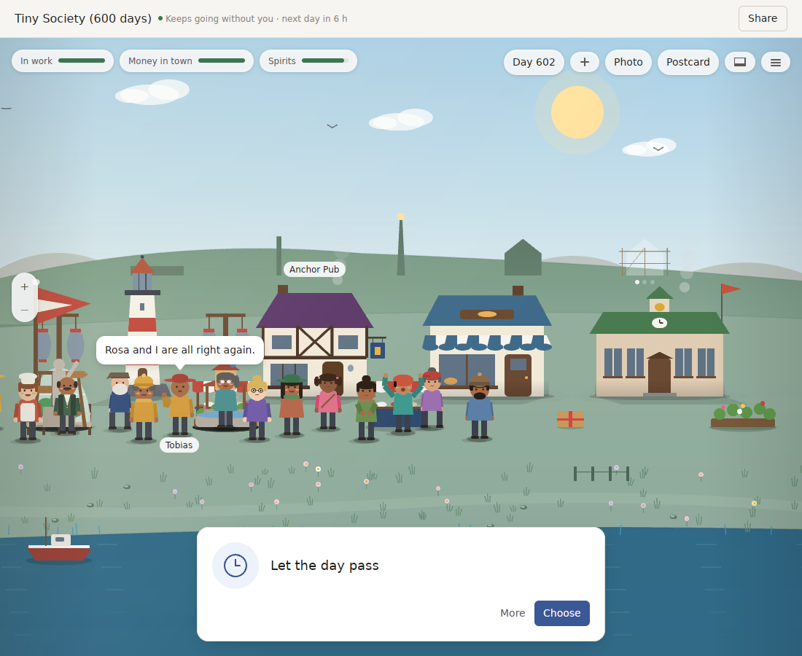
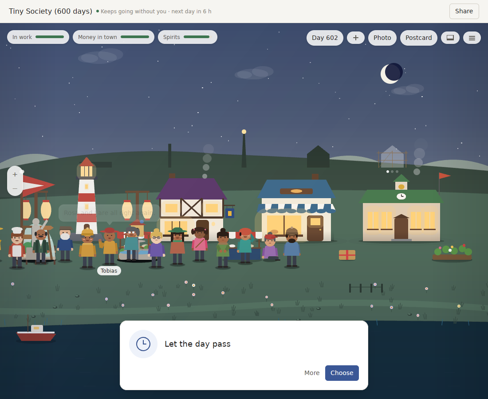
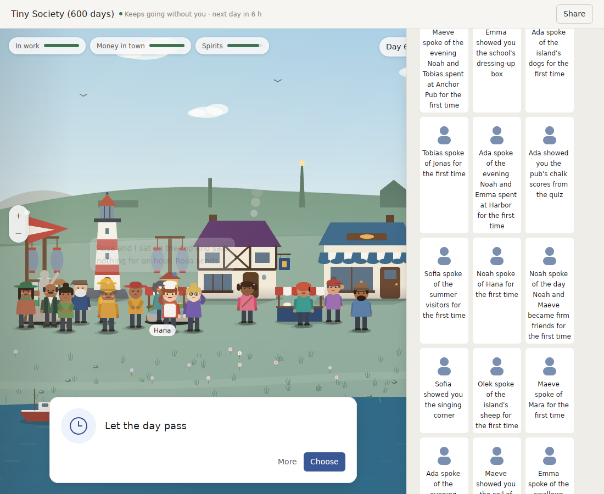

# Review of v0.20: a World that lives but does not show it, and the leap that changes that

`v0.20.0` fixed what `v0.19` got wrong. Choices now make different towns, something new comes every month for three years, a newcomer can find every verb, and a three-year World is quick.

This review asks a harder question: **what does World Machine need to be loved, not just sound?** It measures every part of the product as a player meets it:
- look, sound and life;
- story and authorship;
- feel, sharing and platform;
- the model voice;
- language and engineering.

It sets that against the moments when the best games in the genre went from "nice" to "beloved". The answer is a version that changes what the product *is*, in six leaps.

Measured on 2026-09-29 at `9bf918e` (v0.20.0):
- **Where:** release builds on a busy 4-core Linux machine, and the real app in the Linux preview.
- **Players:** four scripted players over 1,080 days each: the first answer every time, the last answer, never answering, and absent.
- **Labels:** **M** is measured and **I** is inferred.

## What a player sees at day 600

The town finished 62 works in three years, and this picture shows almost none of them:
- the same four buildings as in the first month;
- sixteen people standing in one row;
- one card, "Let the day pass".

At ten at night the windows are lit and everyone is still standing outside.

The book holds 400 entries, every one drawn with the same grey person.

The simulation underneath is rich. The surface does not show it.

## Measured, dimension by dimension

### The place (M)
- **The town stops growing on screen at about day 360.** The scene has 4 places and 19 objects at day 360, 600 and 1,080 alike. Of the 62 works, a handful are drawn; the rest live in a drawer checklist and 5 ridge silhouettes.
- **People have no homes, rooms or routine the eye can follow.** At day 600, 14 of them overlap in one row. At 22:00 everyone is outside.
- **Seasons change the palette and the festivals, not the place.** There is no snow, no autumn leaves and no harbour ice.

### Lives and story (M)
- **Nobody is born, grows old or dies in three years**, under any player. The World keeps no age, so Mia looks the same on day 1 and day 1,080.
- **Relationships churn without stakes.** For the first-answer player there were 303 "became friends", 302 "fell out", 299 "made up" and 275 "drifted apart": about 1.1 changes a day. Passive players see up to 528 fall-outs.
- **Big storylets repeat on the calendar.** The great storm is weathered together 17 times, and the fête and the inspector come 18 times each.
- **The long arc is 11 beats in three years**, each told in a single line and none of them drawn:
  - Mia finishes school;
  - Leo hands over the pub;
  - Leo retires, and his boat passes to Mia;
  - three weddings;
  - two departures.
- **Your choices do shape the town** (confirming v0.20):

  | Player | Works | Couples |
  |---|---|---|
  | First answer | 62 | 6 |
  | Last answer | 29 | 5 |
  | Never answers | 19 | 4 |
  | Absent | 18 | 2 |

  Tiny Society brings 14–28 new kinds of thing per 30 days in year three. Icebridge falls to 9 in its last 60 days.

### Your mark (M)
- **Expression is a menu:** 20 things to make (13 build, 4 plant, 3 decorate), 7 verbs, at most 2 deeds a period.
- **Placement is a spot along one ground line.** Only the World's title can be named, and nothing can be designed.

### Look (M/I)
- **The renderer draws only flat primitives:** quads (26 call sites), paths (23), linear gradients (15) and opacity. There are no images, textures, blurred shadows, light or grain.
- **What GPUI at this pin allows:** it can draw images, SVG and blurred shadows, but not custom shaders, blend modes or render-to-texture in a release build.
- **Motion:** about 30 animated behaviours, 4 of them idle.
- **Coherent, but no signature:** the look is clean and consistent, but nobody would recognise a World Machine screenshot the way they recognise Townscaper or Tiny Bookshop.

### Sound (M/I)
- **Everything is synthesised from sines and noise**, at 22 kHz mono.
- **Music** is one 24-second loop per hour, weather and festival: 192 mixes per World, all from one progression and one motif.
- **Ambience** is a 16-second wind-and-drone loop, with no sea, gulls or rain.
- **Effects** are 3 cues with 3 versions each, plus a babble per person.
- **Playback:** each sound starts a new `/usr/bin/afplay` process. Loops restart with a 0–100 ms gap, and a change of hour or weather waits up to 24 s. There is no mixer and no stereo, so a click cannot be answered by sound within a frame.

### Sharing and platform (M)
- **Sharing is local only.**
  - A World code is 46,212 characters at three years and opens as a read-only visit.
  - A guest can only come from your own first other World.
  - Postcards are images.
  - There is no network, gallery or friend's resident.
- **No platform integration:**
  - not notarized, and updates are a banner only;
  - no notifications, widgets, Shortcuts, Spotlight or Quick Look;
  - no Dock or menu-bar presence;
  - `.worldcode` is not registered with Finder, and `.world` is declared as JSON though the file is gzip.
- **The strip** is a 140-pixel band at up to 12 frames a second. You can look at it and double-click it; nothing else.

### The model voice (M)
The guard on a model's answers is a list of phrases, in English only. 35 new out-of-world answers were run through it and 21 were taken:

| Kind of answer | Declined |
|---|---|
| Speaking as a machine ("As an artificial intelligence…", "Claude here.") | 3 of 12 |
| Chinese | 0 of 4 |
| Harmful or abusive | 0 of 4 |

The shipped "200 of 200" test builds its answers from the filter's own phrase list, so it cannot fail. The voice is off by default and answers only typed talk and Pocket Universe's return narration.

### Language (M)
- **Chinese has gaps.** Per 120 days, 1.9–3.1% of what a Tiny Society player sees stays partly English, and 6.5–7.9% in Maple Street.
- **The failures are sentences assembled from fragments**, e.g. "港口won't know itself, mind。".
- **Names are half translated.**

### Engineering (M)
- **Size:** 97.5k lines of Rust plus 35.2k of tests.
  - v0.20 added 15.7k, 64% of it in the two World Packs.
  - Story content is Rust string tables, with no authoring tool.
  - 874 tests, 23 ignored.
- **Mac coverage:** CI runs the interface tests on Linux and clippy on a Mac, but 13 known-issue entries have never been tried on a Mac, and no click or keypress is verified anywhere.
- **Claims to correct.** v0.20.0's notes give 120–150 ms to open a three-year World and under 100 MB. On the release build as shipped, measured separately, opening from a file took 170–205 ms and memory stayed at 125–129 MB. A three-year snapshot took 17.9–28.0 ms and a day 23–35 ms, against the benchmark's 13.6 ms. The earlier figures came from a quieter machine and a benchmark path; the notes must say what a player's build does.

## What turned the best from "nice" into "beloved"

Every leap in the genre came from one of six mechanisms, listed here by how often they appear:

1. **The player's mark on the space, made cheap and flattering.**
   - Animal Crossing: New Horizons let you shape the whole island.
   - Townscaper and Tiny Glade finish whatever you start, and there is no wrong click.
   - Pokopia and Neko Atsume make who comes depend on what you put out.
2. **People who change and last:**
   - ageing and generations in The Sims;
   - Wildermyth's heroes, who age, are transformed and come back as legacy heroes;
   - marriages in Stardew.
3. **A history you can find and retell:**
   - Dwarf Fortress's Legends and the Boatmurdered retelling;
   - Caves of Qud's generated biographies, quoted by shrines in the world;
   - Wildermyth's comic panels.
4. **One strong look, mostly light and material rather than shape:** Tiny Glade's lighting, Tiny Bookshop's painterly art.
5. **Sharing built into the object:**
   - Townscaper's clipboard string;
   - Animal Crossing's design codes and dream visits;
   - friends' cats on screen in Bongo Cat.
6. **A tactile answer to every small act:** a Townscaper plop, a Tiny Glade rumble, a Bongo Cat tap.

**Where World Machine stands on the six:**
- **3 — a history:** it has better raw material than Dwarf Fortress had, because every Event records what caused it (`caused_by`).
- **5 — sharing:** it has a weak form (codes, guests, postcards).
- **1, 2, 4 and 6 are missing:** there is no space the player shapes, no generations, no signature look and no tactile sound.

The six leaps below are exactly those.

## The leap: v0.21 "The place remembers"

Each leap names what changes, where it lives, and its bar. The value in brackets is today's.

### 1. The place grows and lives (look and life)
- **The scene is a wider harbour you pan along.** It is at least three screens wide:
  - quay and lighthouse;
  - the square;
  - the school and the hill.
  
  Its districts fill up as the town builds.
- **Every finished work stands where it was built**, with its opening remembered [a handful drawn, then a checklist].
- **Everyone has a home and a day.** The rules live in a System, not in the kernel:
  - home at night [everyone outside at 22:00];
  - work by day, the pub in the evening;
  - the square on a festival.
- **Seasons change the place:** snow on roofs, autumn trees, a frozen harbour edge, and spring flowers where gardens were planted.
- **Bars:**
  - at day 1,080 at least 40 of the 62 works are visible in the scene;
  - no two people overlap by more than a third at noon;
  - at 22:00 at most 3 people are outside, except on festival nights;
  - a golden picture holds each season.

### 2. Lives with a whole arc (story and stakes)
- **Ageing:**
  - every resident has an age that advances with the calendar and shows in their drawing (grey hair, a stoop, a cane);
  - children are born to couples and look like their parents, with traits drawn from both;
  - a child becomes a teenager, grows up and takes up a trade;
  - the old retire and, in time, die.
- **A death is a proper beat:**
  - a memorial bench or stone the player places;
  - an heirloom passed down;
  - their lines remembered by others.
- **Fewer, weightier relationship changes:** a friendship or a feud lasts. Cap the churn at 60 relationship changes a year [about 400], and make each one a scene.
- **Storylets that happened keep their history.** A second great storm remembers the first and plays differently; a third is rarer.
- **Bars:**
  - three years of Tiny Society bring at least 3 births, 1–2 deaths and 2 people coming of age;
  - no storylet title repeats more than 3 times in three years [17–18].
- **Scope:** replay stays exact, and ages are derived from recorded events, not wall time.

### 3. Stories you retell (history made visible)
- **Legends.** Every person has a biography page built from the event log:
  - when they came, whom they loved and fell out with, what they built, what happened to them;
  - each line shows its cause (`caused_by`): "because you said …".
  
  Places and works have pages too.
- **Moments as panels.** Key beats (a wedding, a birth, a storm weathered, a work opened, a farewell) are drawn as a three-panel strip in the scene's own art, captioned by the World.
  - The panels go into the book.
  - They can be shared as images.
- **The year in review.** Each New Year the World gives an almanac page: who came and went, what was built, the year's best moment.
- **The book shows faces, not a grey person.** Each entry uses the person's or thing's own drawing [400 identical icons].
- **Bars:**
  - every one of the 11 long-arc beats, plus births, deaths and works, gets a panel;
  - a biography's every line links to its cause;
  - a test replays a three-year World and checks each panel is regenerated identically.

### 4. One look, one sound (the signature)
- **A lit, paper-and-paint diorama.**
  - **How it is drawn:** the scene is painted on the CPU into an image with a 2D vector rasteriser (`vello_cpu` or `tiny-skia`), then shown with GPUI's `img`. That gives:
    - soft contact shadows;
    - a warm key light by hour;
    - paper grain and a light bloom on windows and lamps;
    - rim light at dusk.
  - **It stays testable:** pixels are deterministic, so the golden tests keep working.
  - **Fallback:** if frame time fails on a Mac, a separate wgpu layer.
- **Procedural animation:**
  - squash and stretch;
  - feet that plant;
  - heads that turn toward whoever speaks;
  - clothes and hair with a spring;
  - boats that bob;
  - smoke that drifts with the wind.
- **Real-time sound** with `cpal` and `fundsp`, mixed in stereo in-process [separate `afplay` processes]:
  - a sea that changes with the weather, gulls, rain on roofs, a crowd on festival days;
  - a note for every act (placing, answering, a letter), in the key of the World's tune;
  - music that follows the hour note by note [24-second loops, and up to 24 s to follow a change].
- **Bars:**
  - a still frame is recognisable at thumbnail size;
  - frame time under 8 ms at 60 fps on a Mac, measured, with the Linux preview as a proxy until then;
  - sound answers a click within 30 ms;
  - golden pictures for day, dusk, night and each season.

### 5. Your mark on the place (authorship)
- **Plots you click to build, which the town finishes.**
  - The harbour has building plots along paths.
  - Clicking one offers what could stand there. The town chooses the fitting shape, colour and neighbours, joins walls and paths, and there is no wrong placement.
- **What you build decides who comes and stays.** A bandstand draws musicians, a boathouse draws a boatwright, a garden draws a beekeeper. Some newcomers come *because* of what you made, and say so.
- **One design canvas.**
  - A 16×16 pattern for a flag, a sail, a shop sign or a quilt, shown in the scene.
  - You name boats, works and newborns (the parents propose, you may choose).
- **Bars:**
  - at least 30 buildable plot types;
  - at least 8 newcomers in three years whose arrival names what you built;
  - a design survives a World code and a replay exactly.

### 6. The World off the window (presence and sharing)
- **A strip you can touch:**
  - click a resident and they wave and say a line;
  - drag the envelope to open it;
  - place the strip on any screen edge.
- **Friends' residents.** Paste a friend's code and one of their people can visit your strip or your harbour as a guest, with their own drawing and a line from their World.
- **A small Swift helper for Apple's on-device model.** It asks the World for facts through read-only tools and must cite the events it used [phrase list, English only]. Its answers are validated against those facts, in Chinese as well as English.
- **Quick Look thumbnails and a desktop widget** of a World. These come after Developer ID.
- **Bars:**
  - a new red-team set written by someone other than the filter's author: at least 100 out-of-world answers in English and Chinese, at least 95% declined, and no in-world answer declined in a 200-line in-world set;
  - a friend's resident visits from a code in both Packs.

### And fix what the measurement found
- **Chinese:** build lines from whole translated sentences, not fragments, so no line mixes English and Chinese. Bar: under 0.5% partly English in both Packs [1.9–7.9%].
- **Relationships:** cap the churn (see leap 2).
- **Honest performance notes,** measured on the release build a player gets.
- **File types:**
  - declare `.world` as a gzip document type;
  - register `.worldcode` with Finder.

## How to build it

This is larger than any release so far. Three stages, each a release:

1. **v0.21 — the place.** Leaps 1 (the place grows and lives) and 4 (one look and one sound).
   - The CPU renderer, the panorama, homes and routines, seasons, real-time sound.
   - They share one foundation (the scene painter) and change what every screenshot looks like.
2. **v0.22 — lives.** Leaps 2 (lives with a whole arc) and 3 (stories you retell).
   - Ageing, births and deaths, legends, panels and the almanac.
   - They need the new painter for faces at every age and for the panels.
3. **v0.23 — your mark and the world outside.** Leaps 5 (your mark on the place) and 6 (the World off the window).
   - Plots, the design canvas and naming, the touchable strip, friends' residents, the Swift model helper.

Every stage keeps these rules:
- **Replay is exact.**
- **Worlds from `v0.20` open and play on:** new state derives from recorded events or has a default, and Pack versions stay the same unless a stage truly cannot.
- **The kernel stays domain-free:**
  - ages, homes and plots live in Systems and Packs;
  - the painter and sound live in the interface.

## Not in this leap
- The Mac App Store and sandboxing.
- iCloud sync, beyond letting the user keep the Library in iCloud Drive.
- A Windows build.
- A network service of our own: sharing stays code-based.

## Decisions only you can make
- **Apple Developer membership** ($99 a year). The Swift helper, the widget and Quick Look, notarization, and any real-Mac measurement of the new painter depend on it and on a Mac.
- **The art direction.** "Lit paper-and-paint diorama" is a proposal. One reference image or game you want World Machine to feel like would fix it.
- **Whether v0.21 may break v0.20 Worlds** if the panorama needs it. The default is no.

## What v0.21.0 did

The first stage, "the place": leaps 1 (the place grows and lives) and 4 (one look, one sound), plus the Chinese fix.

| Bar | v0.21.0 |
|---|---|
| Works visible at day 1,080, at least 40 | 48 of the 48 distinct works in Tiny Society (the 62 counted twice-painted works); 35–51 in each Pocket Universe place |
| At most 3 people outside at 22:00 | 0 on ordinary nights; everyone in the square on festival evenings |
| No district over 60% at noon | at most 54% |
| A golden picture for each season | yes, plus night and the panorama's far end |
| Frame under 8 ms (under 16 ms with painting) | longest window frame 10.5–12.4 ms in a three-year benchmark on Linux; painting is off the window's thread; not yet measured on a Mac |
| Sound within 30 ms of a click | within 15 ms in the render graph; the Mac's device delay is unmeasured |
| Chinese partly English, under 0.5% | 0.00% over three years in all four places |

Still open from leaps 1 and 4:
- homes and works cannot be inspected;
- the overview has not been measured in a release build;
- nobody has listened to the sound.

Leaps 2 and 3 are next, as v0.22.

## Sources
- Animal Crossing: New Horizons sales and features: https://en.wikipedia.org/wiki/Animal_Crossing:_New_Horizons
- Townscaper's grid, WFC and clipboard sharing: https://x.com/osksta/status/1176569884924416001
- Tiny Glade's procedural walls and lighting (80.lv interview): https://80.lv/articles/exclusive-tiny-glade-developers-discuss-bevy-proceduralism-publishers-cozy-games
- Dwarf Fortress on Steam, 160k in 24 hours: https://gameworldobserver.com/2022/12/08/dwarf-fortress-sales-160k-units-24-hours
- Caves of Qud's mythic biographies (FDG 2017): https://www.freeholdgames.com/papers/Generation_of_mythic_biographies_in_Cavesofqud.pdf
- Wildermyth, getting players invested in procedural characters (GDC): https://www.gdcvault.com/play/1027614/Independent-Games-Summit-Session-Getting
- The Sims Legacy Challenge: https://sims.fandom.com/wiki/Player_challenge
- Pokémon Pokopia sales (2026-08): https://www.nintendolife.com/news/2026/08/pokemon-pokopia-sales-surpass-five-million-units-globally-in-just-over-four-months
- Bongo Cat concurrent players: https://steamcharts.com/app/3419430
- Rain World's procedural animation: https://www.gamedeveloper.com/art/video-animating-i-rain-world-i-and-its-many-squishy-stretchy-creatures
- No Man's Sky procedural audio: https://www.asoundeffect.com/no-mans-sky-sound-procedural-audio/
- Foundation Models framework (WWDC25): https://wwdcnotes.com/documentation/wwdc25-286-meet-the-foundation-models-framework/
- Apple platform sessions (WWDC 2026): https://developer.apple.com/videos/play/wwdc2026/277/
