# Review of v0.23: a lot was built; now it must feel made

Three releases in a day, v0.21 to v0.23, delivered what the [v0.20 review](REVIEW_v0.20.md) asked for:
- the place grows and keeps a day;
- people are born, age and die, with legends, moments and an almanac;
- you build, design and name things, and friends' residents visit.

On paper almost every bar of that review is met.

This review asks what happens when you **play** it, and what it would take for a stranger to love it. The answer is uncomfortable but clear:
- The simulation is now rich, the kernel is sound, and there are moments of real beauty.
- The surface has not caught up with what was added: a crowded strip at year three, a second Pack wearing the first one's clothes, a first five minutes that answer nothing, and template seams in the words.
- Every player who doesn't say yes gets a repetitive story.
- Performance slid 25–30%, and trust edges are missing: untrusted codes, file versions, backups.

The next version should add almost nothing new. It should make what exists **coherent, crafted and trustworthy**.

Measured on 2026-09-30 at `1a6b607` (v0.23.0):
- **Where:** release builds on a busy 4-core Linux machine, and the real app in the Linux preview.
- **Players:** five scripted players over 1,080 days each: the first answer every time (warm), a warm player who also builds on plots, the last answer, never answering, and absent.
- **Labels:** **M** is measured and **I** is inferred.
- **Scratch reports and all ~70 screenshots** are summarised here; nothing in them contradicts this document.

## What a player sees

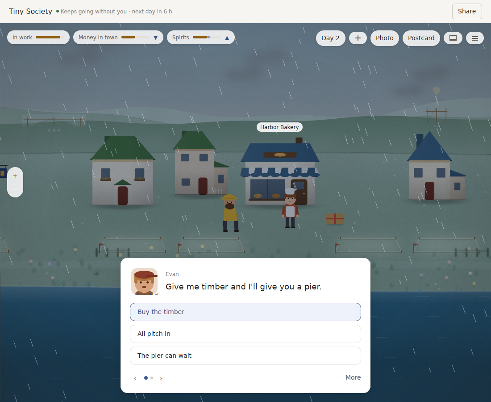

**The first minute (M):**
- A new World opens on Day 2, in rain, straight into a question.
- Leo's welcome comes *after* it.
- Answering changes nothing visible.
- The first build on a plot appears finished at once, while Mara says "I'm sorry, Jonas. I can't keep you."

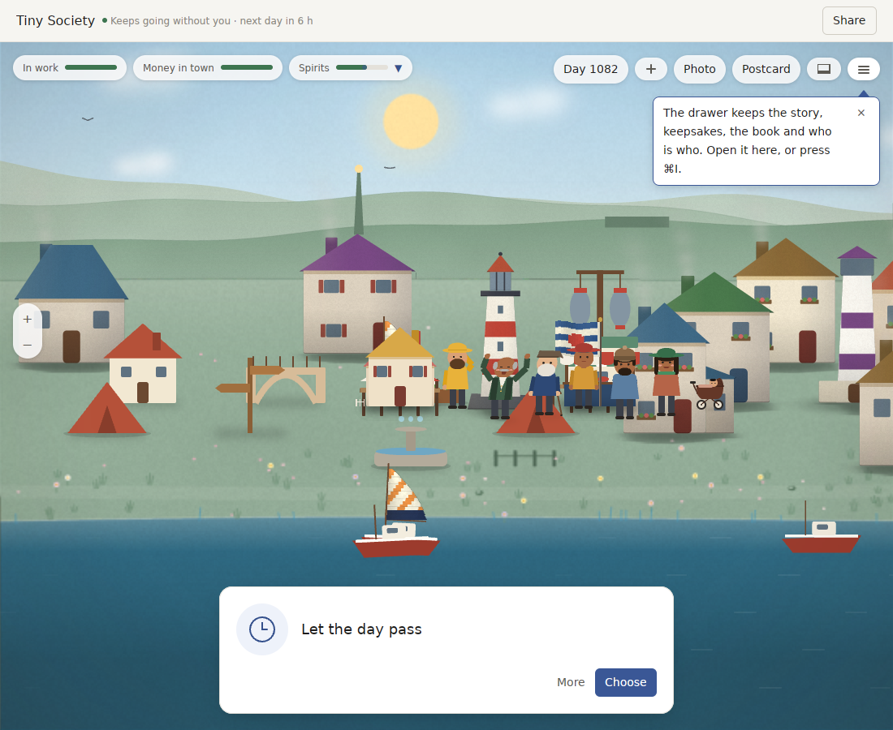

**Day 1,082 at noon (M):**
- The works the harbour built now stand, which is v0.21's promise kept.
- They stand on **one ground line**: cottages, tents, a fountain, a fence and eleven people overlap.
- A cottage is barely taller than a person.
- Two of the skyline's towers are lighthouses that are meant to be a clock tower and a telescope.
- The bottom 40% of the window is empty water.

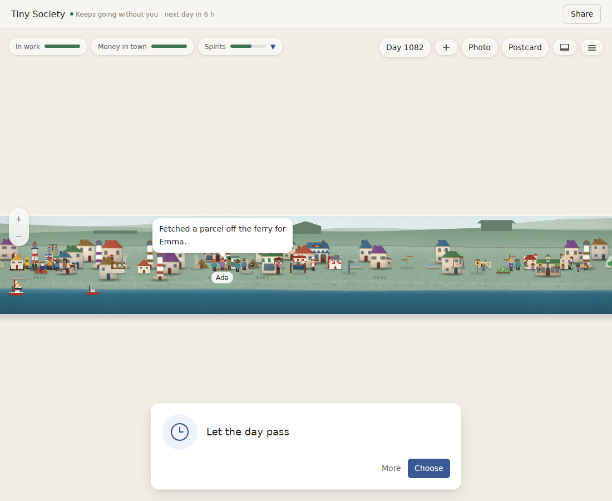

**The whole town, zoomed out (M):**
- The postcard view is a 175-pixel band, with about 80% of the screen bare paper.
- At night the sky is missing.

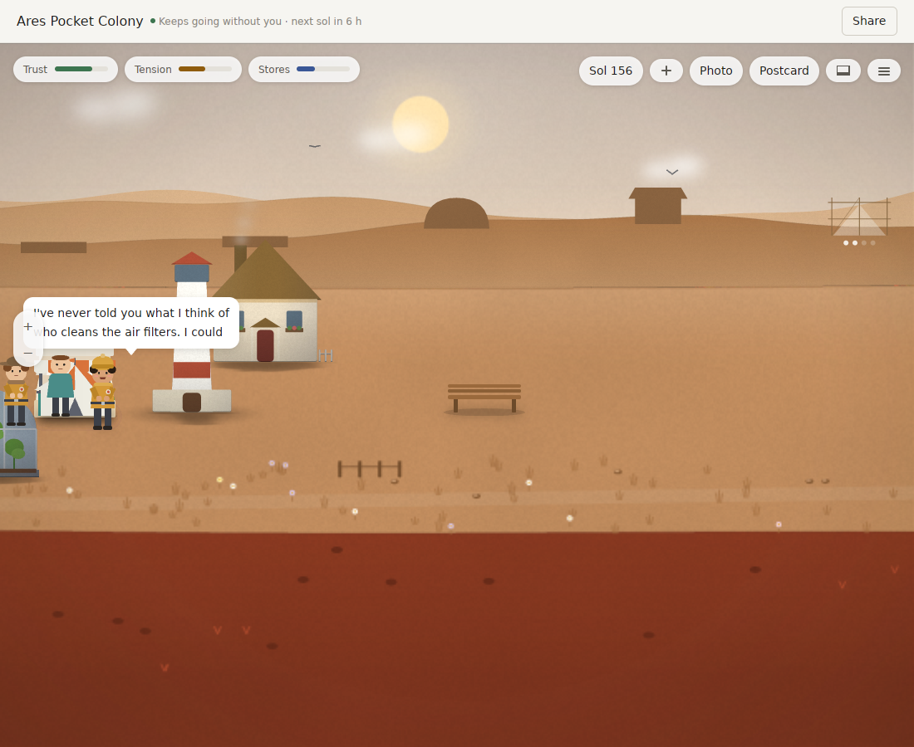

**Pocket Universe (M):**
- Pocket Universe wears the harbour's drawings: on Mars there is a lighthouse, a thatched cottage, gulls and grass.
- Maple Street, 1987, has a lighthouse and a sea.
- Icebridge's penguins live in cottages with flower boxes.

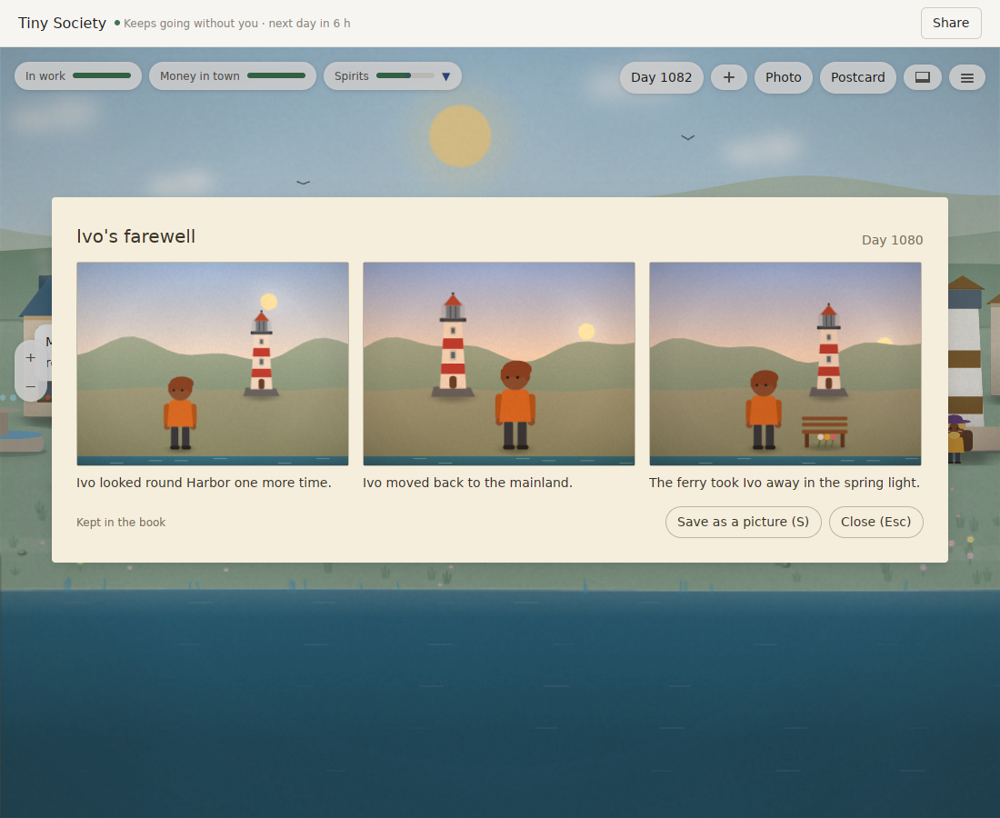

**Moments (M):**
- "Ivo's farewell" is three nearly identical panels, with no ferry and no leaving.
- It names the place "Harbor", the seed's internal name.

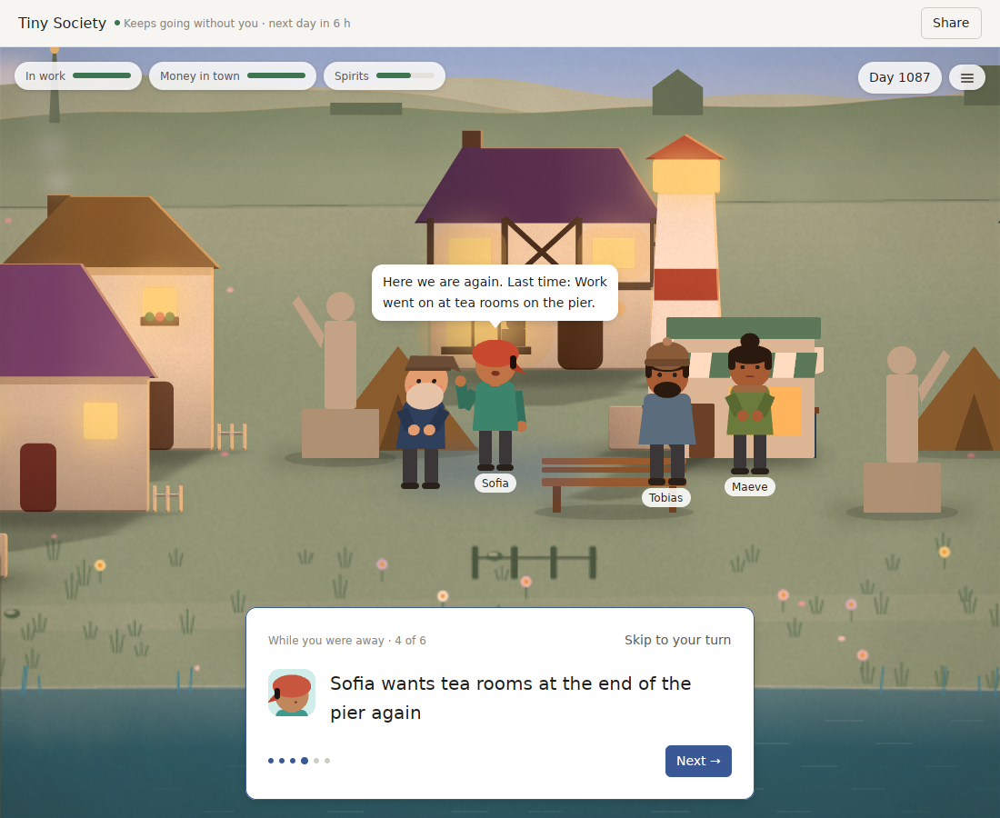

**What already delights (M):**
- Dusk and night: lit windows and silhouettes, the moon and stars, reflections on the water.
- The return film, where the camera glides to each beat's people.
- The design canvas repainting a sail live in the scene.
- Close-ups of people and the penguins.
- Dragging the envelope open on the strip.

These are the product at its best, and the standard everything else should meet.

## Measured, dimension by dimension

### Story and variety (M)

| Measure | v0.20 | v0.23, warm player |
|---|---|---|
| Relationship changes a year | about 393 | 44–52 |
| Births, deaths, comings of age in 3 years | 0 / 0 / 0 | 4 / 2 / 2 |
| Storylet titles told more than 3 times | 17–18 | 0 |
| New kinds of thing per 30 days, year three | 14–28 | 40–58 (the metric now also counts retold titles) |
| Moments in 3 years | none | 178 (festivals 37%, works opened 33%) |
| Legend lines with a real cause | none | 49% |
| Letters a year | – | about 100: the cap of 2 a week, every week, for three years |
| Quiet days | – | 0 |

**Every other player gets a repetitive story (M):**

| Player | Works in 3 y | Storylet titles told 16 times | Distinct storylets | Legend lines caused |
|---|---|---|---|---|
| Warm | 64 | 0 | 177 | 49% |
| Last answer | 17 (29 at v0.20) | 4 | 64 | 24% |
| Never answers | 18 | 8 | 57 | 4% |
| Absent | 18 | 8 | 57 | 5% |

The v0.22 rule that rests a storylet after it is told only rests storylets that were *answered*. Declined or unanswered ones come back every two months ("Mara's oven is failing once more" ×16).

**Towns fall into two families by what they build (M):**
- Warm and builder share the same 64 works.
- Last, never and absent share 17–18 of the harbour's own. The never player, who makes things by hand, and the absent player, who does nothing, end with **identical** works.
- Towns differ in who lives there (people distance 0.39–0.60), but not in what stands.

**What repeats in year three (M):**
- "The light down by Harbor makes you want to stay." is said 15–16 times.
- Ten bench and swing lines are said 9 times each.
- "Harbor" leaks from the seed into prose that elsewhere says "harbour".

**Template seams (M, seen on screen):**
- "We've finished the bandstand painted red and gold!"
- "Last time: Everyone pitched in…"
- A name slot leaks into a Maple Street line.
- Greta writes a letter about "Greta is grown now".

**Legends (M):**
- Bo, born on day 703, reads "3 years in the town" at day 1,082. A 120-day year is used where the harbour's year is 360.
- Bo is drawn as a standing child at one year old.
- The page has two lines.

**The almanac cannot be reached (M):** it exists only on the exact New Year's day, and the drawer does not keep it.

### Authorship (M)

| Measure | v0.23 |
|---|---|
| Plot types | Tiny Society 36; 30 in each Pocket Universe place |
| Plots in the harbour | 19, **all used by day 360** by a player who builds |
| Newcomers drawn by what you built | 8 in 3 years (6 in year one, then 1 a year) |
| Builder against warm player | the same 64 goal works; 11 births against 4; 0 deaths and retirements against 2 and 5 |

- Authorship is front-loaded, and plot works are a layer beside the town's own ladder of works rather than part of it.
- There are two ways to build: the drawn plot popover and the text-only hands list.
- Money is a bar with no number, while costs are numbers, so you cannot tell what you can afford.

### Look, readability and feel (M)

- **Composition:** everything stands on one ground line, with wrong relative scale and the lower 40% empty. The zoomed-out view is a letterbox.
- **Drawings read as the wrong thing:** the clock tower and telescope are lighthouses (4–5 on the skyline), the bandstand is a tent, the statues are faceless mannequins, and a seated man floats.
- **Pocket Universe has no art of its own.**
- **The drawer is a spreadsheet:** about 70 build rows, 74 one-line chapters (mostly "fell out" or "drifted apart") and duplicate keepsakes. Book tiles print captions across the figures.
- **Speech bubbles** collide with the zoom control, stop mid-sentence, and repeat three times in about ten minutes.
- **White buttons and cards glare** on the night scene.
- **Opening a World** shows a bare paper stage for 2–4 s.
- **Sound is off by default.**

### The model voice (M)

| Red-team set | Out-of-world declined | In-world wrongly declined |
|---|---|---|
| 1 (the guard was built against it) | 164 of 164 | 0 of 239 |
| 2 (used for category feedback) | 123 of 132 | 8 of 213 |
| **3 (unseen)** | **161 of 210 (77%)** | **12 of 236 (5%)** |

The CI gate is set 1. A rule list does not generalise to new phrasings; see the research below for what does.

### Language (M)

- **Story text:** 0.00–0.02% partly English (the boat Kittiwake, one penguin letter).
- **Interface:**
  - Every "Open" on Home reads 营业中 ("open for business").
  - The header reads "next 日 in 6 h", and the counter "日 1082".
  - The hands tabs and Settings → Display stay in English.
  - "Night 120" and "Sol 156" stay in English.

### Performance (M, same harness, v0.20 against v0.23)

| Measure | v0.20 | v0.23 |
|---|---|---|
| Three-year snapshot | 16.7–17.0 ms | **21.6–23.9 ms (+30%)** |
| A turn with its save | 34–36 ms | **42–47 ms (+25%)** |
| Shipped 15 ms snapshot benchmark | passed at 13.6 | **fails at 20.7–22.7** |
| Open to first snapshot | 136–143 ms | 139–164 ms |
| Memory after 20 days | 95.6 MB | 93.4 MB |
| Longest window frame (painter benchmark) | – | 10.1–12.8 ms CPU (bar 8); 17.6–20.9 ms by the wall clock |
| World code, builder at 3 years | – | 50,299 (bar 50,000) |
| Pack binaries | 6.4 / 5.9 MB | 8.3 / 8.3 MB |

Sound is healthy: 3.0% of a core, and heard 0.1–3 ms after its cause.

### Engineering (M)

- **Size:** 175.9k lines (+33% since v0.20). 9 files are over 3,000 lines, including `diorama.rs` at 5,764; the story `threads` functions are 1,300+ lines of content written as code.
- **Tests:**
  - 953 pass, and 46 are ignored and never run in CI (23 at v0.20). About 30 of those are real bars: three-year variety, the ten-year wire fit, performance, and Chinese coverage.
  - Two ignored tests fail today: the 15 ms snapshot, and Pocket Universe's careful player (landing pad 2 of 4).
  - One test fails in release but passes in debug: the strip's envelope drag.
- **Lint:** clippy allow-attributes went from 4 to 20. `cargo clippy --workspace` fails on Linux, because two desktop functions are dead code off macOS.
- **Duplication:** about 2,650 identical lines across 11 module pairs in the two Packs (moments 88% identical, book 87%, legends 80%).
- **Dependencies:** all current except tiny-skia (0.11.4, and 0.12 is out). GPUI is pinned at Zed v1.21.0, the latest stable.

### Architecture and trust (from reading the code)

The invariants hold:
- world-core is domain-free and unchanged since v0.20;
- only `execute` changes state;
- models only pick from closed meanings;
- replay applies recorded changes with no model.

The risks are at the edges.

**High:**
1. **Save compatibility has no version of its own.** Files are keyed on Pack versions that have been frozen for many releases (Tiny Society 0.13.0 since v0.16). No writer or schema version is recorded, so an older app opens and saves over a newer file without a word. Only v0.22 fixtures exist; v0.20 and v0.21 Worlds do open, but nothing tests it.
2. **A friend's World code is untrusted input without limits.**
   - There is no size check.
   - It inflates to 256 MiB, then parses and fully replays on the window's thread, so one paste can hang the app.
   - A hosted guest's drawing (up to 32 KiB) stays in your history for good and travels on in your own codes.
3. **The real bars are in tests CI never runs:** 46 ignored.
4. **Copy-paste between Packs:** see Engineering above. It is the biggest drag on the next changes.

**Medium:**
- **The model API key** is handed to every installed Pack, third-party ones included. It is kept through `/usr/bin/security`, and `curl` is run by name.
- **The synthetic ids** (900,000,000+ for homes, 910,000,000+ for works) are an undocumented contract between both Packs and the renderer:
  - a founder id of 10,000,000 or more collides;
  - work ids are catalog positions;
  - births stop silently when a hand-reserved id range runs out.
- **Designs and names travel as `command=argument` text,** checked twice in two ways; names can carry right-to-left override characters.
- **Protocol:** v7 gained plots, designs and names without a version bump. Five wire enums reject unknown variants, so one new variant fails a whole snapshot.
- **Release:** a stable tag can publish unsigned; the release workflow has broad write permission; actions are pinned by tag; there are no `--locked` builds.
- **Saving** rewrites the whole file with no backup, and the `settle` compaction has no property test.
- **Near-misses:**
  - Pocket Universe's narrator writes model prose into a display field of state;
  - the renderer treats ids of 900,000,000 or more as "nothing to inspect";
  - legends show inferred causes as if recorded.

## What the market and the technology say

The full notes, with sources, are in the review workspace. The points that shape this plan:

- **What made recent cozy games loved:**
  - a toy that is satisfying within five minutes;
  - a demo long before release;
  - a low price;
  - being present without demanding attention;
  - other people's things on screen;
  - a named storyteller.

  Examples: Tiny Glade sold 616k in its first month from 1.38M wishlists, with the demo at Next Fest; Rusty's Retirement, a "bottom of your screen" idler, sold about 550k at $6.99; Townscaper sold 380k at $5.99; Tiny Bookshop over 500k.
- **Desktop companions spike and fade:** Bongo Cat, and Desktop Mate, which fell about 85% in two months. What lasts is a slow drip of collectables and other people's things.
- **The Mac is about 2% of Steam.** The practical order is:
  1. a notarized Developer ID build, sold direct and on itch;
  2. Steam with a demo, Mac first and Windows next;
  3. a Mac App Store build later, sealed with its Packs bundled in, because the sandbox forbids user-installed Pack executables and self-updating.
- **Model characters:** 85% of surveyed players are negative about generative AI in games. The shipped games that work give talk a goal (Suck Up!), and they are criticised for repetition and for waiting after every action. Steam requires disclosure of live-generated content and a report button.
- **A guard that generalises is layered, not a list:**
  1. constrained output that must cite the World's own events;
  2. structural checks: the cited events exist, names are known, the script matches the language, no meta words;
  3. a small model as a judge of tone and of "speaking as a machine";
  4. an authored fallback, with the chosen line recorded as an Event so replay never asks a model.

  Measure it on held-out sets with precision and recall.
  - Apple's Foundation Models framework has tool calling and guided generation, with a 4k–8k context and many acknowledged false positives. It is not available in mainland China.
  - A cloud model costs a talkative player under $0.10 a month.
- **Hand-made look, deterministically:** line wobble and "boiling", paper grain, darker edges on fills, slight misregistration of line and fill, and a limited palette. All of it is seedable, so goldens still hold.
- **Rendering:** GPUI has no supported shader or render-to-texture API outside forks. Keep painting on the CPU and hand frames over as images. vello_cpu is faster than tiny-skia, but determinism across thread counts is unconfirmed; switch only if profiling on a real Mac asks for it.
- **Languages:** Simplified Chinese is about a quarter of Steam; Japanese and German come next.

## The verdict

v0.21–v0.23 built the product's **substance**. What stands between it and being loved is **craft**:
1. The first five minutes must answer the player.
2. The place must compose into a picture at every age.
3. Each Pack must look like itself.
4. Every player, not just the yes-sayer, must get a story that doesn't repeat.
5. The words must have no seams.
6. It must be fast again and safe to share.

None of this needs a decision from outside, and most of it is subtraction and rework rather than new features.

## The plan

Three stages, each a release. Bars are measured the same way as here.

### v0.24 — Coherent (the place, the first minutes, the story for every player)

1. **A place that composes at every age.**
   - Four real depth bands:
     - a back row of buildings;
     - a middle street;
     - a front quay or deck in the empty lower third, where people walk and sit;
     - water.
   - Consistent scale: a cottage is 2.5–3× a person.
   - A composition pass that never lets two things overlap and thins what stands to what fits, keeping the rest for the zoomed-in walk.
   - The zoomed-out view becomes a real postcard: sky, the town stacked in depth, and night included.
   - **Bars:** no overlaps at day 1,080 (tested), the lower third used, and the whole-town view filling at least 70% of the window.
2. **Every work drawn as itself.**
   - Distinct silhouettes for the clock tower, telescope, bandstand, statues and the rest; no shape stands in for another.
   - Seated people sit on something.
   - **Bar:** a contact sheet of every work, reviewed, where no two share a silhouette.
3. **Pocket Universe in its own clothes.**
   - Ares: domes, hab modules, regolith, a pale sky, no grass or gulls.
   - Maple Street: a 1987 street with storefronts, cars and wires.
   - Icebridge: ice shelves, igloo-like nests, sea ice.
   - Each place has its own ground, sky, weather and props.
   - **Bar:** no harbour drawing in any Pocket Universe place (tested by an id list).
4. **A first five minutes that answer.**
   - Open on Day 1, in fair weather, with the welcome first.
   - Within 20 seconds, show something the player can change.
   - The first answer changes something visible in the scene.
   - The first plot build shows scaffolding and finishes during the session.
   - Sound is on by default at a gentle level.
   - No sad or rejecting line in the first ten minutes.
   - **Bars:** a scripted first-session test for each of these, and a timed walk-through in the preview.
5. **A story for every player.**
   - Rest every storylet after it is told, answered or not.
   - A declined want changes, is resolved by someone else, or is dropped, and never returns unchanged.
   - Things made by hand and plot works count toward the town's own ladder, so a maker's town diverges from an absent player's.
   - Plots open in stages across three years, not all in year one.
   - Letters vary in rhythm, and quiet days return.
   - **Bars:**
     - for all five players, no storylet title more than 3 times in three years;
     - a legend cause share of at least 30% for Last and Never;
     - the works of Never and Absent at Jaccard distance of at least 0.5;
     - plots opening in each of the three years.
6. **Words without seams.**
   - A template-seam test over every slotted line: no doubled clauses, no leaked slot names, no "Harbor", and no self-reference in letters.
   - Fix the legend year (the Pack's own calendar), draw babies as babies, and give legends at least 5 lines for anyone who has lived a year.
   - Moments show their event: a ferry for a farewell.
   - The almanac is kept in the drawer and reachable any time.
   - The drawer is redesigned from a list into a book of chapters with grouped builds.
   - One way to build (the plot popover, with the hands list folded into it), and money shown as a number.
   - Chinese interface gaps closed: Open, the day counter, Display, the hands tabs, Night and Sol.
   - **Bars:** zero seams, zero English in the zh-Hans interface (tested over every window), and the almanac reachable on every day after the first New Year.

### v0.25 — Crafted and trusted (look, speed, safety, engine)

1. **A hand-made look.**
   - Seeded line wobble and gentle boiling on still things.
   - Misregistration of line and fill, darker edges on fills, and one limited palette per Pack.
   - Night-aware interface: dark cards after dusk.
   - A loading paint instead of a bare stage.
   - Speech bubbles that never collide and never cut a sentence.
   - **Bars:** golden images keep passing (deterministic), and no interface element over the scene is brighter than the scene's sky at night.
2. **Fast again.**
   - The three-year snapshot back under 15 ms, with the ignored benchmark made a CI bar.
   - A turn under 35 ms.
   - The longest window frame under 8 ms CPU.
   - Measure snapshot size and make it a bar.
   - Keep a builder's World code under 50,000 characters.
3. **Safe to share and to keep.**
   - World codes:
     - a size limit before inflating (1 MiB of text, 16 MiB inflated);
     - parsing and replay off the window's thread with a timeout;
     - a guest's drawing kept by reference to a small, bounded, validated form;
     - names stripped of bidirectional control characters.
   - Files:
     - a writer and schema version in every file, and an older app refusing to save over a newer file;
     - a backup copy before each save;
     - fixtures from v0.20, v0.21, v0.22 and v0.23 for both Packs, all opened and replayed in CI;
     - a property test for `settle`.
   - The model key goes only to the app's own voice, never to a Pack, and tools are run by absolute path.
   - **Protocol v8:**
     - capability flags (plots, designs, names, story);
     - tolerant enums with an "unknown" variant;
     - typed design and name intents replacing `command=argument`.
   - An id allocator in the kernel, and documented, validated reserved ranges.
4. **The engine made for the next Pack.**
   - A shared Pack kit: chronicle (legends, moments, almanac), `days::Town` (homes, days, plots), hands plots, and a `world-pack-testkit` with the long-run players and red-team harness.
   - **Bar:** at least 2,000 of the duplicated lines removed, and both Packs unchanged in behaviour (replay-identical fixtures).
   - Split `diorama.rs` into scene, people, works, light and interface modules.
   - Move story content from code into data files the Packs load.
   - CI:
     - a nightly job runs every ignored bar;
     - `cargo clippy --workspace` passes on Linux;
     - the release-only strip test is fixed;
     - the release workflow refuses to publish unsigned under a stable tag once signing exists, with `--locked` builds and actions pinned by commit.

### v0.26 — The voice done right, and out into the world

1. **A layered World voice.**
   - The model answers through constrained output that cites the World's events.
   - Structural checks run on every answer.
   - A small model judges tone and meta-talk.
   - An authored fallback applies, with every accepted line recorded, so replay never asks.
   - Talk gets a goal: a resident asks for something, and talk can help.
   - Apple's `LanguageModel` protocol lets one path serve on-device, Private Cloud Compute or a cloud model.
   - **Bar:** on a fourth set written blind and never seen, at least 95% declined and at most 1% wrongly declined, reported as precision and recall per language.
2. **Out into the world (needs your decisions below):**
   - a notarized build;
   - a free demo of the first hour;
   - a store page and a trailer cut from the return film and dusk;
   - Japanese;
   - a desktop widget and Quick Look once a Developer ID exists.

## What v0.24.0 did

The first stage, "coherent".

| Bar | v0.24.0 |
|---|---|
| No overlaps at day 1,080 | 0 overlaps, tested at 4 hours and 2 window sizes |
| Lower third used | every person out at noon stands on the quay in the lower third |
| Whole-town view fills at least 70% of the window | the scene fills the window, the town 74% of its height, with sky and night |
| Cottage 2.5–3 times a person | 2.75, tested at 3 window sizes |
| No two works share a silhouette | 0 collisions among 424 drawings |
| No harbour drawing in Pocket Universe | 0 on a builder's lived year in each place |
| First-session behaviour | Day 1, fair, welcome first; the first answer is seen; the first build is finished the next day; 0 sad lines in 5 days (was 23) |
| No storylet title more than 3 times, five players | 0 in Tiny Society and every Pocket Universe place (was 4–8 titles ×16) |
| Legend causes of at least 30% for Last and Never | 45–61% |
| Never and Absent works at a Jaccard distance of at least 0.5 | 0.85 in Tiny Society; 0.61–0.64 in Pocket Universe |
| Plots opening in each of three years | [12, 4, 3] in Tiny Society; [9, 4, 2–5] in Pocket Universe |
| Zero seams | 0 of 79 and 82 left |
| Zero English in the zh-Hans interface | 0 in 646 lines, walked in a test |
| Almanac reachable after the first New Year | from the drawer and with Y |

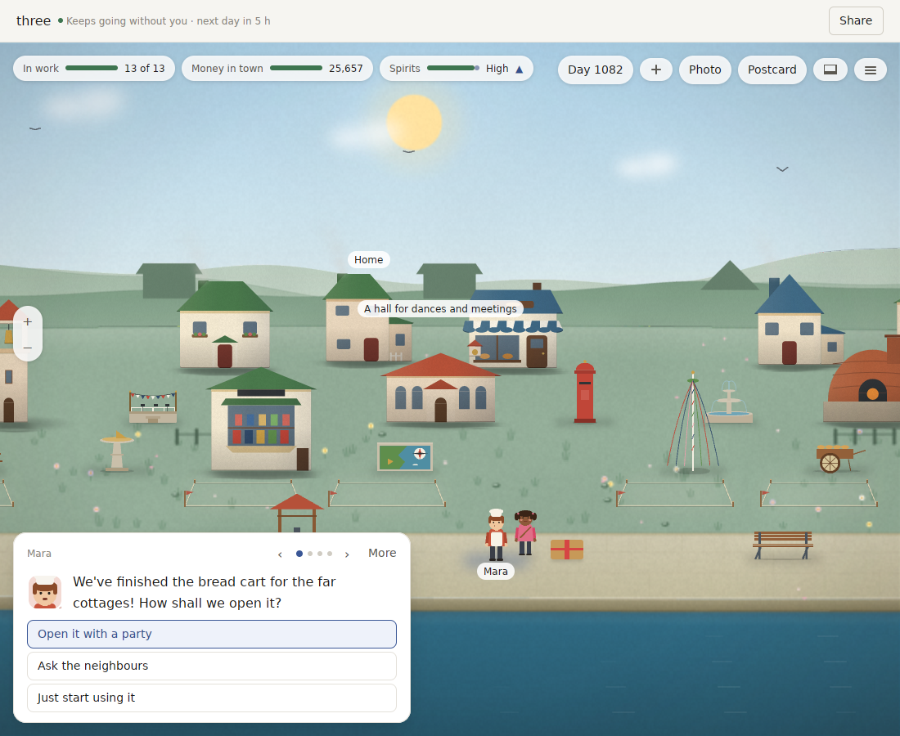
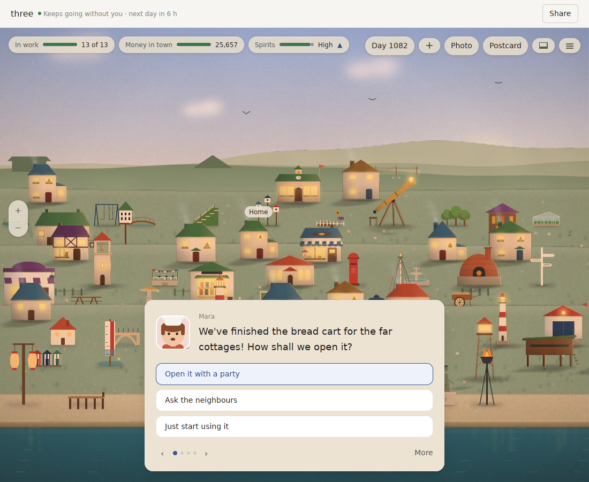
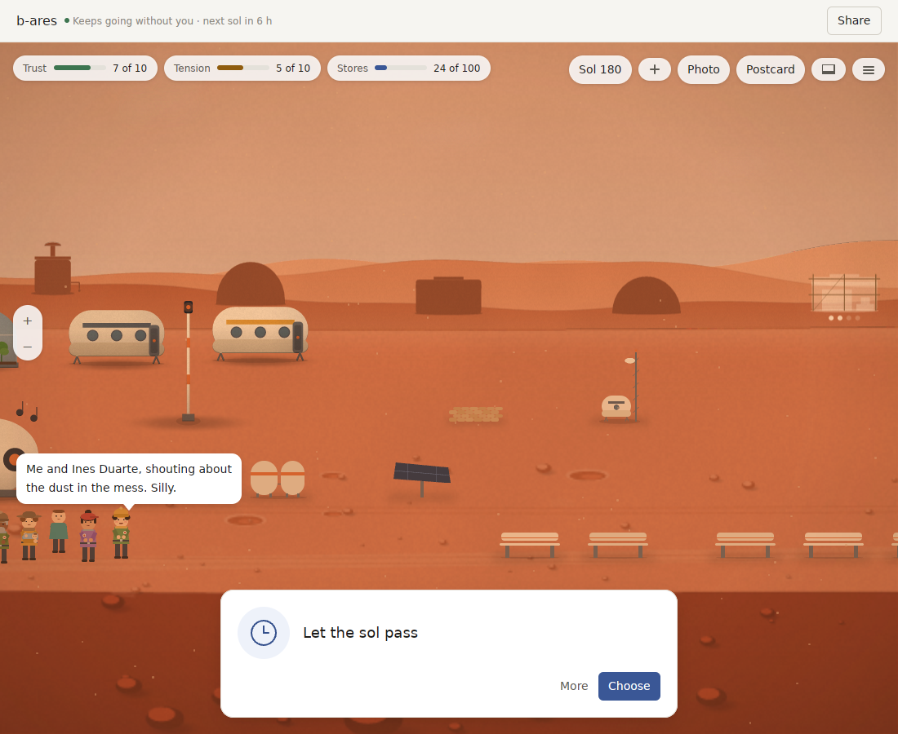
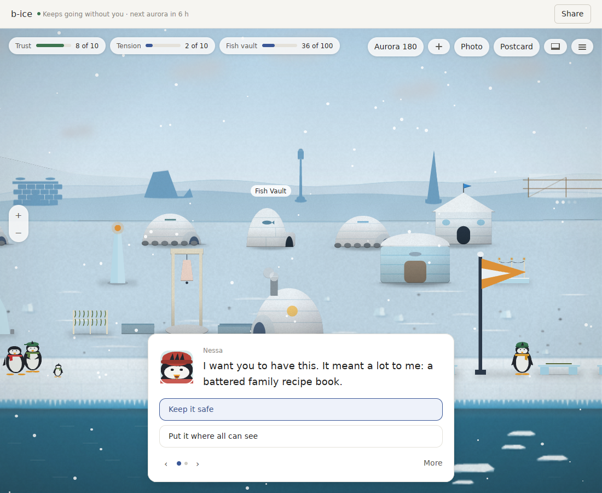
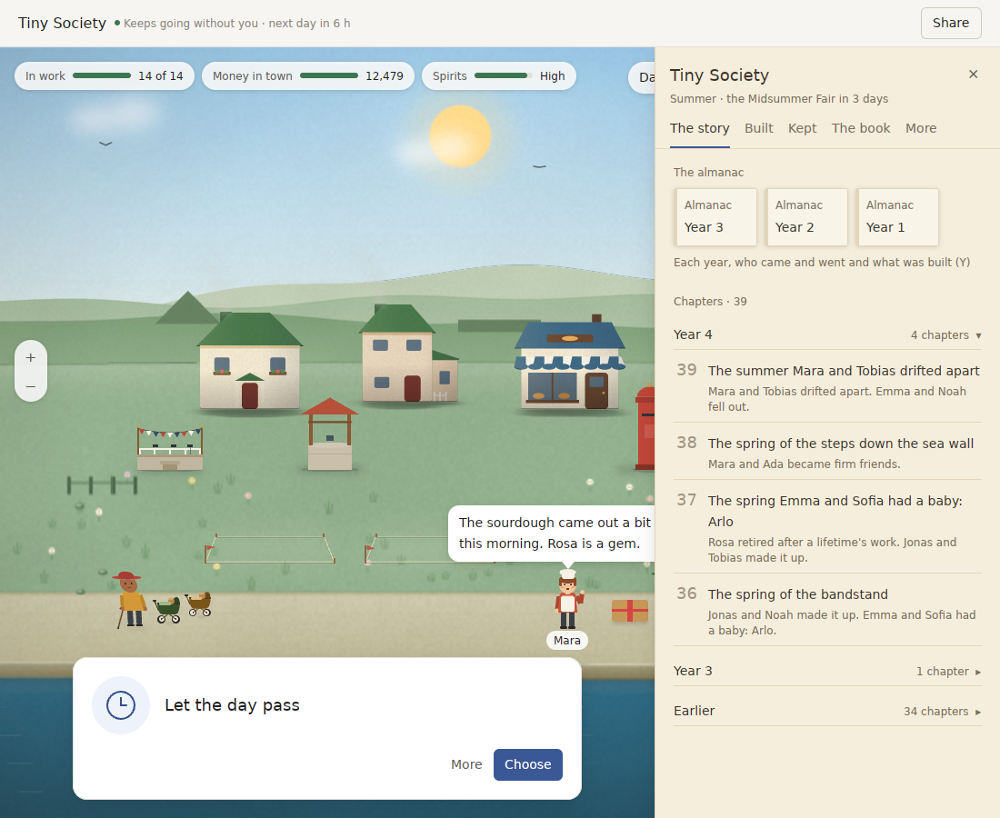

Next is v0.25: a crafted and trusted product, with the speed back.

## What v0.25.0 did

The second stage, "crafted and trusted".

| Bar | v0.25.0 |
|---|---|
| Goldens pass with the hand-made look | yes, deterministic; regenerated and each one looked at |
| Nothing over the scene brighter than the night sky | tested at 23:00 |
| Three-year snapshot under 15 ms | 3.9–6.3 ms (was 26) |
| A turn under 35 ms | not met on a busy machine: 43–57 ms (was 53–68) |
| Longest window frame under 8 ms CPU | 3.3–5.2 ms (was 7–11.6) |
| Snapshot size bar | 1,243,230 bytes, byte-identical to v0.24, bar 1,367,000 |
| Builder's World code under 50,000 | 49,951 |
| World codes limited and opened off the window's thread | 1 MiB / 16 MiB, 20 s |
| Files versioned, with backups, and old files replayed | v0.20–v0.24 fixtures in both Packs |
| At least 2,000 duplicated lines removed | 2,319 (1,664 of them code) |
| Nightly job for every ignored bar | yes |

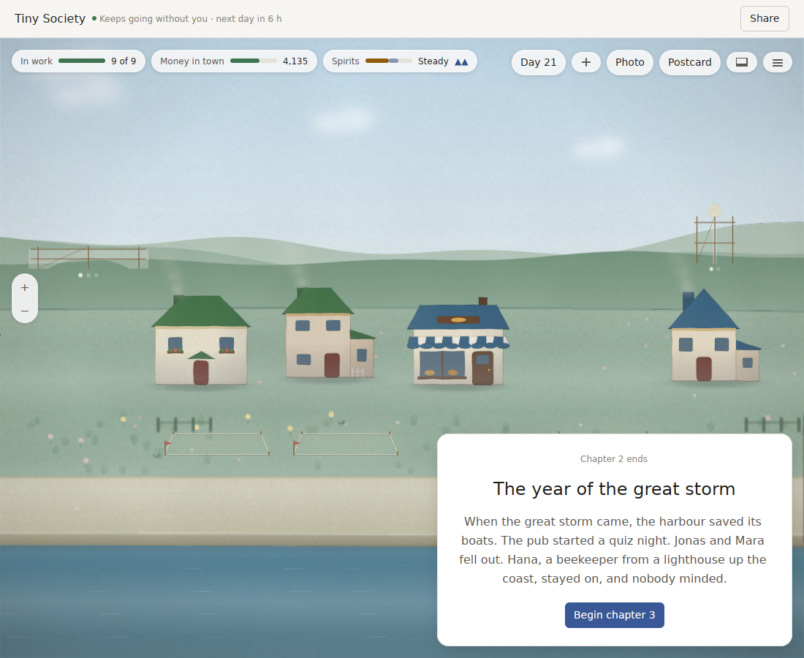
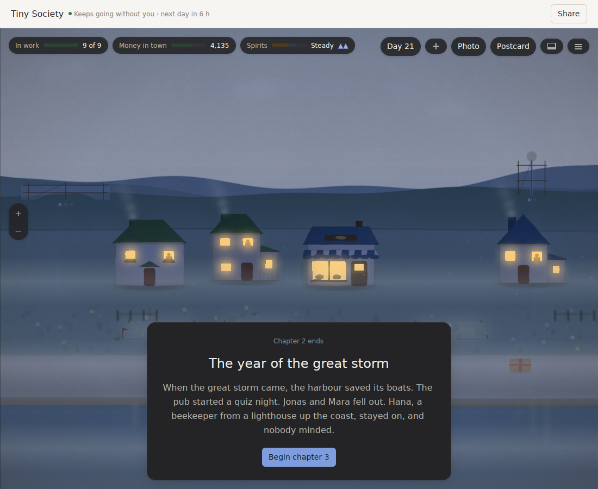

Next is v0.26: a layered World voice measured on a fresh blind set, then going out.

## Decisions only you can make

1. **Apple Developer Program** ($99 a year). It unlocks notarization, the widget, Quick Look, iCloud and any store. Everything in v0.26's second part waits on it.
2. **A Mac for testing.** Nothing since v0.21 (look, sound, clicks, keys, performance on Apple silicon) has been seen on a Mac.
3. **Where to sell first and at what price.** Direct and itch with a notarized build is the fast path. Steam needs a demo and about six months of wishlists to work. Comparable titles sell at $6.99–$19.99.
4. **Windows.** The Mac is about 2% of Steam; a Windows build would multiply reach but needs a GPUI Windows target and testing.
5. **A model for the voice's judge.** A cloud model (under $0.10 a month for a talkative player, with the player's own key), Apple's on-device model (Mac only, not in mainland China), or both.
6. **A commissioned artist.** The procedural look can get much further (v0.25). A human art director's pass on the palette, silhouettes and one Pack's key art would lift it further than any code.
7. **Five think-aloud testers** for the first hour, which is what v0.24 is built around.

## Sources

The review workspace holds the four full reports (the player's walk-through with about 70 screenshots, the measurements with logs and scratch harnesses, the architecture reading with file and line references, and the research with URLs). Key public sources:
- Tiny Glade, 600k sold and why: https://gigazine.net/gsc_news/en/20241120-tiny-glade-600k-sold-reason/ and https://vginsights.com/game/tiny-glade
- Rusty's Retirement and the idler genre: https://newsletter.gamediscover.co/p/how-rustys-retirement-idle-farmed and https://store.steampowered.com/bundle/48558/BottomOfYourScreen/
- Townscaper: https://mcvuk.com/business-news/when-we-made-townscaper/
- Tiny Bookshop, 500k sold: https://gonintendo.com/contents/55621-tiny-bookshop-getting-physical-switch-release-game-hits-500k-sold
- Next Fest wishlist benchmarks: https://howtomarketagame.com/2025/03/26/benchmarks-how-many-wishlists-can-i-get-from-steam-next-fest/
- Steam Hardware Survey, macOS: https://store.steampowered.com/hwsurvey/?platform=mac
- Steam content survey (AI disclosure): https://partner.steamgames.com/doc/gettingstarted/contentsurvey
- Suck Up!: https://store.steampowered.com/app/2726370/Suck_Up/ ; Whispers from the Star: https://vaporlens.app/app/3730100/whispers_from_the_star
- Apple Foundation Models (WWDC26): https://developer.apple.com/videos/play/wwdc2026/241/
- App Review Guidelines: https://developer.apple.com/app-store/review/guidelines/ ; Developer ID: https://developer.apple.com/developer-id/
- GPUI pixel-buffer surfaces PR: https://github.com/zed-industries/zed/pull/61291
- vello: https://github.com/linebender/vello ; tiny-skia changelog: https://github.com/linebender/tiny-skia/blob/main/CHANGELOG.md
- Steam language mix: https://alconost.com/en/blog/steam-language-mix-indies
- Claude Haiku 4.5 cost and latency: https://artificialanalysis.ai/models/claude-4-5-haiku
