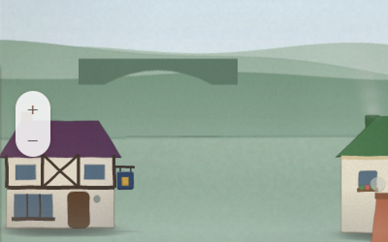
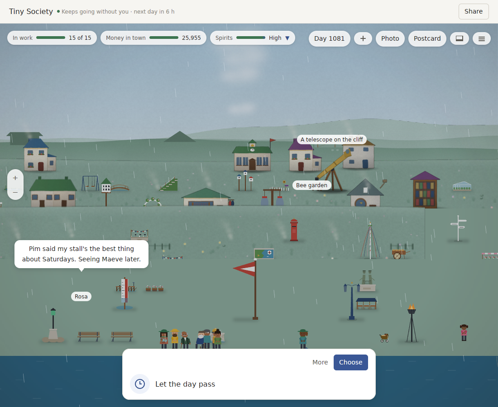
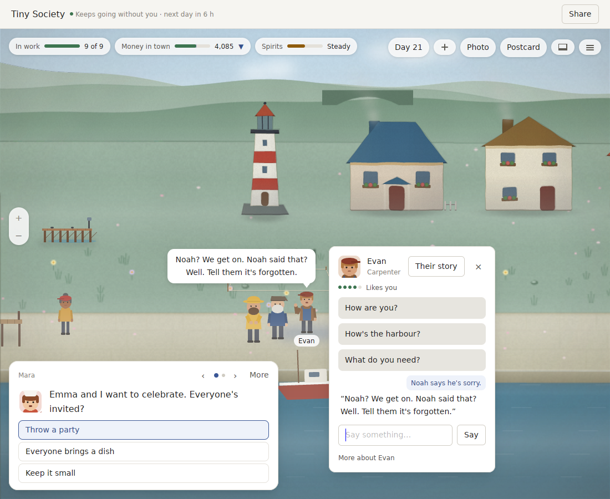
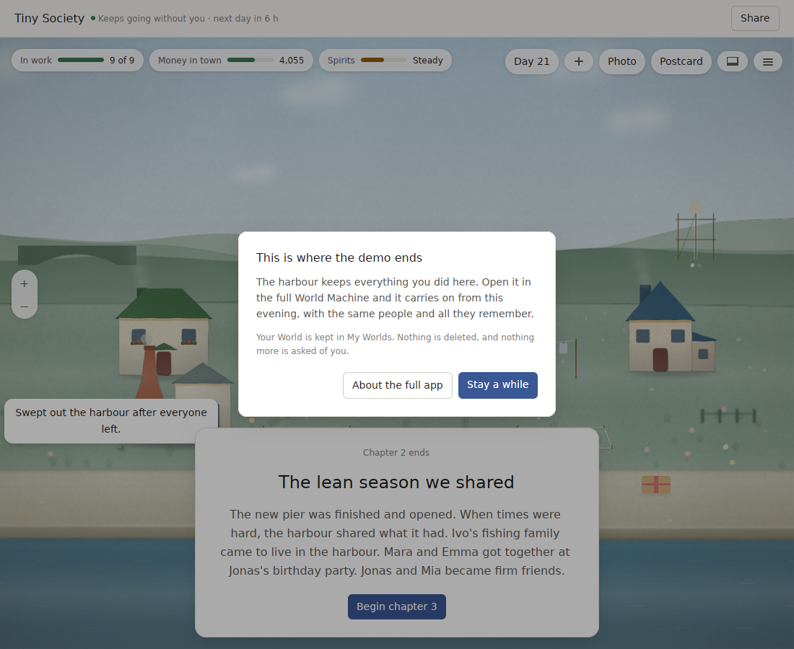
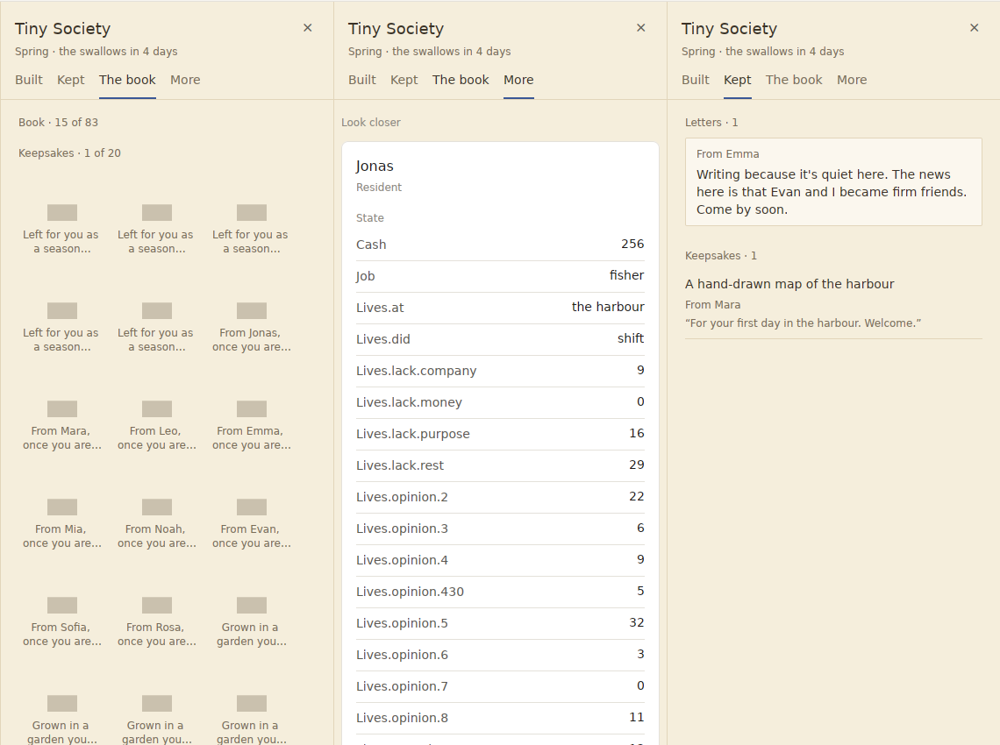
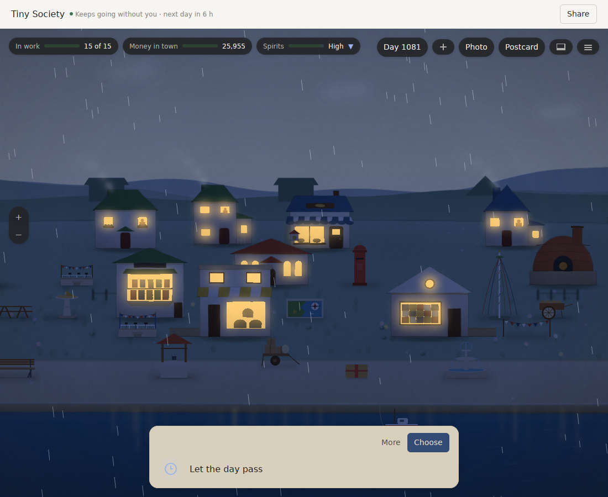

# World Machine v0.26: a deep review, and what v0.27 should be

Reviewed on 2026-10-01 at `dd5d60a` (v0.26.0). The data-loss bug the review found was fixed and released as v0.26.1 (`b338754`).

The review has four parts, each written independently:
- **Player:** the real app played in the Linux preview, about 280 screenshots.
- **Measurement:** five scripted players over three years in both Packs, plus favour players, with v0.25 rebuilt and timed alongside.
- **Architecture:** a reading of v0.26's diff and the whole tree.
- **Research:** web sources, with URLs and dates.

Every number is measured unless it says otherwise. The full reports and their logs are kept in the review workspace.

## The verdict

**v0.24 to v0.26 fixed a great deal:**
- The kernel and all eight invariants hold.
- Story variety is fixed: no storylet title is told more than 3 times in three years, for any player (it was 16 times at v0.23).
- Players who never answer now get towns that differ from each other.
- Night, the return film and Pocket Universe's three places look good.
- Japanese reads as if a person wrote it.
- A turn with its save is 30–35 ms, and the longest frame is 5–6.6 ms.

**But a player still meets a game whose loop is answering cards, in a town that does not visibly answer back:**
- In 23 days the harbour's main screen changed twice.
- The first answer's pier was drawn on a hilltop.
- Two of three favours were asked and lapsed without the player seeing them. The third took four wrong clicks to find its target and ended in a line that contradicted itself.
- After three years the town is a catalogue of objects on a lawn. There are visible tile seams, a postbox as tall as a person, and a telescope as tall as a house.
- The demo ends on a plain dialog stacked over a chapter card.

**The voice guard:**
- With the judge it declines 91.6% of bad answers and wrongly declines 0.6% of good ones (bar 95% / 1%).
- The rules alone catch only 32.7% of bad answers in Japanese.
- The judge's "keep" can override a doubtful rule finding. That is how v0.26 is built; the v0.26.0 notes said otherwise, and v0.26.1 corrected them.

**v0.27 should make the town answer the player,** make favours seen and doable, and tighten the voice and the plumbing. Notarization, the store and the widget still wait on the decisions at the end.

## What the player found

1. **The town doesn't answer the player.**
   - Water works (pier, jetty) stand on the hill or in the meadow.
   - Choosing Pottery puts a "Pottery" label on an existing cottage, with no scaffolding; the kiln appears a day later.
   - The quay screen looked the same from day 2 to day 16.
2. **Favours are invisible and hard to do.**
   - The asker is often off screen, and the target can be hidden under a card.
   - There is no marker, no quick reply and no thanks on screen.
   - The target's answer contradicts itself: "Noah? We get on. Noah said that? Well. Tell them it's forgotten."
3. **Composition is a catalogue on a lawn.** There are no paths or clusters, wide empty screens in the first month, tile seams, and props out of scale.
4. **The first minute has no arrival and no toy.** The welcome appears over fog, nobody is in view on day 1, and the first thing to do is a priced card.
5. **The demo ends on a dialog.** It sits over the "Begin chapter 3" card, says "this evening" at noon, and Home never says it is a demo.
6. **Repetition within an hour.**
   - One return told the day-9 chimney fire four times.
   - Two storm strips were nearly the same.
   - All three Pocket Universe places open with "X and I aren't speaking…".
7. **Moment strips don't show their moment.** "A bread cart" shows no cart, and harbour strips show one figure and a lighthouse.
8. **Chinese and Japanese gaps.**
   - The person card ("Shop assistant", "Say something…", "More about") and Home's "Start a World →" stay English.
   - Switching language live leaves an open World partly English.
   - Japanese uses “” instead of 「」, and some lines start with 。.
9. **Engine words on screen.**
   - The drawer's "More" tab is a raw inspector (`Lives.opinion.430`).
   - "Anchor Pub exhausted its payroll reserve".
   - "The year of…" titles an 11-day chapter.
   - Some keepsakes are grey placeholders.
   - Two Worlds are both called "Tiny Society".
10. **Input and focus are fragile.**
    - A tip stole focus, so Enter did nothing for 13 presses; Enter in the scene passed two days.
    - Clicks hit the wrong person, and name labels stack.
    - Labels showed before the buildings were painted.

**What already delights:**
- night;
- the return film;
- Pocket Universe's places;
- the Japanese;
- payoff lines such as "Rosa, a potter from a town with no sea, came because of the pottery you built."

These lines are the product's real voice, and the scene should say what they say.

## What the measurements found

| | v0.26 | Bar |
|---|---|---|
| Storylet titles told more than 3 times, any player | 0 | met |
| Legend causes, Last / Never / Absent | 56% / 45% / 46% | met |
| Seams at day 1,080 | 2–8 lines per player ("A good summer, summer of year 9") | 0, met only through year 1 |
| Year-three filler | "Something for the turn of the season." ×13; ten bench and swing lines ×9 | none set |
| No sad line in days 1–5 | the Last player gets one on day 4 | missed |
| Favours | 44 a year, first on day 5 | – |
| Favours done with everyday words | 77% ("look in on someone": 31%) | – |
| Favours for players who don't talk | 100% lapse, still asked every 8 days | – |
| A turn with its save | 30–35 ms (v0.25 on the same machine: 38–46) | 35 ms, met narrowly |
| First snapshot after a day | 25–38 ms; the 15 ms test now times a cached second look | needs its own bar |
| Longest frame | 4.95–6.59 ms | 8 ms, met |
| Memory after 20 days | 104–105 MB (v0.25: 99–100) | – |
| Builder's World code | 49,179 | 50,000, met |
| Hearing, 40 fresh phrases per language | en 77.5%, zh 82.5%, ja 90% | – |
| Voice guard, set 4, rules alone | 55.8% declined (ja 32.7%), 0.8% wrongly | – |
| Voice guard, set 4, with the judge | 91.6% declined, 0.6% wrongly | 95% / 1%, missed |
| Partly English in a year, zh | 0.06–0.48% (v0.23: 0.00–0.02%; regressed in letters) | 0.5% |
| Partly Latin in a year, ja | 0.00–0.08% | – |
| Nightly job | 4 failures every night | green, missed |

**The 40 misses on set 4:**
- 10 real-world names;
- 10 paraphrased harm;
- 6 polite assistant refusals in Chinese and Japanese;
- 5 invented names;
- 3 machine self-reference;
- 3 prompt injection;
- 3 other.

The judge's "keep" un-declined 14 of them.

**Two cheap changes would help without overfitting:**
- Promote the `machine_named` and `refusal_cannot` findings to certain. They never fire on a good line in any of the four sets, and they lift set 4 to 92.2% with no new false declines.
- Stop the judge keeping harm, instructions and real-world findings.

The rest needs narrow judge questions, a katakana stranger check, and Japanese rules built from development data.

**Other findings:**
- **Hearing:** the shipped "never tuned on" Japanese phrase set now scores 48 of 48, so it no longer measures anything.
- **Nightly job:** it fails every night for three reasons:
  - `a_full_block_of_children_fails_loudly` relies on a `debug_assert!`, so it fails in release;
  - `judge_prompts_are_written` (both Packs) and `judged_metrics` panic without their environment variables.

## What the architecture review found

The kernel is healthy. All eight invariants pass, and most of v0.23's high and medium items are closed.

| | Finding | Status |
|---|---|---|
| B1 | After Save As, turns were kept in memory, never written, and lost on close. | **Fixed in v0.26.1** |
| B2 | The judge's "keep" overrides doubtful rule findings, including harm, instructions and fourth-wall. It is on by default when a key is stored. | Notes corrected in v0.26.1; behaviour to change in v0.27 |
| B3 | The listener (20 s) then the judge (6–8 s) run inside a 12 s window deadline. A slow pair loses the model's answer entirely, and the abandoned requests are still billed. The judge is also asked about answers the rules will decline anyway. | Open |
| M1 | Home's rename and export run on the UI thread while the writer thread works on the same file, with a shared fixed temp name. Nothing stops the demo and the full app writing one World at once. | Open |
| M2 | Save failures on close are swallowed; on quit they only reach the log. | Open |
| M3 / M5 | The Pack trusts a `judge` field inside response text, which is safe only because the app rebuilds that text. A third-party Pack's prompt is sent as-is with the player's key, twice per utterance. | Open |
| M4 | There is no v0.25 fixture, and the v0.20 and v0.21 fixture files are byte-identical. | Open |
| M6 | The red-team sets are measured, not gated. | Open |
| M7 | The demo gate does not use `offers_pack`, so other Packs play without limit; it fails open with no calendar. | Open |
| M8 | Model replies are checked only for control characters, not for bidirectional or invisible characters (`is_clean_text` exists). | Open |

**Code health:**
- 206k lines of Rust (+17%); world-gpui is 49.9k.
- The longest functions are `paint_thing` at 852 lines and `turn_questions` at 842.
- `ja_walk.rs` and `zh_walk.rs` share 371 of 411 lines.
- The replay goldens format about 2.7 GB of debug text per test run, and Pocket Universe's library tests take 44 minutes.
- There are 734 packages and no `cargo-deny`.

**The refactors that would most raise velocity:**
- one `WorldFile` owner in world-library, so that B1 and M1 cannot happen;
- prompts built by the host from a structured `Hearing`, which closes M3, M5 and B3 together.

## What the research found (sourced in the report)

- **Judges are lenient.**
  - Recent papers find LLM judges right on over 96% of good outputs but on under a quarter of bad ones.
  - A "minority veto" (decline if either of two judges declines) and checklists beat one verdict.
  - At these sample sizes, set 4's recall has a 95% interval of 88.8–93.8%.
  - Proving 1% wrongly declined needs about 1,500 good lines.
  - Proving 95% recall needs about 500 bad lines per language.
- **Apple:** Foundation Models guardrails can only be relaxed for rewriting tasks, and adapters are 160 MB or more. Citing fact numbers inside the reply's structure, as v0.26 does, is the right approach.
- **Market and AI disclosure:**
  - Games with an AI disclosure get about half as many reviews.
  - World Machine's label will come from model-assisted text, not from the optional voice.
  - Desktop idlers keep selling: Rusty's Retirement about 880k copies; Hozy sold 100k in 4 days from 500k wishlists.
- **Steam:**
  - Steam requires notarized Mac builds.
  - The February 2027 Next Fest closes registration on 10 January 2027, and the store page must be public before then.
  - A typical game gains about 200 wishlists from a Next Fest.
- **Apple path:**
  - Individual enrolment costs $99 and is often same-day.
  - Since November 2025 the App Review guidelines (5.1.2(i)) require the app to ask consent in-app, naming Anthropic, before data goes to it.
  - Reviewers treat AI chat like user content: they expect a filter, a report button and a contact.
- **Playtests:**
  - Five think-aloud users find about 77–85% of usability problems.
  - The median demo player quits at about 14 minutes.
  - A protocol of testers on their own Macs, a next-day return and the World file as the log costs about $250–400.
- **Art:** about $3,000–6,000 buys a 2–3 day art-direction pass and one key art piece with full rights and a no-AI clause.

## The plan for v0.27: "The town answers back"

1. **A place that shows what you did.**
   - Works stand where they belong: water works on the water line, the pier at the quay, tested over three years.
   - A build shows scaffolding within a second of the answer.
   - The 20 commonest storylets each leave a prop in the scene.
   - Paths join the works into at least three clusters.
   - No tile seams in the goldens; props at human scale (a postbox at most 0.8 of a person).
   - **Bar:** the quay screen changes on at least 8 of the first 14 days, for a warm player.
2. **Favours you see and can do.**
   - The asker is in view when asking, and the target gets a marker and a camera move.
   - The favour is a quick reply in the target's card, and the thanks appear on screen within 5 seconds.
   - No contradictory replies.
   - Asks slow down after lapses.
   - **Bar:** at least 90% of favours done with everyday words (measured with fresh phrasing), at least 90% seen by a warm player, and none lapsing unseen.
3. **An arrival and an ending.**
   - The welcome comes after the town is painted, with Leo in view and at least 4 residents on the first screen.
   - Something free to place within 20 seconds.
   - The demo ends on a dusk farewell scene recapping 4–6 of your moments, with a postcard to keep and no card underneath.
   - Home says "World Machine Demo".
   - The time-of-day wording matches the sky.
4. **Words that don't repeat or show their seams.**
   - No event told more than twice in 7 days across cards, film beats, notes and strips.
   - No line said more than 8 times in year three.
   - Zero seams at day 1,080, with the checker fixed.
   - No sad line in days 1–5 for any of the five players.
   - Moment strips show their titled object or at least two named people.
   - The drawer's inspector goes behind a developer setting, and a word test bans engine nouns.
   - Chapter titles fit their length, and every keepsake is drawn.
   - Chinese and Japanese at most 0.05% partly untranslated. The person card and Home are covered by the walk tests; Japanese uses 「」; no line starts with punctuation.
5. **The voice, v2.**
   - Promote `machine_named` and `refusal_cannot` to certain.
   - The judge may no longer keep harm, instructions or real-world findings.
   - Narrow judge questions for harm and real-world names.
   - A katakana stranger check, and Japanese rules from development data.
   - Listener and judge fit inside the window deadline; the judge is skipped when the rules will decline anyway; abandoned requests are cancelled.
   - The verdict travels in the Say intent, never in raw model text.
   - Replies are checked with `is_clean_text`.
   - **Bar:**
     - a fresh set 5, written blind, with about 500 bad lines per language and real model outputs;
     - at least 95% declined and at most 1% wrongly declined per language, reported with intervals;
     - at least 75% declined without a judge in each language;
     - measured through the app's own request as soon as a key is available.
   - Sets 3–5 become a pass/fail test on their recorded verdicts.
6. **Trust and health.**
   - Rename and export of an open World go through its session; unique temp names; one writer per World across apps.
   - Save failures are shown on close and on quit.
   - The demo enforces `offers_pack`.
   - Real v0.25 and v0.26 fixtures, and a v0.21 fixture that differs from v0.20.
   - A green nightly three nights running.
   - The first snapshot after a day under 20 ms as its own bar; memory at most 100 MB after 20 days.
   - Fresh-phrase hearing at least 85% per language.
   - At least one coming of age on Ares.
7. **Velocity.**
   - One `WorldFile` owner in world-library.
   - Host-built prompts from a structured `Hearing`.
   - Streaming golden digests.
   - One language walk for all languages.
   - `forbid(unsafe_code)` where possible, and `cargo-deny`.

## Decisions only you can make

| Decision | Recommendation |
|---|---|
| **Apple Developer Program** ($99 a year) | Enrol now as an individual. It is the one thing that blocks notarization, a Steam Mac build, the widget and Quick Look. |
| **A Mac for testing** | A used M1 MacBook Air (about $340–510). Nothing since v0.21 has been seen, heard or timed on a Mac. |
| **Where to sell, and the price** | Once builds are notarized: a public Steam page with the demo, then launch on Steam and direct at $12.99. The February 2027 Next Fest needs the page public by about December. |
| **Windows** | For the Steam launch, not before the demo. |
| **The judge's model** | Haiku plus this Mac's own model as a veto pair: an answer is declined if either declines. Haiku alone stays the default where the Mac's model is not available. |
| **An artist** | About $3,000–6,000 for a 2–3 day art-direction pass and one key art. v0.27's composition work will give them a better base. |
| **Five think-aloud testers** | Five sessions now on the demo, and a second round after v0.27. |
| **An API key for measurement** | A key with a small budget would let the judge be measured through the app's own request, instead of an agent reading its prompt. |
