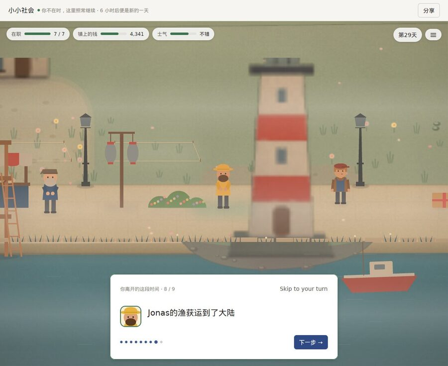
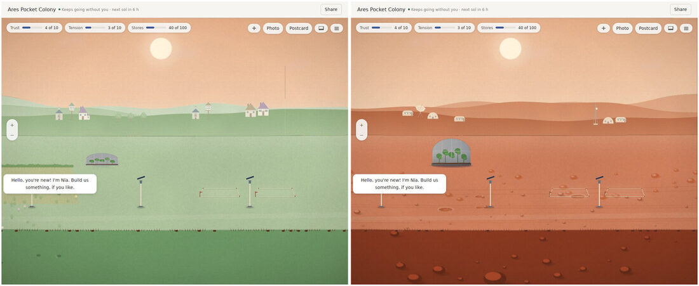
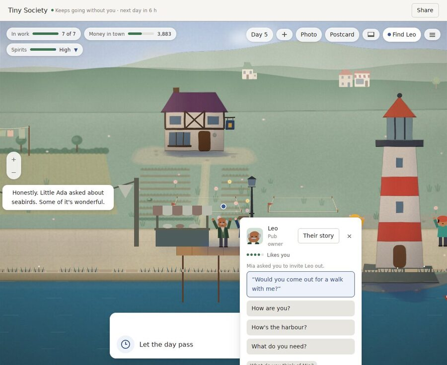
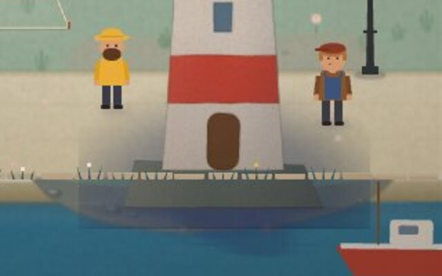

# World Machine v0.28: a deep review, and what v0.29 should be

Reviewed on 2026-10-08 at `1fc5ff0` (v0.28.0), with the persistent-pi deadline fix of #343 beside it (nothing measured here touches it).

The review has five parts, each written independently:
- **Player:** the release app and the demo build played in their real window under Xvfb, about 150 screenshots of free play plus the 66 frames of `scripts/release-shots.sh`, in English, Chinese and Japanese.
- **Art direction:** the art director judged the player's frames, not curated ones, against [the bible](ART_DIRECTION.md).
- **Measurement:** the repo's own harnesses in release, with v0.27.0 rebuilt and timed alongside on the same 4-core machine, plus callgrind for work per turn.
- **Architecture:** v0.28's diff and the whole tree, against [the invariants](../AGENTS.md).
- **Research:** web sources with URLs, all dated 2026-10-08. Pages could not be opened through the network proxy, so every fact comes from search summaries and should be read again before money is spent on it.

Every number is measured unless it says otherwise. The full reports, logs and screenshots are kept in the review workspace.

## The verdict

**v0.28 kept the promises it could measure:**
- The first frame of every World is whole. A painted town is on screen about a second after launch, and in 62 of 62 scenario runs of the real window no unpainted frame followed it.
- Turns got faster: a three-year harbour turn with its save went from 25–26 ms to 22–23 ms, and a three-year Maple Street turn from 356 ms to 38–40 ms (a linear scan that v0.27 never reported).
- Hearing new phrasing rose to 85.7% / 81.2% / 77.7% (en / zh / ja) from v0.27's 74.1% / 75.9% / 71.4% on the same blind set.
- Over three years nothing is said more than 5 times in year three, with no filler, seams, engine words or sad lines.
- No model reply or verdict can pay; that is proved, not sampled.
- CI's test job went from 37 to 28.5 minutes, and save compatibility runs from v0.20 to v0.27.

**But the player still sees an unfinished game, in the frames between the ones we checked.** The art director withdrew the v0.28 sign-off: it was given on settled frames the harness picked, and players mostly see what comes after Next, Esc or Find, or as a place opens:
- The rough stand-in stays on screen for about 2.5 seconds, and the subject of the moment is often the blurriest thing in the frame: the lighthouse is a smear in the return film's eighth beat while the people around it are sharp. The harness counts that frame as painted, so the bar passed while the player saw blur. The store page's return shot is the sharp version of a frame the player saw as a mosaic.
- Each Pocket Universe place opens on the harbour's meadow and cottages for about half a second.
- The lighthouse stands in a hard dark rectangle that runs into the water, and the pub on a clipped shadow bar.
- The talk card runs off the bottom of the window, so its text field cannot be reached; cards stack and cover the person speaking.
- English leaks into Chinese and Japanese ("Skip to your turn", "ノア gave you", the Chinese openers), and lines still break badly in all three languages.

**Pocket Universe is one layout in three costumes.** The three places share the lamp positions, the plots, the keeper's mark and the opening line, and one card reads "Help me fit the new a spare seal?". The player would keep playing the harbour for its story pages, but not Pocket Universe.

**Five claims in v0.28's notes were wrong** (corrected in this change, below), and the release screenshot run in CI has never run.

**v0.29 should make the game right as it is played, not as it is checked:** sharp on the subject of every moment, each Pocket Universe place its own, cards and words that fit, and Windows playable. The research changes the order. Steam is 95% Windows and a game gets one Next Fest, so Windows must be playable before the demo, not after. Next Fest registration closes on 10 January 2027.

## What the player found

**Timings in the real window (release, load 2.5–5):**
- **Launch to the World window:** 1.05–1.30 s, the first frame whole, with 4 residents and 3 buildings.
- **First choice and first keepsake:** about 85 s, most of it spent finding a valid spot.
- **First card answered, pier up:** about 95 s.
- **First favour:** day 5. The player's own words failed; the one-click reply worked. Own words did work for a look-in favour on day 13.
- **The rough stand-in:** visible 2.5–2.6 s after a camera move or a return-film beat.
- **Canned scenarios:** all passed except `zoom`, which failed with 4 unpainted frames at 78–80 s while the machine was loaded.

**The ten most important problems:**
1. **The rough stand-in sits on the subject** for seconds: return beats, Find landings, closing a card.
2. **Pocket Universe places open on the wrong world** for about 0.5 s.
3. **English in Chinese and Japanese:** "Skip to your turn" is hard-coded (`crates/world-gpui/src/window.rs:327`), "ノア gave you" comes from `format!("{from} gave you")` (`world_window.rs:2869`), the Chinese openers are English, and Chinese names stay in Latin letters.
4. **Line breaking** in all three languages: "with a / heavy / crate", "come and go / from / the bench"; a lone "。"; Japanese lines starting with "、", and breaks inside words such as "くださ/い。".
5. **The talk card runs off the window and does not scroll;** cards stack on each other and clip.
6. **The first choice confuses.** Clicking the roped plot opens the build menu, and choosing Wildflowers there does not plant them; clicking open grass planted them on the road. In Ares, clicking zoom-out placed the free bench.
7. **Pocket Universe is one script in three costumes:**
   - identical cards and the same tent;
   - a template bug, "Help me fit the new a spare seal/fuse/lantern?" (`worlds/pocket-universe/data/threads.json:245`);
   - "Night 2" under a noon sun;
   - trust at 10 of 10 by turn 4.
8. **The camera and bubbles disorient:** the drawer and Esc jump to another part of town, bubbles speak for people off screen, and favour markers float in empty air.
9. **Harbour Front defects:** the lighthouse's shadow box and the pub's clipped shadow on day 1, groups of people fused into blobs, and the gauges wrapping into a column when a chip is added.
10. **Thin words in small, frequent ways:**
    - generic replies ("Hello there." to a question; "I like Mia." to "Fancy a stroll?", which also did not do the favour);
    - filler openers ("Frankly.", "Honestly.");
    - a bench line opening year three;
    - the mayor "New to the town";
    - moment captions cut mid-word;
    - "The harbour lamp you began by the harbour";
    - a demo recap of five "You began…" lines in a row.

**Smaller:**
- The book's keepsake hints are cut off.
- Tooltips say ⌘ on Linux.
- Ctrl+W does not close a World window.
- The demo's **Keep a postcard** fails on Linux, and says so honestly.

**What is best:**
- The story pages: the almanac, the chapter-end cards and the three-panel moment strips.
- Causes you can read ("because you said 'sell jam'"), and thanks that show on the asker's card.
- Favours that are clear ("Mia asked you to invite Leo out").
- Years two and three, which feel alive; night with lit windows reads at once.
- Pocket Universe's start screen, and the demo's warm farewell.

**Is the town alive?** In years two and three, yes. In days 1–20, half: there is plenty of chatter, but only one to three people are in frame, and the quay is nearly empty on rainy day 13 and at dusk on day 21, the demo's last picture. Pocket Universe, no: one keeper and a scaffold.

## What the art director found

**No sign-off on v0.28 as a player sees it.** The v0.28 sign-off was too generous because it judged curated, settled frames.

**The ten problems, ranked, with the fix direction:**
1. **The rough stand-in on the subject.** Paint the subject's region first, sharp, before the camera settles. Never show the rough above 1:1; cross-fade from the last sharp frame instead. Count "painted" per region, not per frame.
2. **The wrong-world flash.** Key the rough cache by World; with nothing ready, hold a flat wash in the place's own palette.
3. **Contact shadows drawn as rectangles** (the lighthouse, the pub, a purple halo under Nia on Ares). Use only blurred ellipses at 20–30%, clipped to land; give the lighthouse a painted rock plinth.
4. **Cards cover people, run off the window and stack.** One card at a time, on the side away from its subject, clamped to the window and scrolling inside.
5. **Line breaking, and Latin text in Chinese and Japanese.** Balanced-width bubbles, and kinsoku.
6. **Bubbles and markers point at nothing.** A bubble needs its speaker on screen, or it goes to an edge tab with a portrait; markers stand on the ground with a contact shadow.
7. **Dusk is grey-olive fog over an empty quay** (the store's dusk shot, and the demo's last picture). Use a gold key light and long warm shadows, light every lamp on the spine, and put two groups out by the water.
8. **Pocket Universe is one layout.** Give each place its own layout and spine, scatter things in clusters rather than a grid, and tie the time label to the sky.
9. **People stand in rows and blobs** (about 12 in single file in year two). Enforce the rule of facing groups of 2–3, with minimum spacing.
10. **Zoomed out, the town is a catalogue** of houses one by one on a lawn, with band seams. Tiny Society's Start thumbnail is a lilac placeholder.

**Protect:**
- the moment strips and almanac pages;
- the year-three quay under bunting;
- night windows in the harbour and on Maple Street;
- the Ares rovers and habitats, and the igloo forms;
- the Pocket Universe start screen;
- the v0.27 key art's gold dusk, the target the game itself misses;
- the paper grain and wobble;
- people readable at 1×.

**Each Pocket Universe place, as it should be:**
- **Ares** is a sheltered ring against a hostile plain: rovers and habitats huddled on a lit airlock apron around a green dome garden; teal and signal-white light inside at night, rust dark outside.
- **Maple Street** is a street, not a lawn: asphalt for the spine, kerbs, porches, a bus stop, the arcade's magenta glow, brick-red rows and green front yards. Drop the lilac haze; its night is already Pocket Universe's best picture.
- **Icebridge** is a causeway over dark water: igloos in irregular rows on packed snow, fish-orange and lantern-gold accents, and a cold blue key light, never sand-beige.
- None of the three shares lamp positions, plots, the keeper's mark or the opening line.

## What the measurements found

**Speed (a turn with its save, median / p95, two interleaved rounds at load 1.4–1.8):**

| World | v0.27 | v0.28 | Bar |
|---|---|---|---|
| Harbour, day 1 | 8.9 / 14.6 ms | 8.7 / 13.3 ms | |
| Harbour, year 1 | 19–20 / 22–26 ms | 16–18 / 22–25 ms | |
| Harbour, year 3 | 25–26 / 34 ms | 22–23 / 30–33 ms | 30 / 35, met |
| Maple Street, day 1 | 144–149 / ~200 ms | 8.6–9.0 / ~14.5 ms | |
| Maple Street, year 1 | 271–283 / ~345 ms | 19.5 / 28–33 ms | |
| Maple Street, year 3 | 356–358 / 380–420 ms | 38–40 / 49–52 ms | 30 / 35, **missed** |

- **The repo's turn bench** (228 turns, harbour): 27.4–30.9 ms → 24.5–24.8 ms.
- **Work per turn** (callgrind, 12 turns, the main thread): the year-three harbour went from 2,354 M to 2,034 M instructions (−13.6%; the notes said −17%), Maple Street from 26,993 M to 3,614 M (−87%). In v0.27, 90% of a Pocket Universe turn went to a linear scan in `conversation::faces::in_chinese`; v0.28 indexes it and never said so.
- **Pocket Universe still misses at year three:** a turn is 38–42 ms against 30 / 35, and looking again at an unchanged World is 26 ms against 15. The repo's speed benches are all harbour, so nothing catches it.
- **The harbour, unchanged from v0.27:**
  - looking again at an unchanged World: 2.4–3.3 ms (bar 15, met);
  - the first look after a day: 20–28 ms (bar 20, missed);
  - memory after 20 days: 106–108 MB (bar 100, missed);
  - a three-year file: 2.21 MB, saved in 107–161 ms and opened in 99–116 ms.

**Frames and painting (release):**
- **The longest frame** was under 8 ms in only 6 of 15 runs on a quiet box (load 0.6–1.0): 6.8–10.4 ms, median 8.1. The window thread's CPU time matches the clock within 0.1 ms, so the slow frames are the app's own work, not a busy machine.
- **The real window:** no unpainted frame after the first in 62 of 62 scenario runs, and the first frame was whole in all of them. Day 1 shows exactly 4 residents and 3 buildings, the bar with no margin. But "painted" counts the rough stand-in as painted, which is how the blur above passed.
- **A harness bug:** when Xvfb died, `release-shots.sh` hung forever in `xwininfo -id ""` instead of failing.

**Words over three years:**
- The line said most in year three is said 4–5 times for every player in every place (v0.27: 4–7).
- There is no filler in the top 20, and no seams, engine words or sad lines.
- Over one year no letter in Chinese or Japanese is partly English, in any place. Over three years, 2 Maple Street letters in Chinese carry whole English sentences, and one English letter has a seam ("when A few of us").

**Hearing, favours and talk for rewards** (blind-set hashes verified):

| | v0.27 | v0.28 | Bar |
|---|---|---|---|
| fresh28 heard, en / zh / ja | 74.1 / 75.9 / 71.4% | 85.7 / 81.2 / 77.7% | 85% each |
| Favours done in everyday words | 57.4% | 60.6% (57 of 94) | 90% |

- Quiet players are asked a favour every 14–21 days (the harbour, over 150 days).
- Talk for rewards: 8 completions, all by the player's own words (4 per Pack in 9,300 tries each); none by a model or reply.

**The voice (offline only):**
- Set 6 with the recorded judge verdicts reproduces exactly: 94.0% declined and 2.4% wrongly (en 94.7 / 4.0, zh 94.3 / 2.3, ja 93.0 / 0.9).
- Sets 3–5 hold their floors. Set 5's English wrongly-declined is 2 of 520 (0.38%), not the 0.2% reported, unless one line is excluded as by design.
- Not measurable here: the real judge through the app (no API key on the box), the Mac's own model, and the crisis replies and the Report button end to end.

**Health:**
- CI's test job: 28.5 min (v0.27: 37.4), green.
- The nightly: two green runs, both on v0.27 code; none yet on v0.28.
- 1,408 tests, 70 ignored (v0.27: 1,330 and 69). Pocket Universe's library tests take 98.5 s in debug.
- **`caused_by`:** 90% of a three-year harbour's events and 99% of Maple Street's carry no cause. v0.28 added the counter and changed no provenance.

## What the architecture review found

**The invariants.** 1–4, 6 and 7 hold:
- `world-core` has no dependencies;
- `never_pays.rs` proves no model reply or verdict can pay;
- replay re-applies recorded events;
- `render_world` only reads.

Invariant 8 holds too, but Packs still run pi or `fm` themselves, outside the app's time budget.

**Invariant 5 holds in name only.** 177 event kinds are emitted without a cause, because a day passing has no root event: `pass_days` (`worlds/tiny-society/src/persistence.rs:100`) and every System's `tick()` take no cause. The emitters:
- both Worlds' `story.rs` (79 kinds);
- `systems/lives` (20 kinds; only `react_to` sets a cause);
- `systems/storylets` (2 of 34 constructors set one);
- `calendar`, `hands/mark.rs`, `days/town.rs`, `conversation/favour.rs` and `chronicle/kit.rs`.

**v0.28's "clear the way" item, delivered and not:**
- **Done:**
  - `world-art` (no dependencies, a 436-row catalog);
  - heights declared by the Packs, and a closed `Ground` enum;
  - `forbid(unsafe_code)` in 39 of 40 crates;
  - the cargo-deny ban on `pi_agent_rust`;
  - the replayed-state golden, the Pack-name ratchet and the count of uncaused event kinds.
- **Partial:**
  - `CommandRole` has only `PassesTime`. The favour reply became `Ears::Offered`, a better shape.
  - The decision-maker seam is still five traits.
  - Six subprocess runners remain, one of them `curl` with no deadline (`apps/pocket-universe-pack/src/api_voice.rs:179`).
  - The desktop app still links `world-core` and every System through `world-builtins`.
  - Windows is a compile check, and the 19 Unix-only Pack-process tests never run there.

**What blocks Windows:**
- no key store;
- the language comes only from `LANG` (`world-i18n/src/lib.rs:962`);
- postcards call `/usr/sbin/screencapture` with no gate (`world_window.rs:5094`);
- the lock file is removed while still open, which Windows refuses (`world-library/src/lock.rs:94`);
- no installer, signing or Windows release job.

**What blocks a third Pack:**
- the look is a closed enum (`Setting`, `world_art::Family`, and 2,300 lines in `works/{harbour,mars,street,ice}.rs`);
- translations are compiled into the app (`world-builtins/src/lib.rs`), and the protocol has no locale;
- the included Packs are hard-coded;
- there is no SDK;
- bundles carry no target triple.

**What blocks Steam:**
- A crash is one log line from a panic hook (`diagnostics.rs:108`), with no backtrace or report.
- There is no Steamworks or Cloud.
- Pack processes run with the whole environment minus a denylist, the working directory, and full file and network access (`world-pack-process/src/lib.rs:985`).
- Save compatibility is good.

**Health:**
- **Size:** 235.5k lines, 761 crates.
- **The largest files:** `conversation/lib.rs` 5,828 lines, `world_window.rs` 5,785, `lives/lib.rs` 5,363, the desktop `main.rs` 4,631 (with 107 `cfg(gui)` gates).
- **The longest functions:** `paint_thing` 851 lines, `turn_questions` 841, `render_world` 742.
- **Duplication:** the two Worlds mirror 30 modules.
- **Shared-global hazards of the kind behind v0.28's CI flake:**
  - a test sets the process-wide text scale to 200% while golden and wrapping tests run beside it (`world-gpui/src/lib.rs:205`);
  - a desktop test changes the global language and contrast;
  - the language itself is global;
  - about 12 per-thread maps in `diorama/interface.rs` are never pruned.
- **Six wall-clock asserts** run in debug tests.
- **`check-boundaries.sh`** swallows `cargo tree` errors.

## What the research found (sourced in the report)

- **Steam is 95% Windows.** September 2026's survey: Windows 95.03%, macOS 1.92% (gamingonlinux.com, 2026-10). A game gets one Next Fest, so a Mac-only demo misses almost everyone.
- **Next Fest, February 2027** (partner.steamgames.com):
  - registration closes 10 January 2027 at 11:59pm PST;
  - everything submitted by 8 February;
  - the press preview from 11 February;
  - the fest from 22 February to 1 March.
  - The store page must be public, and Steam Direct makes a first game wait 30 days after the fee, with a Coming Soon page up at least two weeks.
- **Wishlists:** the median fest gain surveyed was 806, and GameDiscoverCo's estimated true median about 200. Wishlists before the fest predict those from it (correlation 0.825), and half the top earners released their demo months early. **Plan for 5–7k wishlists before the fest and 15–30k by launch, not 100k.**
- **AI disclosure has a measured cost:**
  - Game Oracle found about 52.6% fewer reviews for disclosed games after controls, and 84.6% vs 88.3% positive;
  - Haro found AI-flagged games were 30.8% of 2026 releases but 10–27% of estimated sales.
  - Both are correlations. Lead with the handmade town.
- **California SB 1119 ("Adam's Law")**, signed 10 September 2026, takes effect 1 January 2027, most duties from 1 July 2027.
  - It keeps SB 243's video-game exemption only while characters cannot discuss mental health, self-harm, sexual content or things unrelated to the game.
  - Saved exchanges make the voice "recall" the player, so the exemption is the whole defence.
- **EU AI Act Art. 50(1)** was not delayed: keep "Written by AI" in the game rather than lean on the "obviously AI" exception.
- **China, Japan and Korea:**
  - China's generative-AI rules reach services offered from abroad;
  - Japan has no binding duty;
  - Korea's AI Act (January 2026) wants AI text labelled, which the game already does.
- **Cozy lessons:**
  - Rusty's Retirement sold 26% in China, sold a $4 supporter pack to 11% of buyers, and was criticised for CPU and GPU use in the background;
  - Cozy Grove's real-time clock drew backlash from buyers who did not expect it;
  - Steam added a Desktop Companion tag in May 2026.
- **Platforms:**
  - A new Apple team's first notarization can stall for 24 hours to more than 4 days, and enrolment for 2–3 weeks at ID checks.
  - Steam needs notarized Mac builds, and its overlay needs `disable-library-validation`.
  - macOS 27 runs only on Apple silicon.
  - Azure Artifact Signing costs $9.99 a month but is open to individuals only in the US and Canada, and EV certificates no longer skip SmartScreen.
  - The Rust `steamworks` crate is at 0.13.1.
- **Price:** the cozy niche's median list price is $4.99, but games at $20 or more reached 1,000 reviews far more often (a vendor's figure). $12.99 with a 10% launch discount and a supporter pack is a judgement.

## The plan for v0.29: "Right as it's played"

1. **Sharp where the player looks.**
   - **The subject first:**
     - paint the subject's region of each moment first (return beats, Find, closing a card, a place opening);
     - never show the rough above 1:1, and cross-fade from the last sharp frame instead;
     - count "painted" per region, so the bar measures what the player sees.
   - **No foreign world:** key the rough painting by World; before anything is ready, a wash in the place's own palette.
   - **Shadows, light and people:**
     - contact shadows as soft ellipses clipped to land;
     - a rock plinth under the lighthouse;
     - a gold dusk with every spine lamp lit and people out;
     - the layout keeps people in facing groups of 2–3, never rows or blobs.
   - **Frames:** upload pictures ahead of a pan so the slow frames go.
   - **Bars** (release, real window, sampled at 30 fps):
     - the rough on the subject of a moment for at most 250 ms, and anywhere for at most 600 ms;
     - 0 frames of another World in the first 2 s of any open;
     - no straight dark edge longer than 8 px under a structure;
     - at most 4 people in a line on the quay, and silhouettes overlapping by at most 20%;
     - dusk within a gold hue band;
     - the longest frame under 8 ms in 10 of 10 runs on a quiet box.
   - **Sign-off changes:**
     - The sheet comes from scripted free play: day 1's first 90 s; days 5, 13 in rain and 21 at dusk; a return film; Find; Esc; each Pocket Universe place opening; Chinese and Japanese.
     - It includes frames 0.3, 1.0 and 2.5 s after every camera move, and at least a third of the frames are picked at random by the harness.
     - Every store shot must match the frame the player sees at that moment.
2. **Cards and words that fit.**
   - **Cards:**
     - one card at a time, on the side away from its subject, inside the window, scrolling inside;
     - a bubble only with its speaker on screen, else an edge tab with a portrait;
     - markers on the ground;
     - the drawer and Esc never move the camera.
   - **Lines:**
     - balanced English bubbles, and kinsoku in Chinese and Japanese;
     - no UI text in Latin letters in Chinese or Japanese (the hard-coded strings, the openers, the gift line);
     - names written in the reader's script, held by a test.
   - **The first choice:** clicking a plot plants what you chose there, and a click on a control never places anything.
   - **Small words:**
     - the Pocket Universe template bug;
     - the time label tied to the sky;
     - captions never cut mid-word;
     - "the harbour lamp … by the harbour";
     - a demo recap that varies;
     - the book's cut-off hints;
     - ⌘ only on a Mac, and Ctrl+W.
   - **Bars:**
     - 0 frames where a card or bubble covers its own speaker or a Find target;
     - every card fully inside the window;
     - no English line under 30% of its bubble's width;
     - no Chinese or Japanese line that starts with 、。」 or is only punctuation;
     - 0 Latin UI strings in Chinese or Japanese;
     - 0 partly English letters over three years in every place.
3. **Each Pocket Universe place its own.**
   - **Its own layout and look:**
     - per-place layout, spine, palette and opening line, as the art director describes;
     - no shared lamp positions, plots or keeper's mark.
   - **Its own cards:**
     - the cards and threads diverge by place;
     - trust paced so it cannot reach 10 of 10 in the first week.
   - **Speed:** Pocket Universe joins the speed benches.
   - **Bars:**
     - at most 20% of a place's first-month cards shared with another place;
     - each place's turn at year three under 30 / 35 ms, and looking again at an unchanged World under 15 ms;
     - the art director's sign-off of each place on free-play frames.
4. **Talk you can trust, measured again.**
   - **The judge:**
     - taught the policy with examples per place (nicknames and the era's real places are in, brands and celebrities out);
     - a resident's own name passes the language check in any script.
   - **Hearing:**
     - beyond the phrase table, at least for Japanese;
     - "look in on someone" done only by words that ask after the person.
   - **The law:**
     - a one-page memo for counsel on SB 243 / SB 1119, the EU and China;
     - a test that pins the California exemption: no reply on mental health, self-harm or sexual content, and none off the game's world.
   - **Bars:**
     - a fresh blind set 7 with at least 95% declined and at most 1% wrongly, per language;
     - fresh29 heard at least 85% per language;
     - at least 80% of favours done in everyday words, a step toward 90;
     - 0 completions in talk for rewards, own words included.
5. **Windows you can play.**
   - **The app:**
     - tests and clippy on Windows in CI;
     - the language from the OS;
     - a Credential Manager key store;
     - postcards made offscreen;
     - the lock-file fix;
     - an installer.
   - **Steam:**
     - a Steamworks spike behind an optional feature of the desktop app;
     - crash backtraces and Pack crash logs;
     - Pack processes started with an allowed list of variables and a scratch working directory.
   - **Background use:** a measured bar for CPU and GPU use while the game sits in the background, since the research found that to be the genre's main complaint.
   - **Bars:**
     - the first 30 minutes played on a real Windows machine;
     - Windows CI green with tests;
     - in the background, under 2% of one core and no frames drawn while covered.
6. **The record tells the truth.**
   - **Causes:**
     - one root event for each day passing, threaded through `pass_days` and every `tick()`;
     - a small declared list of root kinds.
     - **Bar:** under 10% of events without a cause, and none of an undeclared kind.
   - **Shared state:**
     - remove the process-wide render state, starting with the text-scale test;
     - prune the per-window maps.
   - **The release check:**
     - the release screenshot run actually runs for every release (called from the release workflow, since a tag the workflow itself pushes triggers nothing);
     - the harness fails fast when its display dies.
   - **The nightly:** three green nights on v0.29 code.
7. **The fest demo.**
   - **A 20–30 minute demo, complete without the voice,** in order:
     - a painted town in seconds;
     - a favour within about 3 minutes;
     - a build you can see;
     - a day passing;
     - a return film;
     - an ending card that carries the save over and asks for the wishlist.
   - **Store-page lines in all three languages** that say what the clock does and that every drawing is made by the game's own code.
   - **Bars:** the art director's free-play sign-off on the demo, and five think-aloud testers on the v0.29 demo.

## Decisions only you can make

| Decision | Recommendation |
|---|---|
| **Apple Developer Program** ($99 a year) | **Enrol now** and submit a trivial notarization the day the ID exists: enrolment and a new team's first notarization can each take days to weeks. |
| **Steam fee and the Coming Soon page** | Pay the fee now; put the page up **by about 15 November**, so it has been public long enough before the fest. |
| **Windows signing** | Azure Artifact Signing ($9.99 a month) if you are in the US or Canada; otherwise a standard certificate, accepting SmartScreen warnings until reputation builds. |
| **A Windows PC and a Mac for testing** | A mid-range Windows laptop and a used M1 MacBook Air. Nothing since v0.21 has been seen on a Mac, and nothing at all on Windows. |
| **Next Fest, February 2027** | Register by **10 January 2027**; the demo public from late November to mid-December, sent to creators. |
| **The voice at 1.0** | Ship 1.0 with the voice opt-in and labelled, or bring it as a free update after launch. Either way the store page and the demo lead with the handmade town. |
| **Wishlist target** | 5–7k before the fest and 15–30k by launch, not 100k. |
| **Price** | $12.99 with a 10% launch discount and a supporter pack; Valve's suggested prices for China and Japan. Launch in April–May 2027, away from Steam's seasonal sales. |
| **Counsel** | One review of the memo on SB 243 / SB 1119, the EU and China before the demo goes public. |
| **An API key for measurement** | A small budget, so the voice is measured through the app's real request. |

**The owner's answers (2026-10-08):**
- **Apple Developer Program:** not now; enrol later. v0.29 keeps the Mac build ad-hoc signed, and nothing in it waits on notarization.
- **Next Fest:** no rush to register for February 2027. Plan item 7 still builds the demo, but not to the fest's dates.
- v0.29 goes ahead on the plan above.

## Corrections to v0.28's notes

The measurement found five statements in v0.28's CHANGELOG, KNOWN_ISSUES and the v0.27 review's last section wrong or misleading. They are corrected in this change:
1. **"Release screenshots in CI for every release":** the `release-shots` workflow has never run. The release was dispatched by hand, and a tag a workflow pushes triggers no other workflow.
2. **"No `unsafe` in any crate (two test helpers aside)":** `world-pack-process` only denies `unsafe` and allows it for its production pipe calls; 39 of 40 crates forbid it.
3. **"Favours fell from v0.27's 75% to 60.6%":** on the same set v0.27 scores 57.4%, so v0.28 is 3.2 points better.
4. **"The longest-frame miss needs a quiet machine":** it fails 9 of 15 runs on a quiet box, and the slow frames are the app's own work.
5. **"0 partly English letters":** true over a year; over three years two Maple Street letters in Chinese carry English sentences.

Also: set 5's English wrongly-declined is 0.38%, not 0.2%.
