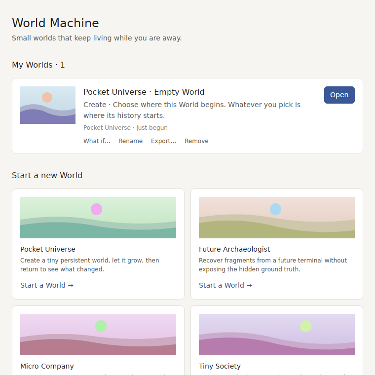
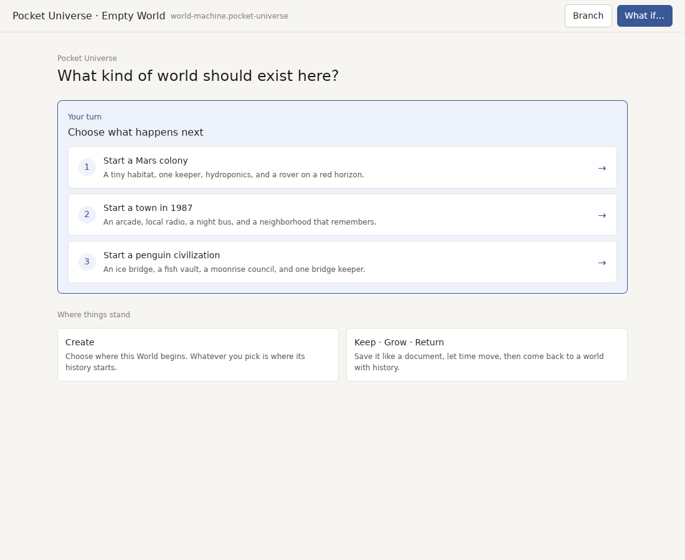
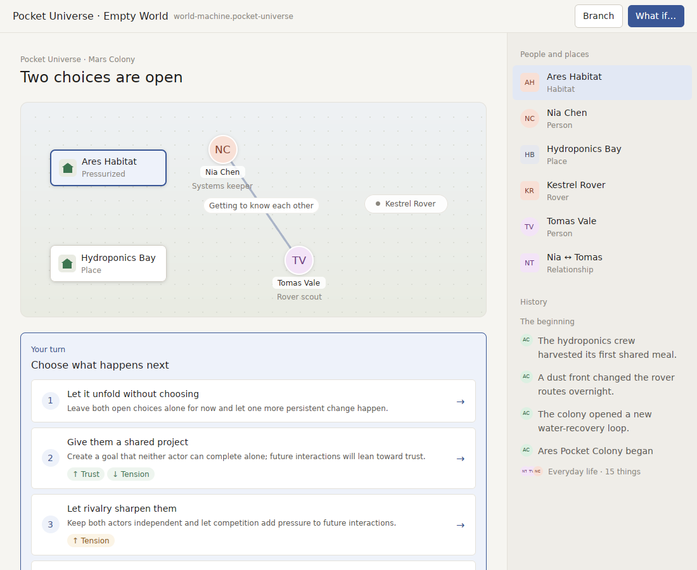
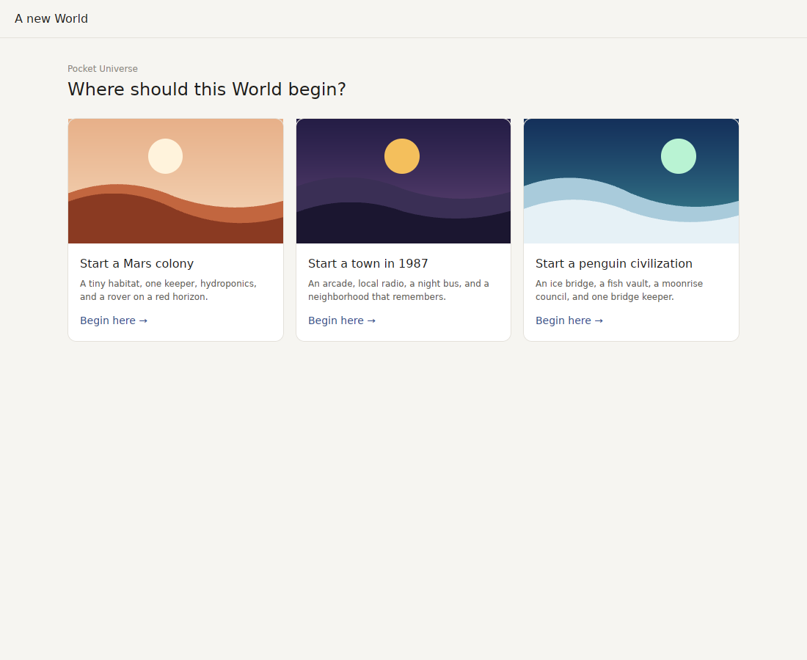
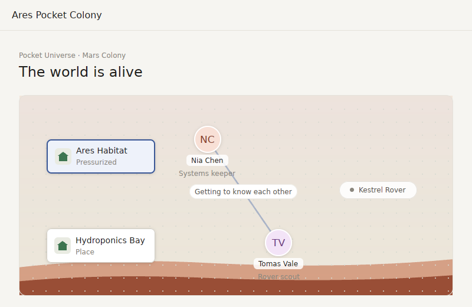
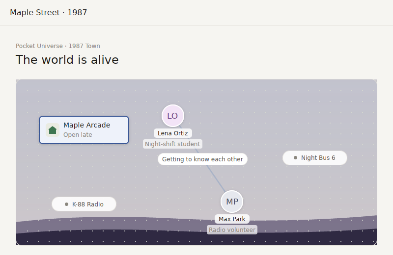
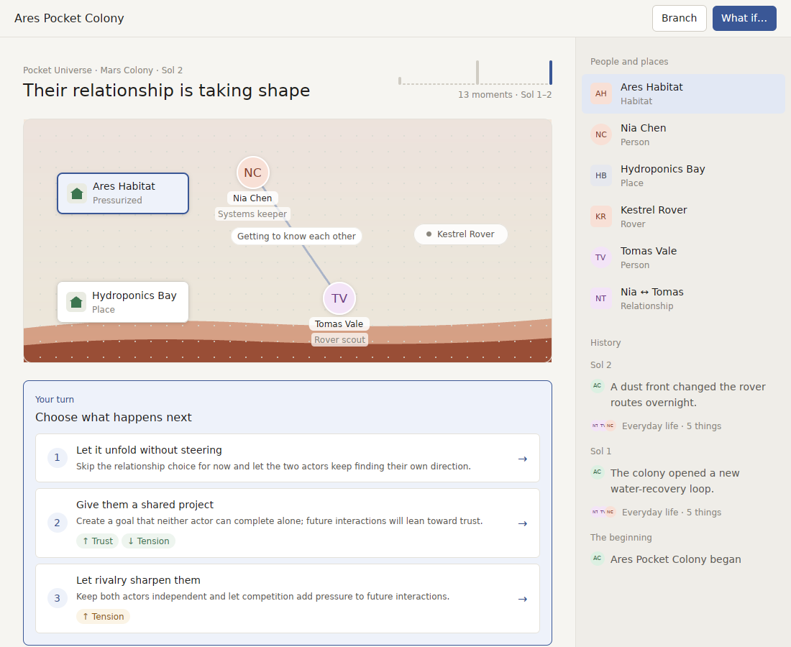

# v0.6.0 as a stranger meets it (2026-09-25)

`v0.6.0` fixed how a World *looks* once you are inside one. This review starts one step earlier, where every real user starts: a new install with an empty library. `FRESH=1 scripts/linux-preview.sh` now reproduces that, and every screenshot below comes from it.

**Verdict:** the World window is credible. The first five minutes are not a product yet. A stranger is handed a form, then a diagram that looks the same whatever they chose, then a list of choices phrased for the engine, and nothing ever tells them the one thing this app is about: that the World keeps going after they close it.

## What a new user actually sees

**1. First launch.** The app creates a World named *Pocket Universe · Empty World* and opens it. Home already lists it with *What if…*, *Rename* and *Export…* on a World that does not exist yet, beside four Packs of equal weight. Two of those four are engine fixtures: *Future Archaeologist* promises to "recover fragments … without exposing the hidden ground truth".

**2. The first question is a form.** "What kind of world should exist here?" is three rows of text in a box titled *Choose what happens next*, above two cards of instructions ("Keep · Grow · Return — Save it like a document…"). The title bar shows *Branch* and *What if…* on a World with no history, and the file label is the Pack id `world-machine.pocket-universe`.

**3. The choice does not change the look.** A Mars colony opens on the same grey dotted canvas, with the same green house icon for a pressurised habitat that a 1987 arcade or an ice bridge gets. The World is still called *Empty World*, in the title bar and on Home, for the rest of its life.

**4. Three turns in, nothing on screen has moved.** The colony opened a water-recovery loop, a dust front changed the rover routes, and the crew harvested its first meal. All of that is text in History. The scene is pixel for pixel what it was, and every entry sits under *The beginning*, because a turn in the app does not move time.

**5. The choices still speak engine.** "Create a goal that neither **actor** can complete alone; future **interactions** will lean toward trust." "Leave both open choices alone and let one more **persistent change** happen."

**6. The promise is invisible.** Time moves one period per six hours, and only while the app is closed. Nothing in the first session says so, there is no moment that ends a session ("leave them to it"), and nothing ever reaches the user between sessions. A World that keeps living while you are away needs to be *felt* on day one, and today it can only be discovered by accident on day two.

## Against the products this app competes with

| Moment | Best in class | World Machine `v0.6.0` |
| --- | --- | --- |
| First screen | *Townscaper*, *A Short Hike*: the world, immediately, no form | A three-row text form |
| Picking a start | Game "new game" screens: three illustrated worlds, one click | Three text rows |
| Sense of place | Every scene has its own palette and silhouette | One grey canvas, one house icon, for Mars, 1987 and Antarctica |
| Turn feedback | *Townscaper*, *Islanders*: every action visibly adds to the world | The scene does not change; History grows |
| Ending a session | *Animal Crossing*: "see you tomorrow", the town keeps its own clock | Close the window and hope |
| Between sessions | Tamagotchi, AC: the world reaches out when something happens | Nothing until you reopen it |
| Distribution | Double-click and it opens | "Open Anyway" in System Settings (not notarized) |

## v0.7: the first five minutes, and the reason to come back

In order. Each item is something a stranger would notice within one session.

1. ~~**A World is named, and starts with a picture.**~~ *(done, below)* First launch opens on three illustrated start cards (Mars colony, 1987 town, penguin civilization), each with its own palette and landscape, not a text form. Picking one names the World after its place ("Ares", "Maple Street", "Icebridge") everywhere, and *Branch* and *What if…* appear only once a World has history worth branching.
2. **Every seed looks like where it is.** *(palette and backdrop done; glyphs per kind of place still to come)* A Pack supplies a palette and a backdrop per World (red dust and a ridge for Ares, sodium-lit night for Maple Street, ice and aurora for Icebridge), and a glyph per kind of place (dome, arcade, bridge) instead of one house. This is the "Pack art" item from the last review, now justified by six real Worlds across two Packs.
3. **The World grows on screen.** What a turn builds (a water-recovery loop, a tournament bracket, a new span of the bridge) appears in the scene as a small new thing that stays, so after a week the colony looks lived in. *Townscaper*'s one lesson: every action visibly adds.
4. ~~**Time the player can read.**~~ *(done)* History and the page say "Sol 3" / "Night 12" / "Aurora 4", the World's own unit, not "Time 70" or *The beginning*; a turn that moves time says so.
5. **Ending a session, and being called back.** A clear "Leave them to it" moment that says when the World next moves ("Next sol in 5 h"), and a macOS notification when something that matters happened while the app was closed ("Nia and Tomas formed a partnership"). Off by default until asked, never more than one a day.
6. **Home shows only Worlds a person would play.** Engine fixtures (*Future Archaeologist*, *Micro Company*) move behind a developer setting; Home leads with the player's Worlds and one featured start.
7. ~~**The last engine words in choices**~~ *(done)* ("actor", "persistent change", "interactions").
8. **Notarization.** A product opens on double-click. The pipeline is ready; it needs the five secrets in `RELEASE_SIGNING.md`, which only the repository owner can add.

Still open from before: a check on a real Mac, the Analyst panel's layout, and five strangers for five minutes each, which this list is designed to make worth running.

## Progress

**Where a World begins** is now three pictures, each in its place's own colours:

**Ares** stands on red dust under a peach sky and is called Ares Pocket Colony in its window and on Home; **Maple Street** is a street at dusk. *Branch* appears once there is history, *What if…* once there are two choices.

**Time reads in the World's own unit** ("Sol 2", "Sol 1–2"), and each turn is a sol of its own in History instead of everything sitting under *The beginning*:

