# v0.7.0 review: a picture of a World, not yet a living one

`v0.7.0` fixed the first five minutes: a new user now starts from a picture, and the World they pick has its own name, colours and buildings. This review plays the release the way a player does: first launch, five turns, then a return after thirty hours away. It then puts each moment beside the product that does that moment best. Every screenshot comes from `scripts/linux-preview.sh` (`FRESH=1` for a new install, `AWAY_HOURS=30` for the return).

**Verdict:** each screen is now credible, but the World still doesn't feel alive. The scene is a diagram laid on a landscape: labelled circles and tiles joined by labelled lines, and nothing in it moves. Coming back after a day away is a two-line list. What is at stake is never on screen, and each choice is a paragraph to read. The products this app competes with are all built around one moment it barely has: looking at a place and seeing who is there and what they are doing.

## What a player actually sees

**First launch opens two windows.** Home and the new World open together. Behind the start cards, Home already lists an unbegun "A new World" with a generic cover and a *What if…* button, before the player has chosen anything. Two thirds of the World window below the cards is empty.

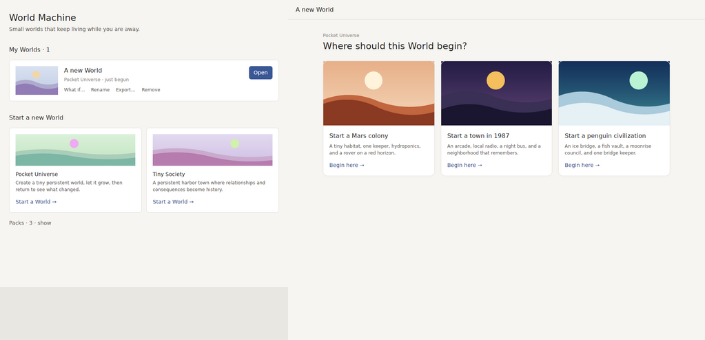

**Five sols in, the scene looks the way it did on sol 1.** Three domes and two masts have appeared on the ridge. Nia, Tomas, the habitat, the greenhouse and the rover all sit exactly where they started. The only thing that shows the pair's story is the text on a line ("Getting to know each other", then "Partners"). The rover is a grey pill floating in the sky. The page heading, "A larger choice is here", describes the engine rather than the colony. So does the first choice, which reads "Leave the larger intervention alone for now and let existing dynamics keep working."

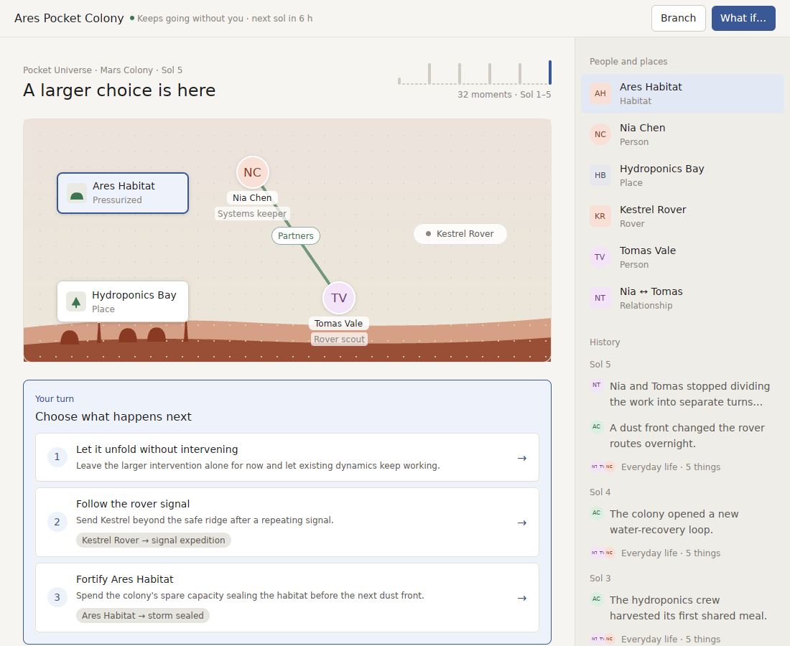

**Home still counts in engine time.** The colony card says "time 50", where the World itself says "Sol 5", and its summary is cut off mid-word: "Current thread · Nia and Tomas stopped dividing the work into separate turns. Kestrel now launches with them as one expedition c".

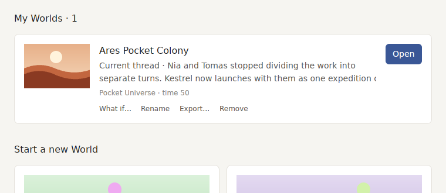

**Coming back is a list.** Thirty hours away gives a heading ("While you were away"), change chips on four people ("cash ↑15"), and two lines under *What happened*. Nothing on screen shows the day passing or where anyone went. In Tiny Society's crowded scene the Harbor tile covers the Anchor Pub, and "Wedding bre…" is cut off.

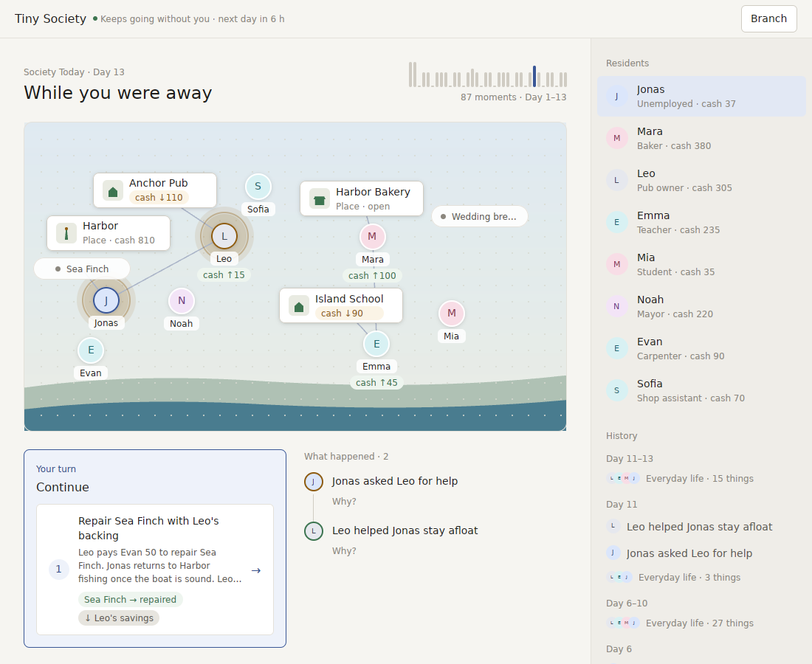

**A library of branches is a wall of text.** Once a player has branched, each card carries three lines of provenance. Branched Worlds get generic covers because their scenery is never written to the file. Every card still says "time 110" or "time 230".

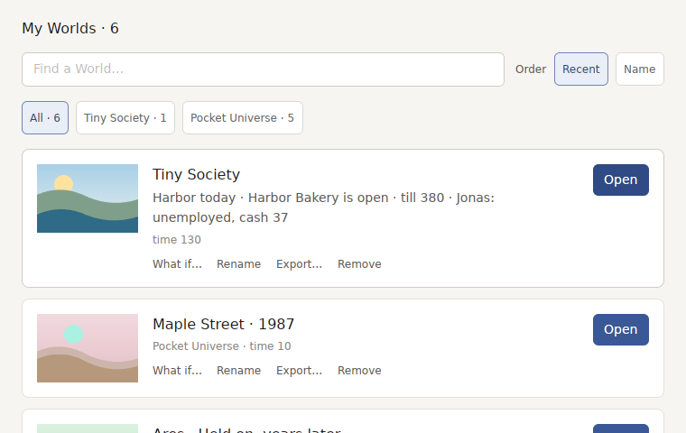

## Against the products that do each moment best

| Moment | Best in class | What it does | World Machine v0.7.0 |
| --- | --- | --- | --- |
| Looking at the World | *RimWorld*, *The Sims*, *Townscaper* | People are small figures in a place, doing something; you read the story from where they are and who they stand with | Circles and tiles on a backdrop, connected by labelled lines; nobody moves |
| Coming back | *Neko Atsume*, *Animal Crossing*, *Pokémon Sleep* | The place itself shows who came and what changed; the summary is a few big, picture-first beats you step through | A heading, chips, and a two-line list |
| Knowing what is at stake | *Frostpunk*, *Reigns* | Two to four meters are always on screen (Hope and Discontent; church, people, army, treasury) | Stakes are buried in tile captions ("trouble rising") and the inspector |
| Making a choice | *Reigns* | One person asks you something; while you consider it, dots mark which meters it will move | Two or three rows of prose, each with a small effect chip |
| Time passing | *Animal Crossing* | The clock is real and the sky and the music follow it | The sky never changes; there is no sound at all |
| The library | Apple Photos Memories, a console game's save slots | Big living covers; what is new is a badge, not a paragraph | A list of cards with meta lines and provenance text |
| Being told | *Neko Atsume* | A notification when something worth coming back for happens | Nothing until the app is opened (waits on signing) |

Three lessons matter more than the rest:

1. **A place, not a diagram.** RimWorld and The Sims show relationships through where people are: together at the workbench, apart at opposite ends of the map. A labelled line between two circles is the kind of chart a strategy dashboard uses, not a picture of a place.
2. **The return is the product.** Everything in Neko Atsume exists for the moment you open it and see who came. For World Machine, whose promise is "Small worlds that keep living while you are away", that moment is currently a text list.
3. **Show the stakes, then let a choice move them.** Reigns is mostly text, yet it never feels like reading, because every card shows its effect on the meters before you commit.

## v0.8: a World you can watch

In order. Each item is something a player would notice in the first session.

1. ~~**The scene is a place.**~~ *(done)* People stand at the place they are in, next to whoever they are with, and walk there when a turn moves them. A pair's relationship reads from how close they stand, with a small bubble (a heart, a spark, a frown), not a labelled line. Things like the rover stand on the ground. A Pack says where each person is (`at` a place). The scene lays places out without overlapping and never cuts a name off.
2. ~~**The return is a moment.**~~ *(done)* Coming back opens a short sequence of big beats, one per thing that happened. Each beat puts that thing's people and place in the middle of the scene with one sentence, and *Next* steps to the next beat. The last beat hands over to your turn. The sequence is replayed from recorded events, never made up.
3. ~~**Stakes are always on screen.**~~ *(done)* A Pack declares two or three gauges per World (air and morale on Mars; cash and trust in the harbour), and they sit on the scene. Hovering a choice marks which gauges it moves and which way, the way Reigns does.
4. ~~**A choice is someone asking.**~~ *(done)* Each choice shows the face of whoever it concerns, a short line, and its gauge marks. The paragraph moves to a detail view.
5. ~~**Time you can see.**~~ *(done; the sky follows your clock, sound is optional)* The sky follows the time of day within a period. People and lights move a little between turns. Each landscape has a quiet ambient sound, off by default and switched on in Settings.
6. ~~**Home is a shelf of living Worlds.**~~ *(done)* Covers are drawn from each World's actual scene (its landscape and what it has built), with a badge for what is new since you left. Age reads in the World's own unit ("Sol 5"). Branch history moves into the Branches view. First launch opens one window, and a World appears on Home only once it has begun.
7. ~~**Nothing written in engine words.**~~ *(done)* Rewrite the headings and choices that still describe the machinery ("A larger choice is here", "let existing dynamics keep working"). Add a test that fails if any player-facing text uses a word from a small banned list.
8. **Being told, and a signed app.** Notarization, then a notification when a World you care about changes. Both still wait on the five secrets in `RELEASE_SIGNING.md`.

Items 1 to 3 change the World Pack protocol. As with `Scenery` and `CanvasMark`, every new field is optional, so older Packs keep working. Each item is built in both Pocket Universe and Tiny Society before it counts, because a concept that works in only one World doesn't belong in the protocol.

## Progress

**The World is a place.** Nia stays at the habitat when she looks after the others and Tomas goes out with the rover when he explores; once they are partners they go together, a heart between them. The stakes sit above the scene.

**People walk.** A turn that moves someone shows them walking over, here Tomas leaving the habitat for the rover on the first sol:

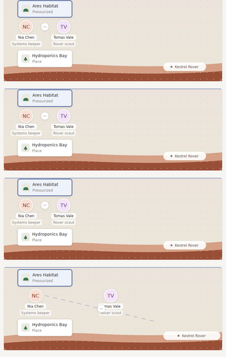

**The harbour stands people at their work.** Nothing covers anything else and no name is cut off:

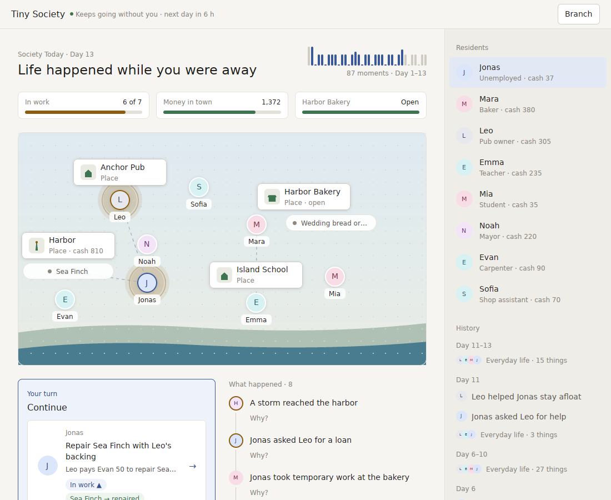

**Coming back is a moment.** One beat at a time, the people it is about lit up, then your turn:

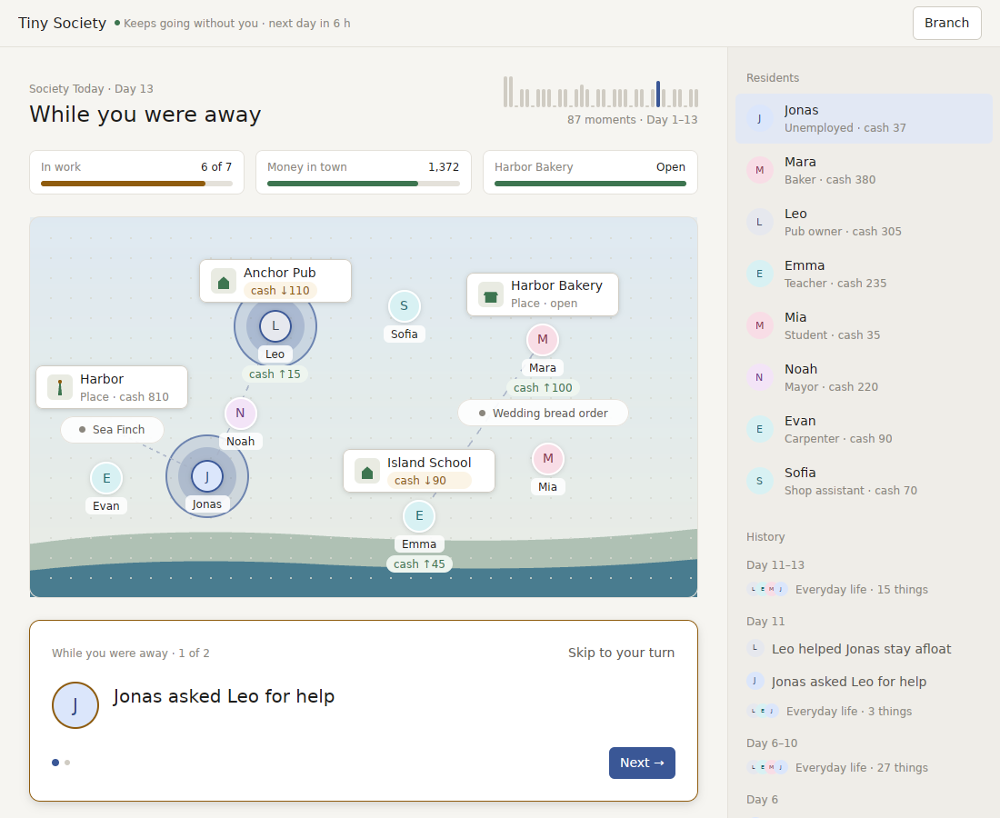

**A choice shows what it moves, measured.** Hovering "Give them a shared project" lights Trust ▲▲ and shows where it would end up; the pair it concerns are lit on the scene and asking on the card:

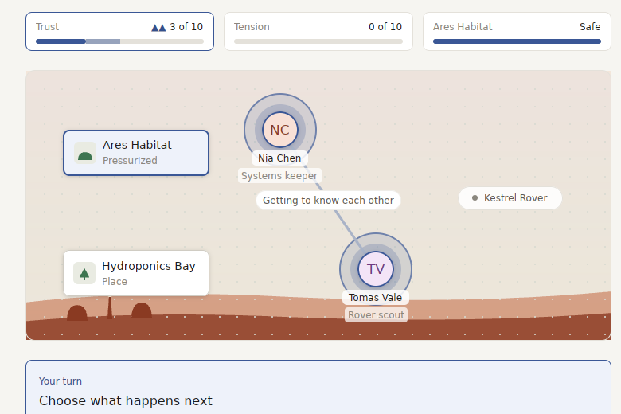

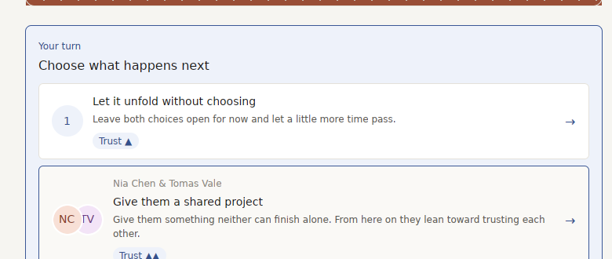

**Home is a shelf of living Worlds:**

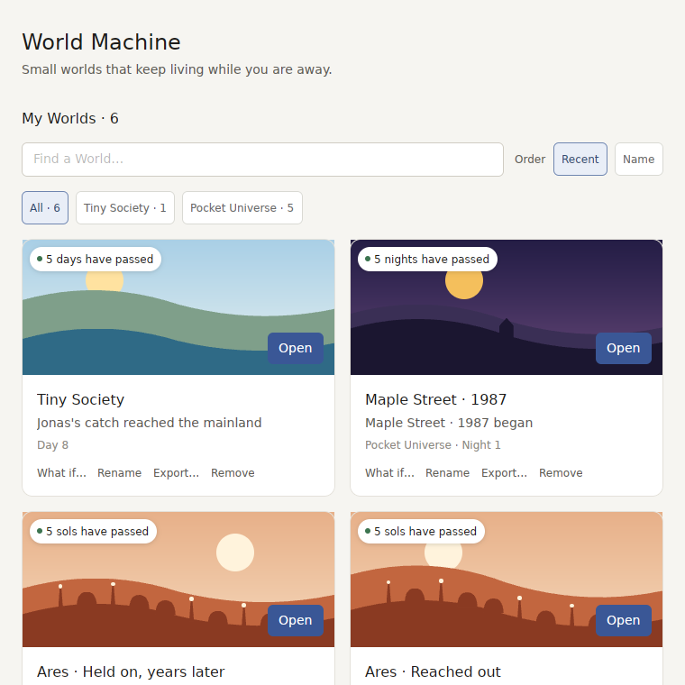

**Night and dusk follow the player's clock:**

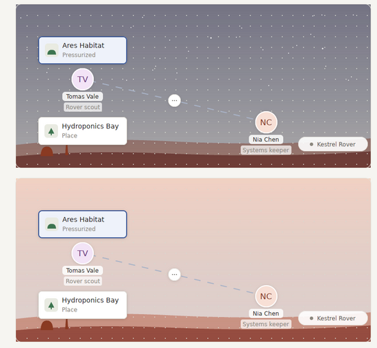

## Not verifiable from here

- A real Mac: fonts, window chrome, full screen, and every keyboard shortcut.
- The ambient sound. It is made and tested here, but plays through macOS's own player, so nobody has heard it yet.
- Whether a stranger understands the first session without help. Nothing replaces three people playing it for ten minutes while someone watches.
