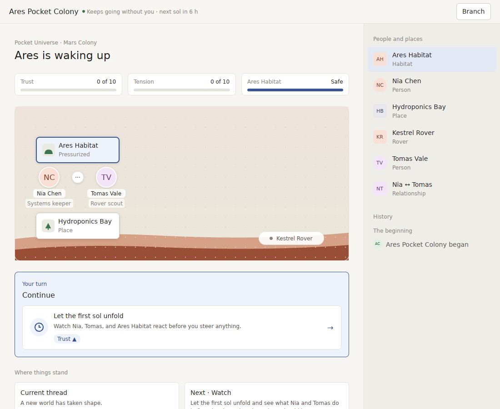
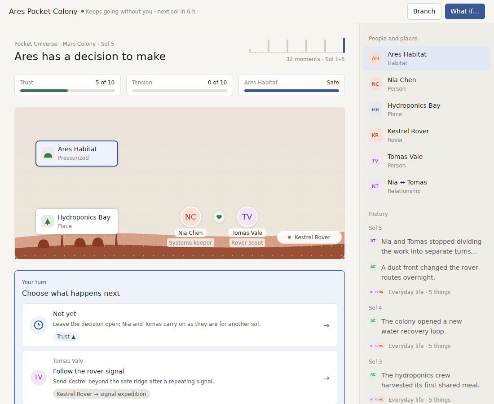
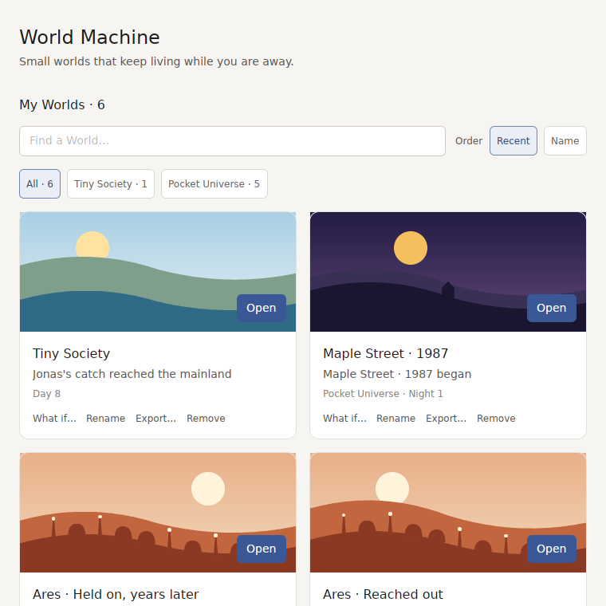

# v0.8.0 review: a dashboard with a picture in it

`v0.8.0` added the pieces a living World needs: people stand where they are, a return is told one beat at a time, the stakes sit on screen, and a choice has someone asking it. This review plays the release like a player would: a first launch, five sols, Home, and a return after thirty hours away. It then asks a harder question than the last two reviews: not "is each piece there?" but "does it feel like the products people love?" Every screenshot comes from `scripts/linux-preview.sh`.

**Verdict:** the pieces are in place, but the window is still built like a web page. There's a heading, a row of three meter cards, then a picture that fills about a quarter of the window, then a panel of choices, cards under the fold, and a sidebar that lists every entity and every event. People are initials in circles and places are white labelled cards. The Sol 5 screen shows about 170 words at rest. A player *reads* this app. In the products it competes with, the player *watches* a place, and the words are the exception. More polish on this layout won't close that gap. The next version has to change what the window is.

## What a player actually sees

**First launch.** One window, the right World, and a clear first move. Most of it is text around a picture: the heading, three meters at "0 of 10", "Pressurized", "Systems keeper", "Rover scout", six rows of *People and places* that repeat what the picture shows, and "Where things stand" cards below the fold.

**Five sols in.** The pair now stand together, a heart between them, and the ridge has grown domes and masts. But the Habitat and Hydroponics Bay are still white cards floating in the sky, and Nia and Tomas are "NC" and "TV". The rover is a pill-shaped label. The picture is a quarter of the window; the sidebar history holds more of the story than the scene does.

**Coming back.** The return is now a sequence ("While you were away · 1 of 2", "Jonas asked Leo for help", *Next →*). The scene behind it is a diagram of the harbour: eight white place cards, nine initials, a halo, "cash ↓110" and "cash ↑15" chips, dotted lines. Nothing moves, and the beat doesn't take you to where it happened; it lights two circles in a crowded chart.

**Home.** The covers are real landscapes now. Under each one are four text actions (*What if…, Rename, Export…, Remove*), a search field and filter chips for six Worlds. Two Ares branches have identical covers.

## Against the products that do it best

| Moment | Best in class | What it does | World Machine v0.8.0 |
| --- | --- | --- | --- |
| What the window is | *Townscaper*, *Animal Crossing*, *Stardew Valley*, *RimWorld* | The place fills the screen; UI is a thin layer on top that appears when needed | A page layout; the place is one panel among cards and a sidebar |
| Who lives there | *The Sims*, *Animal Crossing*, Stanford's *Smallville* (generative agents) | Every person is a drawn character you'd recognise; they walk, work and talk in speech bubbles | Two-letter initials in circles, with job titles in grey pills |
| Being there between decisions | *Neko Atsume*, *Townscaper*, *Animal Crossing* | Nothing needs doing and it is still worth looking at: people wander, lights come on, water moves | Still, unless a turn just moved someone |
| Talking to someone | *Character.AI*, *Animal Crossing*, *Disco Elysium* | Click a person and they answer, in their own voice, about their life | Clicking a person opens a data inspector |
| A decision | *Reigns* | One card and one face, a question in a sentence; the meters twitch as you lean left or right | A stacked list of choice rows inside a panel |
| Coming back | *Pokémon Sleep*, *Animal Crossing* | The morning report is a short, animated scene; the camera goes to what happened | A text card over an unchanged diagram |
| The library | Nintendo Switch Home, Apple Photos | Big covers and nothing else; everything else is a right-click or a long-press away | Covers followed by four text actions, a search field and filters |
| Feel | Every one of them | Every change animates with easing; there are small sounds for small things | Mostly instant state changes; no interface sounds |

The lesson running through all of them: **the world is the interface.** Text is what you get when you ask for it, not what you see first.

## v0.9: a place you look into, not a page you read

A version counts as a real leap only if a screenshot of it could pass for one of the products in the table. The measurable bar: **at rest, a World window shows no more than 40 words**, and the scene takes at least three quarters of it.

1. **The World fills the window.**
   - The scene is full-bleed, edge to edge, and the landscape is the background of the whole window.
   - The gauges become a slim strip over the sky. The choices become cards that rise from the bottom edge when it's your turn. History and *People and places* move into a drawer that opens with a click or ⌘I, like the info panel in Photos.
   - Nothing sits under the fold.
2. **People are characters, places are buildings.**
   - Each person is a small drawn figure generated from a stable seed (skin, hair, clothes, a hat or a tool for their work), the same everywhere: in the scene, on a choice, in a return beat.
   - Each place is drawn standing on the ground as what it is: a dome, a greenhouse, a pub with a sign, a bakery with an awning, a school.
   - Names show on hover or when something is about them. No initials, grey role pills or white cards.
   - A Pack gives a person's look as optional `appearance` hints; without them the app derives one from the id.
3. **People talk.**
   - When something happens, whoever it happened to says a line in a speech bubble over their head ("Could you spare something till Friday?"), the way Smallville agents and Animal Crossing villagers do.
   - Lines come from the recorded event: a Pack may add an optional `line` to what an event tells.
   - With World voice on, the voice may reword the line. The reworded text is presentation, is never read back as World state, and replaying the World doesn't need it.
4. **Life between turns.**
   - Between decisions people move about on their own: they go to work, visit each other and head home at night. The rover rolls out and back, lights come on after dusk and the sea moves.
   - This loop is presentation only, driven by where the recorded state says each person belongs and by the local clock, so it never touches World truth.
   - Leaving a World open on a second screen should be pleasant.
5. **Ask someone.**
   - Click a person and ask them one of a few questions ("How are you?", "What do you think of Tomas?", "What do you need?").
   - They answer in a speech bubble from their recorded state, deterministically, or through World voice when it's on.
   - An answer never changes the World. When it ends with a request ("Could you get me a day off?"), that request is offered as a choice through the normal Action path, so the player acts through the World's rules.
6. **A decision is a card.**
   - Your turn shows one card at a time, *Reigns*-style: a large portrait of whoever asks, one sentence, and two or three answers.
   - Leaning toward an answer by hover or arrow key twitches the gauges it moves; ⏎ commits.
   - The detail paragraph opens on the card's back.
7. **The return is a short film.**
   - Each beat moves the camera, a pan and a gentle zoom, to where it happened. The people involved play it out with a bubble.
   - Beats advance by themselves and a click skips. The film ends by pulling back to the whole World and your first card.
8. **Home is covers and nothing else.**
   - Each cover is a small live render of the World itself, so its people and buildings show and two branches no longer look alike.
   - The badge says what's new. Rename, Export and Remove move to a right-click menu and a ⋯ button that appears on hover.
   - Search and filters appear only once there are more than nine Worlds.
9. **Motion and sound.**
   - Every change eases in and out: a gauge moves, a card rises, a person walks, a building is raised.
   - Small interface sounds (a card flip, a turn passing, a new building) are made the same way the ambient sound is, and are off when sound is off.
10. **Signed, notarized and able to tell you.** This still waits on the five secrets in `RELEASE_SIGNING.md`. Once they are set, a World you care about can send one quiet notification a day ("Mara's bakery opened").

Items 2, 3 and 5 extend the World Pack protocol with optional fields (`appearance`, `line`, and questions a person can be asked). As before, each is built in both Pocket Universe and Tiny Society before it counts. Everything else is presentation and stays out of `world-core`. Nothing here lets text written by a language model become World state: talking and lines are narration, and requests go through Actions.

**Order.** Items 1 and 2 first, because every later item is drawn inside them. Then 4 and 3, which make the place feel alive. Then 6, 7, 8 and 9, which are the same work applied to each moment. Item 5 is the largest and depends on 3.

## How we'll know

- A screenshot test that counts visible words on a World window at rest and fails above 40.
- The scene's share of the window, measured the same way, at least 75%.
- A three-person hallway test on a real Mac: each person gets the app with no instructions and ten minutes. Afterwards they're asked "who lives there and what happened?", and the answer should come from the scene, not from reading.
